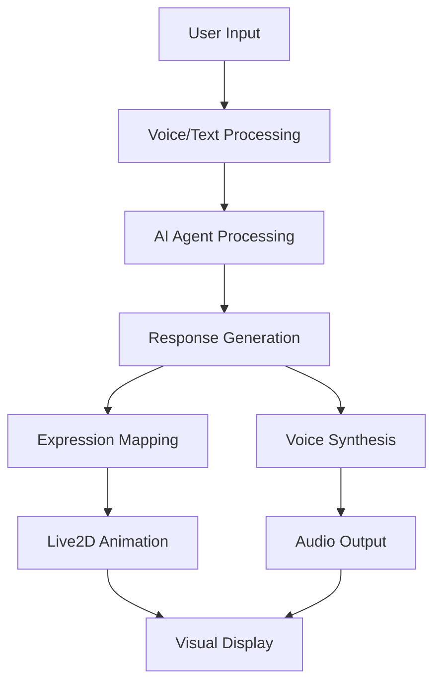
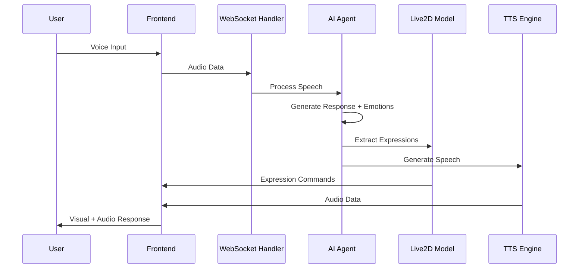

# Open-LLM-VTuber: Architecture Analysis & Extension Guide

## Table of Contents
1. [Project Overview](#project-overview)
2. [Quick Start: Configuring with Ollama](#quick-start-configuring-open-llm-vtuber-with-ollama)
3. [Core Architecture](#core-architecture)
4. [System Components Deep Dive](#system-components-deep-dive)
5. [Data Flow Analysis](#data-flow-analysis)
6. [Extension Points & Implementation Strategies](#extension-points--implementation-strategies)
7. [Building a Personal Virtual Friend System](#building-a-personal-virtual-friend-system)
8. [Implementation Roadmap](#implementation-roadmap)
9. [Best Practices & Considerations](#best-practices--considerations)

---

## Project Overview

### What is Open-LLM-VTuber?

Open-LLM-VTuber is a sophisticated **voice-interactive AI companion** that combines:
- **Real-time voice conversations** with advanced ASR/TTS
- **Visual perception** through camera and screen capture
- **Live2D animated avatars** with dynamic expressions
- **Cross-platform compatibility** (Windows, macOS, Linux)
- **Offline capability** with local model support

### Key Features Analysis



**Core Capabilities:**
- 🎤 **Voice Interaction**: Interruption support, noise handling
- 👁️ **Visual Perception**: Camera, screen recording, screenshots
- 😊 **Emotional Expression**: Live2D facial expressions with emotion mapping
- 🧠 **AI Backend**: Multiple LLM support (OpenAI, Claude, Ollama, etc.)
- 🔊 **Voice Synthesis**: 15+ TTS options including voice cloning
- 💾 **Memory Persistence**: Chat history and conversation continuity

---

## Core Architecture

### Project Structure Analysis

```
Open-LLM-VTuber/
├── src/open_llm_vtuber/           # Core Python backend
│   ├── agent/                     # AI agent implementations
│   ├── asr/                       # Speech recognition modules
│   ├── tts/                       # Text-to-speech modules
│   ├── conversations/             # Conversation management
│   └── live2d_model.py           # Character animation system
├── frontend/                      # Web interface
├── characters/                    # Character configuration files
├── live2d-models/                # 3D avatar assets
├── prompts/                      # System prompts
└── conf.yaml                     # Main configuration
```

### Technology Stack

**Backend Framework:**
- **FastAPI**: Modern async web framework
- **WebSocket**: Real-time communication
- **Python 3.10+**: Core runtime environment

**AI & ML Components:**
- **Multiple LLM Support**: OpenAI, Claude, Ollama, etc.
- **ASR Engines**: Whisper, Sherpa-ONNX, FunASR
- **TTS Engines**: Edge TTS, Azure TTS, GPT-SoVITS
- **Voice Processing**: ONNX Runtime for real-time processing

**Frontend Technologies:**
- **Live2D SDK**: 2D character animation
- **WebGL**: Hardware-accelerated rendering
- **Web Audio API**: Real-time audio processing

---

## Quick Start: Configuring Open-LLM-VTuber with Ollama

### Prerequisites

Before configuring Open-LLM-VTuber with Ollama, ensure you have:

1. **Ollama installed** on your system
2. **Python 3.10+** installed
3. **Open-LLM-VTuber project** cloned locally

### Step 1: Install and Setup Ollama

#### Install Ollama
```bash
# macOS (using Homebrew)
brew install ollama

# Linux
curl -fsSL https://ollama.com/install.sh | sh

# Windows - Download from https://ollama.com/download
```

#### Start Ollama Service
```bash
# Start the Ollama service (runs on localhost:11434 by default)
ollama serve
```

#### Download a Model
```bash
# Download and install a model (recommended models)
ollama pull llama2:latest          # Good for general conversation
ollama pull qwen2.5:latest         # Good for multilingual support
ollama pull llama3.2:latest        # Latest LLaMA model
ollama pull mistral:latest         # Fast and efficient

# Verify models are installed
ollama list
```

### Step 2: Configure Open-LLM-VTuber

#### Main Configuration File: `conf.yaml`

The key configuration changes needed in `conf.yaml`:

```yaml
# conf.yaml - Key sections for Ollama configuration

character_config:
  agent_config:
    conversation_agent_choice: 'basic_memory_agent'
    
    agent_settings:
      basic_memory_agent:
        # Set Ollama as the LLM provider
        llm_provider: 'ollama_llm'
        faster_first_response: True
        segment_method: 'pysbd'
        use_mcpp: True  # Enable MCP for tool usage
        mcp_enabled_servers: ["time", "ddg-search"]

    llm_configs:
      ollama_llm:
        base_url: 'http://localhost:11434/v1'     # Default Ollama API endpoint
        model: 'llama2:latest'                    # Change to your preferred model
        temperature: 1.0                          # Creativity level (0-2)
        keep_alive: -1                           # Keep model in memory (-1 = forever)
        unload_at_exit: True                     # Unload model when closing
```

#### Configuration Options Explained

| Parameter | Description | Recommended Values |
|-----------|-------------|-------------------|
| `base_url` | Ollama API endpoint | `http://localhost:11434/v1` |
| `model` | Model name from `ollama list` | `llama2:latest`, `qwen2.5:latest`, `mistral:latest` |
| `temperature` | Response creativity (0-2) | `0.7` (focused) to `1.2` (creative) |
| `keep_alive` | Memory retention time | `-1` (always), `300` (5 min), `0` (unload immediately) |
| `unload_at_exit` | Auto-unload on exit | `True` (recommended) |

### Step 3: Model Selection Guide

#### Recommended Models by Use Case

**For English Conversations:**
```bash
ollama pull llama3.2:latest      # Best overall performance
ollama pull mistral:latest       # Fast and efficient
ollama pull llama2:7b           # Balanced performance
```

**For Multilingual Support (English + Chinese + others):**
```bash
ollama pull qwen2.5:latest      # Excellent multilingual
ollama pull qwen2.5:14b         # Better quality, needs more memory
```

**For Coding/Technical Discussions:**
```bash
ollama pull codellama:latest    # Code-focused model
ollama pull deepseek-coder      # Advanced coding capabilities
```

#### Configuration Examples by Model

**Basic English Setup (llama2):**
```yaml
ollama_llm:
  base_url: 'http://localhost:11434/v1'
  model: 'llama2:latest'
  temperature: 0.8
  keep_alive: 600  # 10 minutes
  unload_at_exit: True
```

**Multilingual Setup (qwen2.5):**
```yaml
ollama_llm:
  base_url: 'http://localhost:11434/v1'
  model: 'qwen2.5:latest'
  temperature: 0.7
  keep_alive: -1   # Keep loaded
  unload_at_exit: True
```

**High-Performance Setup (larger model):**
```yaml
ollama_llm:
  base_url: 'http://localhost:11434/v1'
  model: 'qwen2.5:14b'
  temperature: 0.9
  keep_alive: 300  # 5 minutes (larger models use more memory)
  unload_at_exit: True
```

### Step 4: Running the Project

#### Method 1: Direct Python Execution
```bash
# Navigate to project directory
cd /path/to/Open-LLM-VTuber

# Install dependencies (first time only)
pip install -r requirements.txt
# OR using uv (recommended)
uv sync

# Start Ollama service (in separate terminal)
ollama serve

# Run Open-LLM-VTuber
python run_server.py
# OR using uv
uv run python run_server.py
```

#### Method 2: Using UV (Recommended)
```bash
# Install uv if not already installed
curl -LsSf https://astral.sh/uv/install.sh | sh

# Navigate to project directory
cd /path/to/Open-LLM-VTuber

# Install dependencies
uv sync

# Start the application
uv run python run_server.py
```

### Step 5: Accessing the Application

Once running, access the application at:
- **Web Interface**: `http://localhost:12393`
- **API Documentation**: `http://localhost:12393/docs`

### Step 6: Troubleshooting Common Issues

#### Issue 1: "Failed to connect to Ollama backend"
**Cause**: Ollama service not running
**Solution**:
```bash
# Start Ollama service
ollama serve

# Verify it's running
curl http://localhost:11434/api/tags
```

#### Issue 2: "Model not found"
**Cause**: Model not downloaded
**Solution**:
```bash
# Check available models
ollama list

# Download the model specified in conf.yaml
ollama pull llama2:latest
```

#### Issue 3: Slow responses
**Cause**: Model not loaded in memory
**Solutions**:
- Set `keep_alive: -1` in config
- Use a smaller model (`llama2:7b` instead of `llama2:13b`)
- Ensure sufficient RAM available

#### Issue 4: High memory usage
**Solutions**:
- Use smaller models
- Set `keep_alive: 0` to unload immediately
- Set `keep_alive: 300` for 5-minute retention

### Step 7: Performance Optimization

#### Memory Management
```yaml
# For systems with limited RAM (<16GB)
ollama_llm:
  model: 'llama2:7b'    # Smaller model
  keep_alive: 300       # Unload after 5 minutes
  unload_at_exit: True

# For systems with ample RAM (>16GB)
ollama_llm:
  model: 'qwen2.5:14b'  # Larger, better model
  keep_alive: -1        # Keep in memory
  unload_at_exit: False # Keep loaded between sessions
```

#### Response Speed Optimization
```yaml
# Enable faster first response
agent_settings:
  basic_memory_agent:
    faster_first_response: True    # Start speaking at first comma
    segment_method: 'pysbd'        # Better sentence segmentation
```

### Step 8: Advanced Configuration

#### Custom Model Parameters
If you need to pass custom parameters to Ollama models, you can modify the `OllamaLLM` class in:
`src/open_llm_vtuber/agent/stateless_llm/ollama_llm.py`

#### Multiple Model Support
You can configure multiple Ollama models for different characters:

```yaml
# In conf.yaml
llm_configs:
  ollama_casual:
    base_url: 'http://localhost:11434/v1'
    model: 'llama2:latest'
    temperature: 1.2  # More creative

  ollama_professional:
    base_url: 'http://localhost:11434/v1'  
    model: 'qwen2.5:latest'
    temperature: 0.5  # More focused
```

Then reference different configs in character files:
```yaml
# characters/casual_friend.yaml
character_config:
  agent_config:
    agent_settings:
      basic_memory_agent:
        llm_provider: 'ollama_casual'

# characters/professional_assistant.yaml  
character_config:
  agent_config:
    agent_settings:
      basic_memory_agent:
        llm_provider: 'ollama_professional'
```

### Complete Working Example

Here's a complete `conf.yaml` section for Ollama:

```yaml
system_config:
  conf_version: 'v1.2.0'
  host: 'localhost'
  port: 12393

character_config:
  conf_name: 'mao_pro'
  conf_uid: 'mao_pro_001'
  live2d_model_name: 'mao_pro'
  character_name: 'Mao'
  human_name: 'Human'
  
  persona_prompt: |
    You are Mao, a friendly and helpful AI companion. You are cheerful, curious, and always eager to learn and chat with humans.
    You love to help with questions and have interesting conversations. You speak in a warm and engaging manner.

  agent_config:
    conversation_agent_choice: 'basic_memory_agent'
    
    agent_settings:
      basic_memory_agent:
        llm_provider: 'ollama_llm'
        faster_first_response: True
        segment_method: 'pysbd'
        use_mcpp: True
        mcp_enabled_servers: ["time", "ddg-search"]

    llm_configs:
      ollama_llm:
        base_url: 'http://localhost:11434/v1'
        model: 'llama2:latest'
        temperature: 0.8
        keep_alive: -1
        unload_at_exit: True

  # TTS Configuration (choose one)
  tts_config:
    tts_model: 'edge_tts'  # Free option
    # OR
    # tts_model: 'openai_tts'  # Higher quality, requires API key

  # ASR Configuration  
  asr_config:
    asr_model: 'faster_whisper'
    faster_whisper:
      model_path: 'tiny'
      language: 'en'
      device: 'auto'
```

This configuration provides a complete working setup with Ollama as the LLM backend, enabling you to run Open-LLM-VTuber entirely offline with local models.

---

## System Components Deep Dive

### 1. Character System Architecture

#### Live2D Model Structure (`live2d_model.py:28-144`)

```python
class Live2dModel:
    def __init__(self, live2d_model_name: str, model_dict_path: str):
        self.model_dict_path = model_dict_path
        self.live2d_model_name = live2d_model_name
        self.model_info = {}      # Model configuration
        self.emo_map = {}         # Emotion to expression mapping
        self.emo_str = ""         # Available emotion keywords
```

**Key Components:**
- **Model Dictionary** (`model_dict.json`): Central registry of all Live2D models
- **Expression Mapping**: Links emotions to facial expressions
- **Motion System**: Idle animations and interaction responses

#### Character Configuration System

```yaml
# characters/example.yaml
character_config:
  conf_name: "CharacterName"
  conf_uid: "unique_identifier"
  live2d_model_name: "model_reference"
  persona_prompt: |
    Character personality and behavior description
```

**Configuration Hierarchy:**
1. **System Config** (`conf.yaml`): Global settings
2. **Character Config** (`characters/*.yaml`): Character-specific overrides
3. **Model Config** (`model_dict.json`): Visual appearance settings

### 2. Emotion & Expression Engine

#### Expression Detection Algorithm (`live2d_model.py:146-172`)

```python
def extract_emotion(self, str_to_check: str) -> list:
    """Extract emotion keywords from text and return expression indices"""
    expression_list = []
    str_to_check = str_to_check.lower()
    
    # Parse emotion tags like [joy], [anger], [sadness]
    for key in self.emo_map.keys():
        emo_tag = f"[{key}]"
        if emo_tag in str_to_check:
            expression_list.append(self.emo_map[key])
    
    return expression_list
```

**Emotion System Features:**
- **Tag-based Detection**: `[emotion]` keywords in AI responses
- **Multi-emotion Support**: Multiple expressions per response
- **Dynamic Mapping**: Configurable emotion-to-expression relationships

#### Expression Mapping Example

```json
// model_dict.json
"emotionMap": {
    "neutral": 0,    // Default expression
    "anger": 2,      // Expression file exp_02.exp3.json
    "joy": 3,        // Expression file exp_03.exp3.json
    "sadness": 1,    // Expression file exp_01.exp3.json
    "surprise": 3    // Reuses joy expression
}
```

### 3. AI Agent Architecture

#### Agent Interface Design (`agent/agents/agent_interface.py`)

```python
class AgentInterface(ABC):
    @abstractmethod
    async def generate_response(self, message: str, **kwargs) -> str:
        """Generate AI response from user input"""
        pass
    
    @abstractmethod
    def get_memory_summary(self) -> str:
        """Return conversation context"""
        pass
```

**Available Agent Types:**
- **Basic Memory Agent**: Simple conversation history
- **Stateless LLM**: No memory, pure input-output
- **Letta Agent**: Advanced memory management
- **Hume AI**: Emotional intelligence integration

#### Memory Management System

```python
# agent/agents/basic_memory_agent.py
class BasicMemoryAgent:
    def __init__(self):
        self.conversation_history = []
        self.memory_limit = 10  # Last N exchanges
        
    def add_to_memory(self, human_input: str, ai_response: str):
        """Store conversation for context"""
        self.conversation_history.append({
            'human': human_input,
            'ai': ai_response,
            'timestamp': datetime.now()
        })
```

### 4. Voice Processing Pipeline

#### ASR (Automatic Speech Recognition) System

**Supported Engines** (`asr/` directory):
- **Whisper**: OpenAI's speech recognition
- **Sherpa-ONNX**: Offline real-time ASR
- **Azure Speech**: Cloud-based recognition
- **FunASR**: Chinese language optimization

#### TTS (Text-to-Speech) Architecture (`tts/tts_interface.py:8-41`)

```python
class TTSInterface(metaclass=abc.ABCMeta):
    async def async_generate_audio(self, text: str) -> str:
        """Generate audio file from text"""
        return await asyncio.to_thread(self.generate_audio, text)
    
    @abstractmethod
    def generate_audio(self, text: str) -> str:
        """Synchronous audio generation"""
        raise NotImplementedError
```

**TTS Engine Options:**
- **Edge TTS**: Microsoft's online TTS
- **GPT-SoVITS**: Voice cloning capability
- **Azure TTS**: Enterprise-grade synthesis
- **Coqui TTS**: Open-source neural TTS

### 5. Frontend Integration

#### WebSocket Communication Pattern

```javascript
// Frontend WebSocket handling
const ws = new WebSocket('ws://localhost:12393/ws');

ws.onmessage = (event) => {
    const data = JSON.parse(event.data);
    
    switch(data.type) {
        case 'expression':
            // Update Live2D facial expression
            live2dModel.setExpression(data.expression_id);
            break;
        case 'audio':
            // Play TTS audio
            playAudioFromBase64(data.audio_data);
            break;
        case 'message':
            // Display text message
            updateChatDisplay(data.content);
            break;
    }
};
```

---

## Data Flow Analysis

### Complete Interaction Flow



### Configuration Loading Process

1. **System Initialization** (`conf.yaml`)
2. **Character Loading** (`characters/*.yaml`)
3. **Model Registration** (`model_dict.json`)
4. **Agent Instantiation** (Based on configuration)
5. **Service Context Creation** (Dependency injection)

### Memory & State Management

```python
# conversations/conversation_handler.py
class ConversationHandler:
    def __init__(self):
        self.active_conversations = {}
        self.chat_history_manager = ChatHistoryManager()
        
    async def handle_message(self, user_id: str, message: str):
        """Process user message through complete pipeline"""
        conversation = self.get_or_create_conversation(user_id)
        
        # Generate AI response with emotion extraction
        response = await conversation.agent.generate_response(message)
        
        # Extract expressions for Live2D
        expressions = conversation.live2d_model.extract_emotion(response)
        
        # Generate audio
        audio_path = await conversation.tts.async_generate_audio(response)
        
        # Save to history
        self.chat_history_manager.save_exchange(user_id, message, response)
        
        return {
            'text': response,
            'expressions': expressions,
            'audio': audio_path
        }
```

---

## Extension Points & Implementation Strategies

### 1. Character Customization Extensions

#### Enhanced Character Profile System

```yaml
# Enhanced character configuration
character_config:
  # Basic Identity
  conf_name: "MyVirtualFriend"
  conf_uid: "friend_001"
  
  # Personality Matrix
  personality_traits:
    extraversion: 0.8      # 0.0 (introverted) to 1.0 (extraverted)
    agreeableness: 0.9     # 0.0 (competitive) to 1.0 (cooperative)
    conscientiousness: 0.7 # 0.0 (spontaneous) to 1.0 (disciplined)
    neuroticism: 0.3       # 0.0 (calm) to 1.0 (anxious)
    openness: 0.8          # 0.0 (traditional) to 1.0 (creative)
  
  # Relationship Dynamics
  relationship_config:
    relationship_type: "close_friend"  # acquaintance, friend, close_friend, romantic
    intimacy_level: 0.6               # Affects conversation depth
    familiarity_growth_rate: 0.1      # How quickly relationship develops
    
  # Behavioral Patterns
  behavior_config:
    response_style: "supportive"      # supportive, challenging, humorous, formal
    conversation_initiative: 0.4      # How often AI starts conversations
    emotional_sensitivity: 0.8        # Reaction intensity to user emotions
    
  # Visual Customization
  appearance_config:
    age_appearance: "young_adult"     # child, teen, young_adult, adult, mature
    style_preference: "casual"        # casual, formal, cute, elegant, trendy
    color_palette: "warm"            # warm, cool, neutral, vibrant, pastel
    outfit_variety: true             # Multiple outfit options
```

#### Implementation: Multi-State Character System

```python
# Enhanced live2d_model.py extension
class PersonalizedLive2dModel(Live2dModel):
    def __init__(self, character_profile: dict):
        super().__init__(character_profile['live2d_model_name'])
        
        # Extended properties
        self.personality_traits = character_profile.get('personality_traits', {})
        self.relationship_state = character_profile.get('relationship_config', {})
        self.appearance_variants = self._load_appearance_variants()
        self.current_mood = 0.5  # -1.0 to 1.0
        self.relationship_level = 0.0  # 0.0 to 1.0
        
    def _load_appearance_variants(self):
        """Load different visual states for the character"""
        return {
            'default': self.model_info,
            'casual': self._load_variant('casual'),
            'formal': self._load_variant('formal'),
            'sleepy': self._load_variant('sleepy'),
            'excited': self._load_variant('excited')
        }
    
    def update_relationship_state(self, interaction_sentiment: float):
        """Update relationship based on interaction quality"""
        growth_rate = self.relationship_state.get('familiarity_growth_rate', 0.1)
        
        if interaction_sentiment > 0.5:
            self.relationship_level = min(1.0, self.relationship_level + growth_rate)
        elif interaction_sentiment < -0.5:
            self.relationship_level = max(0.0, self.relationship_level - growth_rate * 0.5)
    
    def get_contextual_expressions(self) -> dict:
        """Return expression mapping adjusted for current relationship/mood"""
        base_expressions = self.emo_map.copy()
        
        # Modify expressions based on relationship level
        if self.relationship_level > 0.7:
            # More expressive when close
            base_expressions['joy'] = min(7, base_expressions.get('joy', 3) + 1)
            base_expressions['affection'] = base_expressions.get('joy', 3)
        
        # Adjust for current mood
        mood_modifier = int(self.current_mood * 2)  # -2 to 2
        for emotion in ['joy', 'surprise']:
            if emotion in base_expressions:
                base_expressions[emotion] = max(0, min(7, base_expressions[emotion] + mood_modifier))
        
        return base_expressions
```

### 2. Advanced Memory & Relationship System

#### Long-term Memory Architecture

```python
# agent/agents/enhanced_memory_agent.py
from datetime import datetime, timedelta
import json

class EnhancedMemoryAgent(BasicMemoryAgent):
    def __init__(self, character_profile: dict):
        super().__init__()
        
        # Memory categories
        self.episodic_memory = []      # Specific events and conversations
        self.semantic_memory = {}      # Facts about the user
        self.emotional_memory = []     # Emotional moments and their context
        self.preference_memory = {}    # User likes, dislikes, habits
        
        # Relationship tracking
        self.relationship_timeline = []
        self.milestone_memories = []   # Important relationship moments
        
        # Learning parameters
        self.memory_retention_days = 365
        self.importance_threshold = 0.6
        
    def add_episodic_memory(self, interaction: dict, importance_score: float):
        """Store specific interaction with importance weighting"""
        memory_entry = {
            'timestamp': datetime.now(),
            'content': interaction,
            'importance': importance_score,
            'emotional_context': self._analyze_emotional_context(interaction),
            'relationship_impact': self._assess_relationship_impact(interaction)
        }
        
        self.episodic_memory.append(memory_entry)
        
        # If highly important, also store as milestone
        if importance_score > 0.8:
            self.milestone_memories.append(memory_entry)
    
    def update_semantic_memory(self, facts: dict):
        """Update long-term facts about the user"""
        for key, value in facts.items():
            if key not in self.semantic_memory:
                self.semantic_memory[key] = {
                    'value': value,
                    'confidence': 0.5,
                    'last_updated': datetime.now(),
                    'source_interactions': []
                }
            else:
                # Update existing fact with confirmation
                existing = self.semantic_memory[key]
                if existing['value'] == value:
                    existing['confidence'] = min(1.0, existing['confidence'] + 0.1)
                else:
                    # Conflicting information - handle carefully
                    existing['confidence'] *= 0.8
                    if existing['confidence'] < 0.3:
                        existing['value'] = value
                        existing['confidence'] = 0.5
    
    def get_relevant_context(self, current_topic: str) -> str:
        """Retrieve relevant memories for current conversation"""
        # Combine different memory types for rich context
        context_parts = []
        
        # Recent emotional memories
        recent_emotions = [m for m in self.emotional_memory 
                          if m['timestamp'] > datetime.now() - timedelta(days=7)]
        
        # Relevant semantic facts
        relevant_facts = self._find_relevant_facts(current_topic)
        
        # Important episodic memories
        important_episodes = [m for m in self.episodic_memory 
                            if m['importance'] > 0.7]
        
        # Construct context string
        if relevant_facts:
            context_parts.append(f"What I know about you: {relevant_facts}")
        
        if recent_emotions:
            context_parts.append(f"Recent emotional context: {recent_emotions[-1]['summary']}")
        
        if important_episodes:
            context_parts.append(f"Important memories: {important_episodes[-3:]}")
        
        return " | ".join(context_parts)
    
    def _analyze_emotional_context(self, interaction: dict) -> dict:
        """Analyze emotional significance of interaction"""
        # This would integrate with sentiment analysis
        return {
            'user_sentiment': 0.0,    # -1.0 to 1.0
            'ai_response_tone': 'neutral',
            'emotional_keywords': [],
            'interaction_type': 'casual'  # casual, important, conflict, celebration
        }
```

### 3. Dynamic Appearance System

#### Multi-Model Character Switching

```python
# appearance/character_variants.py
class CharacterAppearanceManager:
    def __init__(self, base_model_name: str):
        self.base_model_name = base_model_name
        self.available_variants = self._discover_variants()
        self.current_variant = 'default'
        self.context_rules = self._load_context_rules()
        
    def _discover_variants(self) -> dict:
        """Find all available appearance variants"""
        variants = {'default': f'{self.base_model_name}'}
        
        # Look for variant models
        variant_patterns = [
            f'{self.base_model_name}_casual',
            f'{self.base_model_name}_formal',
            f'{self.base_model_name}_sleepy',
            f'{self.base_model_name}_excited',
            f'{self.base_model_name}_winter',
            f'{self.base_model_name}_summer'
        ]
        
        for pattern in variant_patterns:
            if self._model_exists(pattern):
                variant_type = pattern.split('_')[-1]
                variants[variant_type] = pattern
        
        return variants
    
    def suggest_variant(self, context: dict) -> str:
        """Suggest appropriate appearance based on context"""
        time_of_day = context.get('time_of_day', 'day')
        conversation_mood = context.get('mood', 'neutral')
        relationship_level = context.get('relationship_level', 0.0)
        
        # Time-based variants
        if time_of_day in ['late_night', 'early_morning'] and 'sleepy' in self.available_variants:
            return 'sleepy'
        
        # Mood-based variants
        if conversation_mood == 'excited' and 'excited' in self.available_variants:
            return 'excited'
        
        # Relationship-based variants (more casual when closer)
        if relationship_level > 0.7 and 'casual' in self.available_variants:
            return 'casual'
        elif relationship_level < 0.3 and 'formal' in self.available_variants:
            return 'formal'
        
        return 'default'
    
    async def switch_variant(self, new_variant: str) -> bool:
        """Switch to different character appearance"""
        if new_variant not in self.available_variants:
            return False
        
        self.current_variant = new_variant
        model_name = self.available_variants[new_variant]
        
        # Send update command to frontend
        await self._send_model_update(model_name)
        return True
```

### 4. Personality-Driven Response System

#### Personality-Based Response Modification

```python
# personality/response_modifier.py
class PersonalityResponseModifier:
    def __init__(self, personality_traits: dict):
        self.traits = personality_traits
        self.response_templates = self._load_response_templates()
        
    def modify_response(self, base_response: str, context: dict) -> str:
        """Adjust response based on personality traits"""
        modified_response = base_response
        
        # Extraversion adjustment
        if self.traits.get('extraversion', 0.5) > 0.7:
            modified_response = self._make_more_enthusiastic(modified_response)
        elif self.traits.get('extraversion', 0.5) < 0.3:
            modified_response = self._make_more_reserved(modified_response)
        
        # Agreeableness adjustment
        if self.traits.get('agreeableness', 0.5) > 0.7:
            modified_response = self._add_supportive_language(modified_response)
        
        # Conscientiousness adjustment
        if self.traits.get('conscientiousness', 0.5) > 0.7:
            modified_response = self._add_helpful_suggestions(modified_response, context)
        
        # Neuroticism adjustment (emotional stability)
        neuroticism = self.traits.get('neuroticism', 0.5)
        if neuroticism > 0.6:
            modified_response = self._add_emotional_language(modified_response)
        
        # Openness adjustment
        if self.traits.get('openness', 0.5) > 0.7:
            modified_response = self._add_creative_elements(modified_response)
        
        return modified_response
    
    def _make_more_enthusiastic(self, response: str) -> str:
        """Add enthusiasm markers for extraverted personalities"""
        # Add exclamation points, positive interjections
        enthusiasm_markers = ['!', ' That sounds amazing!', ' How exciting!']
        # Implementation details...
        return response
    
    def generate_expression_tags(self, response: str, emotional_context: dict) -> str:
        """Add appropriate emotion tags based on personality"""
        base_emotions = []
        
        # High extraversion = more expressive
        if self.traits.get('extraversion', 0.5) > 0.6:
            if 'positive' in emotional_context.get('sentiment', ''):
                base_emotions.append('[joy]')
            if 'surprising' in response.lower():
                base_emotions.append('[surprise]')
        
        # High agreeableness = more empathetic expressions
        if self.traits.get('agreeableness', 0.5) > 0.6:
            if 'sorry' in response.lower() or 'understand' in response.lower():
                base_emotions.append('[sadness]')  # Empathetic expression
        
        # Insert emotions naturally into response
        if base_emotions:
            response = f"{base_emotions[0]} {response}"
        
        return response
```

### 5. Advanced Voice Personality System

#### Voice Cloning Integration

```python
# voice/personality_voice.py
class PersonalityVoiceManager:
    def __init__(self, character_profile: dict):
        self.character_profile = character_profile
        self.voice_variants = self._initialize_voice_variants()
        self.current_emotional_state = 'neutral'
        
    def _initialize_voice_variants(self) -> dict:
        """Set up different voice variants for emotional states"""
        base_voice = self.character_profile.get('voice_config', {})
        
        return {
            'neutral': base_voice,
            'happy': {**base_voice, 'pitch_modifier': 1.1, 'speed_modifier': 1.05},
            'sad': {**base_voice, 'pitch_modifier': 0.9, 'speed_modifier': 0.95},
            'excited': {**base_voice, 'pitch_modifier': 1.2, 'speed_modifier': 1.1},
            'tired': {**base_voice, 'pitch_modifier': 0.85, 'speed_modifier': 0.85},
            'whisper': {**base_voice, 'volume_modifier': 0.6, 'breathiness': 1.3}
        }
    
    async def generate_contextual_audio(self, text: str, context: dict) -> str:
        """Generate audio with personality and emotional context"""
        # Determine appropriate voice variant
        emotional_state = self._analyze_emotional_context(text, context)
        voice_config = self.voice_variants.get(emotional_state, self.voice_variants['neutral'])
        
        # Adjust for relationship level
        relationship_level = context.get('relationship_level', 0.0)
        if relationship_level > 0.8:
            # More intimate/casual voice when close
            voice_config = {**voice_config, 'warmth_modifier': 1.2}
        
        # Adjust for time of day
        time_context = context.get('time_of_day', 'day')
        if time_context in ['late_night', 'early_morning']:
            voice_config = {**voice_config, 'volume_modifier': 0.8}
        
        # Generate audio with modified parameters
        return await self._synthesize_with_config(text, voice_config)
    
    def _analyze_emotional_context(self, text: str, context: dict) -> str:
        """Determine appropriate emotional voice state"""
        # Analyze text for emotional markers
        text_lower = text.lower()
        
        if any(word in text_lower for word in ['amazing', 'great', 'wonderful', 'love']):
            return 'happy'
        elif any(word in text_lower for word in ['sorry', 'sad', 'unfortunately']):
            return 'sad'
        elif '!' in text and any(word in text_lower for word in ['wow', 'incredible', 'fantastic']):
            return 'excited'
        elif context.get('time_of_day') in ['late_night', 'early_morning']:
            return 'tired'
        
        return 'neutral'
```

---

## Building a Personal Virtual Friend System

### Comprehensive Implementation Strategy

#### Phase 1: Foundation Enhancement (Weeks 1-2)

**1. Enhanced Character Configuration System**

```python
# config/enhanced_character_config.py
@dataclass
class PersonalVirtualFriendConfig:
    # Basic identity
    name: str
    unique_id: str
    
    # Personality (Big Five + additional traits)
    personality: PersonalityTraits
    
    # Relationship dynamics
    relationship_type: str  # friend, mentor, companion, romantic_interest
    intimacy_level: float   # 0.0 to 1.0
    
    # Behavioral patterns
    conversation_style: ConversationStyle
    emotional_responsiveness: float
    
    # Appearance customization
    appearance_variants: Dict[str, str]
    default_appearance: str
    
    # Voice configuration
    voice_profile: VoiceProfile
    
    # Memory configuration
    memory_retention_days: int = 365
    relationship_growth_rate: float = 0.1

@dataclass
class PersonalityTraits:
    extraversion: float      # 0.0 to 1.0
    agreeableness: float
    conscientiousness: float
    neuroticism: float
    openness: float
    
    # Additional traits for virtual friends
    playfulness: float
    supportiveness: float
    intellectual_curiosity: float
    emotional_intelligence: float

@dataclass
class ConversationStyle:
    formality_level: float    # 0.0 (casual) to 1.0 (formal)
    humor_frequency: float    # How often to use humor
    question_asking: float    # How curious/inquisitive
    topic_initiative: float   # How often to start new topics
    emotional_sharing: float  # How much to share own "emotions"
```

**2. Multi-State Live2D Management**

```python
# appearance/multi_state_character.py
class MultiStateCharacterManager:
    def __init__(self, config: PersonalVirtualFriendConfig):
        self.config = config
        self.state_manager = CharacterStateManager()
        self.appearance_manager = CharacterAppearanceManager(config.name)
        self.current_context = ContextTracker()
        
    async def update_character_state(self, interaction_data: dict):
        """Update character state based on interaction"""
        # Analyze interaction impact
        sentiment = self._analyze_sentiment(interaction_data)
        topic = self._extract_topic(interaction_data)
        user_emotion = self._detect_user_emotion(interaction_data)
        
        # Update internal state
        self.state_manager.update_mood(sentiment)
        self.state_manager.update_energy_level(interaction_data.get('time_of_day'))
        self.state_manager.update_relationship_familiarity(sentiment)
        
        # Determine if appearance change is needed
        suggested_variant = self.appearance_manager.suggest_variant({
            'mood': self.state_manager.current_mood,
            'energy': self.state_manager.energy_level,
            'relationship_level': self.state_manager.relationship_level,
            'time_of_day': interaction_data.get('time_of_day'),
            'conversation_topic': topic
        })
        
        # Apply appearance change if different
        if suggested_variant != self.appearance_manager.current_variant:
            await self.appearance_manager.switch_variant(suggested_variant)
        
        # Update expression mapping for current state
        self._update_expression_mapping()
    
    def _update_expression_mapping(self):
        """Adjust expression mapping based on current state"""
        base_mapping = self.appearance_manager.get_base_expression_mapping()
        
        # Modify based on relationship level
        if self.state_manager.relationship_level > 0.7:
            # More intimate expressions available
            base_mapping.update({
                'affection': 4,
                'playful': 5,
                'intimate_joy': 6
            })
        
        # Modify based on mood
        mood_modifier = self.state_manager.current_mood
        for emotion in ['joy', 'surprise']:
            if emotion in base_mapping:
                base_mapping[emotion] = max(0, min(7, 
                    base_mapping[emotion] + int(mood_modifier * 2)))
```

#### Phase 2: Advanced Relationship System (Weeks 3-4)

**1. Comprehensive Memory Architecture**

```python
# memory/relationship_memory.py
class RelationshipMemorySystem:
    def __init__(self, character_config: PersonalVirtualFriendConfig):
        self.config = character_config
        
        # Memory storage systems
        self.episodic_memory = EpisodicMemoryStore()
        self.semantic_memory = SemanticMemoryStore()
        self.emotional_memory = EmotionalMemoryStore()
        self.procedural_memory = ProceduralMemoryStore()
        
        # Relationship tracking
        self.relationship_tracker = RelationshipTracker()
        self.milestone_detector = MilestoneDetector()
        
        # Learning systems
        self.preference_learner = PreferenceLearner()
        self.habit_tracker = HabitTracker()
        
    async def process_interaction(self, interaction: InteractionData) -> MemoryProcessingResult:
        """Process new interaction through all memory systems"""
        
        # 1. Analyze interaction significance
        significance_score = await self._analyze_significance(interaction)
        
        # 2. Store in episodic memory
        episodic_entry = EpisodicMemoryEntry(
            timestamp=interaction.timestamp,
            content=interaction.content,
            context=interaction.context,
            emotional_context=interaction.emotional_context,
            significance=significance_score
        )
        await self.episodic_memory.store(episodic_entry)
        
        # 3. Extract and update semantic facts
        new_facts = await self._extract_semantic_facts(interaction)
        await self.semantic_memory.update_facts(new_facts)
        
        # 4. Process emotional significance
        emotional_impact = await self._analyze_emotional_impact(interaction)
        await self.emotional_memory.store_emotional_moment(emotional_impact)
        
        # 5. Update relationship state
        relationship_update = await self.relationship_tracker.process_interaction(
            interaction, significance_score, emotional_impact
        )
        
        # 6. Check for milestones
        milestones = await self.milestone_detector.check_for_milestones(
            interaction, self.relationship_tracker.current_state
        )
        
        # 7. Learn preferences and habits
        await self.preference_learner.process_interaction(interaction)
        await self.habit_tracker.update_patterns(interaction)
        
        return MemoryProcessingResult(
            relationship_update=relationship_update,
            milestones=milestones,
            significance_score=significance_score,
            emotional_impact=emotional_impact
        )

class RelationshipTracker:
    def __init__(self):
        self.relationship_level = 0.0      # Overall closeness
        self.trust_level = 0.0             # User's trust in AI
        self.comfort_level = 0.0           # Mutual comfort
        self.shared_experiences = []       # Important shared moments
        self.inside_jokes = []             # Developed humor patterns
        self.communication_patterns = {}   # Learned communication preferences
        
    async def process_interaction(self, interaction: InteractionData, 
                                 significance: float, emotional_impact: dict) -> dict:
        """Update relationship state based on interaction"""
        
        # Calculate relationship impact
        relationship_delta = self._calculate_relationship_delta(
            interaction, significance, emotional_impact
        )
        
        # Update relationship dimensions
        self.relationship_level = self._update_with_decay(
            self.relationship_level, relationship_delta['overall'], 0.001
        )
        
        self.trust_level = self._update_with_decay(
            self.trust_level, relationship_delta['trust'], 0.0005
        )
        
        self.comfort_level = self._update_with_decay(
            self.comfort_level, relationship_delta['comfort'], 0.001
        )
        
        # Track communication patterns
        self._update_communication_patterns(interaction)
        
        # Detect new shared experiences
        if significance > 0.7:
            self.shared_experiences.append({
                'timestamp': interaction.timestamp,
                'description': interaction.content[:100],
                'emotional_context': emotional_impact,
                'significance': significance
            })
        
        return {
            'relationship_level': self.relationship_level,
            'trust_level': self.trust_level,
            'comfort_level': self.comfort_level,
            'relationship_delta': relationship_delta
        }
```

**2. Contextual Response Generation**

```python
# conversation/contextual_response_generator.py
class ContextualResponseGenerator:
    def __init__(self, character_config: PersonalVirtualFriendConfig, 
                 memory_system: RelationshipMemorySystem):
        self.config = character_config
        self.memory = memory_system
        self.personality_modifier = PersonalityResponseModifier(character_config.personality)
        self.relationship_modifier = RelationshipResponseModifier()
        
    async def generate_response(self, user_input: str, context: dict) -> ResponseData:
        """Generate contextually appropriate response"""
        
        # 1. Retrieve relevant context from memory
        relevant_context = await self.memory.get_relevant_context(
            user_input, context, max_tokens=500
        )
        
        # 2. Analyze user input deeply
        user_analysis = await self._analyze_user_input(user_input, context)
        
        # 3. Determine response strategy based on relationship state
        relationship_state = self.memory.relationship_tracker.current_state
        response_strategy = self._determine_response_strategy(
            user_analysis, relationship_state, context
        )
        
        # 4. Generate base response using AI
        base_response = await self._generate_base_response(
            user_input, relevant_context, response_strategy
        )
        
        # 5. Apply personality modifications
        personality_modified = self.personality_modifier.modify_response(
            base_response, context, user_analysis
        )
        
        # 6. Apply relationship-based modifications
        relationship_modified = self.relationship_modifier.modify_response(
            personality_modified, relationship_state, user_analysis
        )
        
        # 7. Add appropriate emotional expressions
        final_response = self._add_emotional_expressions(
            relationship_modified, user_analysis, relationship_state
        )
        
        # 8. Determine voice characteristics
        voice_characteristics = await self._determine_voice_characteristics(
            final_response, context, relationship_state
        )
        
        return ResponseData(
            text_response=final_response,
            emotional_expressions=self._extract_expressions(final_response),
            voice_characteristics=voice_characteristics,
            response_metadata={
                'strategy': response_strategy,
                'relationship_context': relationship_state,
                'personality_influence': self.personality_modifier.get_influence_summary()
            }
        )
    
    def _determine_response_strategy(self, user_analysis: dict, 
                                   relationship_state: dict, context: dict) -> str:
        """Determine how to approach the response"""
        
        # Consider user emotional state
        if user_analysis['emotional_state']['primary_emotion'] in ['sad', 'frustrated', 'angry']:
            if relationship_state['trust_level'] > 0.6:
                return 'supportive_intimate'
            else:
                return 'supportive_gentle'
        
        # Consider user needs
        if user_analysis['intent']['type'] == 'seeking_advice':
            if relationship_state['relationship_level'] > 0.7:
                return 'advisory_personal'
            else:
                return 'advisory_professional'
        
        # Consider relationship dynamics
        if relationship_state['relationship_level'] > 0.8:
            return 'intimate_casual'
        elif relationship_state['relationship_level'] > 0.5:
            return 'friendly_warm'
        else:
            return 'polite_helpful'
        
        return 'default'
```

#### Phase 3: Advanced Personalization Features (Weeks 5-6)

**1. Dynamic Personality Evolution**

```python
# personality/dynamic_personality.py
class DynamicPersonalitySystem:
    def __init__(self, base_personality: PersonalityTraits):
        self.base_personality = base_personality
        self.current_personality = base_personality.copy()
        self.personality_history = [base_personality]
        
        # Adaptation parameters
        self.adaptation_rate = 0.05
        self.personality_drift_limit = 0.3  # Max deviation from base
        
        # Learning systems
        self.user_preference_analyzer = UserPreferenceAnalyzer()
        self.interaction_outcome_tracker = InteractionOutcomeTracker()
        
    async def evolve_personality(self, interaction_feedback: InteractionFeedback):
        """Gradually adapt personality based on user interactions"""
        
        # Analyze what personality aspects worked well
        successful_traits = await self._analyze_successful_interactions(interaction_feedback)
        
        # Determine adaptation direction
        adaptation_vector = self._calculate_adaptation_vector(successful_traits)
        
        # Apply gradual personality changes
        for trait, change in adaptation_vector.items():
            current_value = getattr(self.current_personality, trait)
            base_value = getattr(self.base_personality, trait)
            
            # Calculate maximum allowed deviation
            max_deviation = self.personality_drift_limit
            allowed_range = (
                max(0.0, base_value - max_deviation),
                min(1.0, base_value + max_deviation)
            )
            
            # Apply change within limits
            new_value = current_value + (change * self.adaptation_rate)
            new_value = max(allowed_range[0], min(allowed_range[1], new_value))
            
            setattr(self.current_personality, trait, new_value)
        
        # Record personality change
        self.personality_history.append(self.current_personality.copy())
        
        # Update response generation parameters
        await self._update_response_parameters()
    
    async def _analyze_successful_interactions(self, feedback: InteractionFeedback) -> dict:
        """Identify which personality traits led to positive interactions"""
        successful_patterns = {}
        
        # Analyze recent interactions with positive outcomes
        positive_interactions = [i for i in feedback.recent_interactions 
                               if i.user_satisfaction > 0.7]
        
        for interaction in positive_interactions:
            # Correlate interaction success with personality state at the time
            personality_at_time = self._get_personality_at_timestamp(interaction.timestamp)
            
            # Identify traits that were prominent in successful responses
            prominent_traits = self._identify_prominent_traits(
                personality_at_time, interaction.response_style
            )
            
            for trait in prominent_traits:
                if trait not in successful_patterns:
                    successful_patterns[trait] = []
                successful_patterns[trait].append(interaction.user_satisfaction)
        
        # Calculate average success for each trait
        trait_success_scores = {}
        for trait, scores in successful_patterns.items():
            trait_success_scores[trait] = sum(scores) / len(scores)
        
        return trait_success_scores

class UserPreferenceAnalyzer:
    def __init__(self):
        self.interaction_database = []
        self.preference_patterns = {}
        
    async def analyze_user_preferences(self, interactions: List[InteractionData]) -> dict:
        """Analyze user preferences from interaction patterns"""
        
        preferences = {
            'communication_style': self._analyze_communication_preferences(interactions),
            'humor_style': self._analyze_humor_preferences(interactions),
            'support_style': self._analyze_support_preferences(interactions),
            'information_delivery': self._analyze_information_preferences(interactions),
            'emotional_expression': self._analyze_emotional_preferences(interactions)
        }
        
        return preferences
    
    def _analyze_communication_preferences(self, interactions: List[InteractionData]) -> dict:
        """Analyze preferred communication patterns"""
        positive_interactions = [i for i in interactions if i.user_satisfaction > 0.6]
        
        # Analyze patterns in successful interactions
        formality_scores = [i.response_metadata.get('formality_level', 0.5) 
                           for i in positive_interactions]
        verbosity_scores = [len(i.ai_response.split()) for i in positive_interactions]
        enthusiasm_scores = [i.response_metadata.get('enthusiasm_level', 0.5) 
                            for i in positive_interactions]
        
        return {
            'preferred_formality': sum(formality_scores) / len(formality_scores) if formality_scores else 0.5,
            'preferred_verbosity': sum(verbosity_scores) / len(verbosity_scores) if verbosity_scores else 50,
            'preferred_enthusiasm': sum(enthusiasm_scores) / len(enthusiasm_scores) if enthusiasm_scores else 0.5
        }
```

**2. Proactive Interaction System**

```python
# interaction/proactive_system.py
class ProactiveInteractionSystem:
    def __init__(self, character_config: PersonalVirtualFriendConfig,
                 memory_system: RelationshipMemorySystem):
        self.config = character_config
        self.memory = memory_system
        self.interaction_scheduler = InteractionScheduler()
        self.topic_generator = TopicGenerator()
        self.mood_tracker = UserMoodTracker()
        
    async def generate_proactive_interaction(self, context: dict) -> Optional[ProactiveInteraction]:
        """Generate appropriate proactive interaction based on context"""
        
        # Check if proactive interaction is appropriate
        if not self._should_initiate_interaction(context):
            return None
        
        # Get relationship context
        relationship_state = self.memory.relationship_tracker.current_state
        
        # Determine interaction type
        interaction_type = self._determine_proactive_interaction_type(
            context, relationship_state
        )
        
        # Generate content based on type
        interaction_content = await self._generate_interaction_content(
            interaction_type, context, relationship_state
        )
        
        return ProactiveInteraction(
            type=interaction_type,
            content=interaction_content,
            timing=self._calculate_optimal_timing(context),
            priority=self._calculate_priority(interaction_type, context)
        )
    
    def _determine_proactive_interaction_type(self, context: dict, 
                                            relationship_state: dict) -> str:
        """Determine what kind of proactive interaction to initiate"""
        
        # Check for special occasions
        if self._is_special_date(context['current_date']):
            return 'celebration'
        
        # Check user's emotional state over time
        recent_mood = self.mood_tracker.get_recent_mood_trend()
        if recent_mood['average'] < 0.3:  # User seems down
            if relationship_state['trust_level'] > 0.6:
                return 'emotional_support'
            else:
                return 'gentle_check_in'
        
        # Check for shared interests to discuss
        if self._has_new_relevant_information(context):
            return 'information_sharing'
        
        # Time-based interactions
        time_context = context.get('time_of_day')
        if time_context == 'morning' and relationship_state['relationship_level'] > 0.5:
            return 'morning_greeting'
        elif time_context == 'evening' and relationship_state['relationship_level'] > 0.7:
            return 'evening_reflection'
        
        # Random social interaction if relationship is strong
        if (relationship_state['relationship_level'] > 0.8 and 
            random.random() < self.config.personality.extraversion):
            return 'casual_conversation'
        
        return None
    
    async def _generate_interaction_content(self, interaction_type: str, 
                                          context: dict, relationship_state: dict) -> dict:
        """Generate specific content for the proactive interaction"""
        
        templates = {
            'morning_greeting': [
                "Good morning! Hope you're having a great start to your day! [joy]",
                "Morning! How are you feeling today? [neutral]",
                "Hey there! Ready to take on the day? [surprise]"
            ],
            'emotional_support': [
                "Hey, I've been thinking about you. How are you holding up? [concern]",
                "I hope you know that I'm here if you need to talk about anything. [supportive]",
                "You've seemed a bit quiet lately. Want to share what's on your mind? [gentle]"
            ],
            'information_sharing': [
                "I came across something I thought you might find interesting!",
                "Remember when we talked about [topic]? I learned something cool about it!",
                "I found something that reminded me of our conversation about [topic]."
            ]
        }
        
        if interaction_type in templates:
            base_message = random.choice(templates[interaction_type])
            
            # Personalize based on relationship and memory
            personalized_message = await self._personalize_message(
                base_message, context, relationship_state
            )
            
            return {
                'message': personalized_message,
                'suggested_responses': self._generate_response_options(interaction_type),
                'emotional_context': self._determine_emotional_context(interaction_type)
            }
        
        return None
```

---

## Implementation Roadmap

### Development Timeline (8-Week Implementation Plan)

#### **Week 1-2: Foundation Setup**
- [ ] Set up enhanced character configuration system
- [ ] Implement basic personality traits integration
- [ ] Create multi-state Live2D character management
- [ ] Design relationship state tracking foundation
- [ ] Test basic personality-driven responses

#### **Week 3-4: Memory & Relationship Systems**
- [ ] Implement comprehensive memory architecture
- [ ] Build relationship progression tracking
- [ ] Create milestone detection system
- [ ] Develop preference learning algorithms
- [ ] Test memory persistence and retrieval

#### **Week 5-6: Advanced Personalization**
- [ ] Implement dynamic personality evolution
- [ ] Build contextual response generation
- [ ] Create proactive interaction system
- [ ] Develop voice personality matching
- [ ] Test personality adaptation mechanisms

#### **Week 7-8: Integration & Polish**
- [ ] Integrate all systems with existing codebase
- [ ] Implement appearance variant switching
- [ ] Create user interface for character customization
- [ ] Performance optimization and testing
- [ ] Documentation and deployment preparation

### Technical Implementation Steps

#### **Step 1: Enhanced Configuration System**

1. **Create new configuration structure**:
   ```bash
   mkdir src/open_llm_vtuber/personality/
   mkdir src/open_llm_vtuber/relationship/
   mkdir src/open_llm_vtuber/appearance/
   ```

2. **Implement enhanced character config**:
   - Extend existing YAML structure
   - Add personality trait definitions
   - Create relationship configuration schema

3. **Modify existing systems**:
   - Update `live2d_model.py` to support variants
   - Extend agent factory for personality integration
   - Modify conversation handler for relationship context

#### **Step 2: Memory System Integration**

1. **Database design for memory storage**:
   ```python
   # Use SQLite for local storage
   memory_db_schema = {
       'episodic_memories': ['id', 'timestamp', 'content', 'importance', 'emotional_context'],
       'semantic_facts': ['id', 'key', 'value', 'confidence', 'last_updated'],
       'relationship_state': ['timestamp', 'relationship_level', 'trust_level', 'comfort_level'],
       'milestones': ['id', 'timestamp', 'type', 'description', 'significance']
   }
   ```

2. **Integration with existing agents**:
   - Extend `BasicMemoryAgent` for relationship tracking
   - Add memory context to response generation
   - Implement memory consolidation processes

#### **Step 3: Appearance System Enhancement**

1. **Live2D model variant system**:
   - Create model variant discovery system
   - Implement context-based switching logic
   - Add smooth transition animations

2. **Frontend integration**:
   - Modify WebSocket handlers for model switching
   - Update Live2D renderer for dynamic models
   - Add transition effects

### Testing Strategy

#### **Unit Tests**
- Personality trait calculations
- Memory storage and retrieval
- Relationship progression logic
- Expression mapping accuracy

#### **Integration Tests**
- End-to-end conversation flows
- Memory system consistency
- Character state synchronization
- Voice-appearance coordination

#### **User Experience Tests**
- Personality consistency over time
- Relationship progression naturalness
- Response appropriateness
- Character believability

---

## Best Practices & Considerations

### **1. Privacy & Data Handling**

**Memory Storage Security:**
```python
class SecureMemoryStorage:
    def __init__(self, encryption_key: str):
        self.encryption = Fernet(encryption_key)
        self.local_storage_only = True
        
    def store_memory(self, memory_data: dict) -> bool:
        """Store memory with encryption"""
        encrypted_data = self.encryption.encrypt(
            json.dumps(memory_data).encode()
        )
        # Store only locally, never send to external services
        return self._write_to_local_db(encrypted_data)
```

**Best Practices:**
- All personal data stays on user's device
- Implement memory data expiration
- Provide user control over memory deletion
- Use encryption for sensitive information

### **2. Relationship Boundary Management**

**Healthy Relationship Modeling:**
```python
class RelationshipBoundaryManager:
    def __init__(self):
        self.boundary_rules = {
            'max_intimacy_level': 0.9,  # Maintain AI nature
            'dependency_warning_threshold': 0.8,
            'healthy_interaction_frequency': timedelta(hours=2)
        }
    
    def check_interaction_health(self, interaction_pattern: dict) -> dict:
        """Ensure healthy interaction patterns"""
        warnings = []
        
        # Check for over-dependency
        if interaction_pattern['daily_frequency'] > 20:
            warnings.append('consider_breaks')
        
        # Check for unhealthy attachment
        if interaction_pattern['emotional_dependency'] > 0.8:
            warnings.append('maintain_real_relationships')
        
        return {'warnings': warnings, 'suggestions': self._generate_health_suggestions()}
```

### **3. Performance Optimization**

**Memory Management:**
- Implement memory importance scoring
- Use LRU caching for frequent memories
- Compress older memory entries
- Periodic memory consolidation

**Response Time Optimization:**
- Cache common personality responses
- Pre-compute expression mappings
- Optimize model switching transitions
- Background memory processing

### **4. Extensibility Architecture**

**Plugin System Design:**
```python
class PersonalityPluginManager:
    def __init__(self):
        self.registered_plugins = {}
        
    def register_plugin(self, plugin_name: str, plugin_class: type):
        """Register custom personality enhancement plugins"""
        self.registered_plugins[plugin_name] = plugin_class
        
    def apply_plugins(self, base_response: str, context: dict) -> str:
        """Apply all registered plugins to modify response"""
        modified_response = base_response
        
        for plugin_name, plugin_class in self.registered_plugins.items():
            plugin_instance = plugin_class(context)
            modified_response = plugin_instance.modify_response(modified_response)
        
        return modified_response
```

### **5. Ethical Considerations**

**Transparency Maintenance:**
- Always maintain AI identity awareness
- Provide clear boundaries for AI capabilities
- Implement regular reality check mechanisms
- Avoid deceptive human-like claims

**User Well-being:**
- Monitor for over-dependency patterns
- Encourage real human relationships
- Provide mental health resources when appropriate
- Implement interaction time recommendations

---

## Conclusion

The Open-LLM-VTuber project provides an excellent foundation for building sophisticated personal virtual friend systems. Its modular architecture, comprehensive emotion system, and extensive customization options make it highly suitable for extension into more personalized AI companions.

Key success factors for implementation:
1. **Gradual Enhancement**: Build upon existing systems rather than replacing them
2. **User Privacy**: Keep all personal data local and secure
3. **Healthy Boundaries**: Maintain appropriate AI-human relationship dynamics
4. **Performance Focus**: Optimize for real-time interaction quality
5. **Extensible Design**: Allow for future feature additions and customizations

The resulting system can provide users with highly personalized, emotionally intelligent virtual companions while maintaining ethical standards and technical excellence.

---

## Additional Resources

### **Documentation References**
- [Open-LLM-VTuber Official Documentation](https://open-llm-vtuber.github.io/docs/)
- [Live2D SDK Documentation](https://docs.live2d.com/)
- [FastAPI Documentation](https://fastapi.tiangolo.com/)

### **Example Implementations**
- Character configuration examples in `characters/` directory
- Live2D model structure in `live2d-models/` directory
- TTS implementation examples in `src/open_llm_vtuber/tts/` directory

### **Community & Support**
- [GitHub Repository](https://github.com/t41372/Open-LLM-VTuber)
- [Discord Community](https://discord.gg/3UDA8YFDXx)
- [QQ Group](https://qm.qq.com/q/ngvNUQpuKI)

This comprehensive lecture provides the foundation for understanding and extending the Open-LLM-VTuber project into a sophisticated personal virtual friend system.