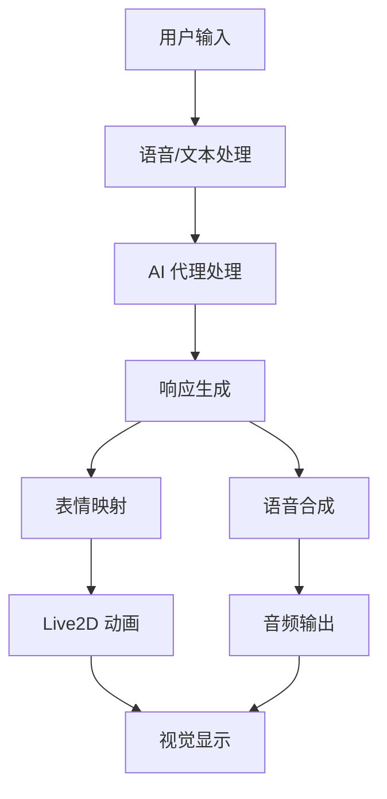
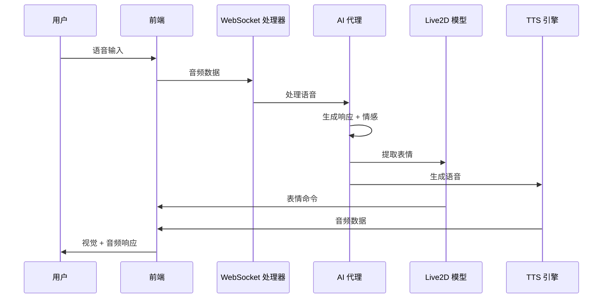

# Open-LLM-VTuber: 架构分析与扩展指南

## 目录
1. [项目概述](#项目概述)
2. [快速开始：使用 Ollama 配置](#快速开始使用-ollama-配置-open-llm-vtuber)
3. [核心架构](#核心架构)
4. [系统组件深入分析](#系统组件深入分析)
5. [数据流分析](#数据流分析)
6. [扩展点与实现策略](#扩展点与实现策略)
7. [构建个人虚拟朋友系统](#构建个人虚拟朋友系统)
8. [实现路线图](#实现路线图)
9. [最佳实践与注意事项](#最佳实践与注意事项)

---

## 项目概述

### 什么是 Open-LLM-VTuber？

Open-LLM-VTuber 是一个复杂的**语音交互 AI 伴侣**，结合了：
- **实时语音对话**，配备先进的 ASR/TTS
- **视觉感知**，通过摄像头和屏幕捕获
- **Live2D 动画角色**，具有动态表情
- **跨平台兼容性**（Windows、macOS、Linux）
- **离线功能**，支持本地模型

### 关键功能分析



**核心能力：**
- 🎤 **语音交互**：支持打断、噪音处理
- 👁️ **视觉感知**：摄像头、屏幕录制、截图
- 😊 **情感表达**：Live2D 面部表情与情感映射
- 🧠 **AI 后端**：多种 LLM 支持（OpenAI、Claude、Ollama 等）
- 🔊 **语音合成**：15+ TTS 选项，包括语音克隆
- 💾 **记忆持久化**：聊天历史和对话连续性

---

## 核心架构

### 项目结构分析
```
Open-LLM-VTuber/
├── src/open_llm_vtuber/           # 核心 Python 后端
│   ├── agent/                     # AI 代理实现
│   ├── asr/                       # 语音识别模块
│   ├── tts/                       # 文本转语音模块
│   ├── conversations/             # 对话管理
│   └── live2d_model.py           # 角色动画系统
├── frontend/                      # Web 界面
├── characters/                    # 角色配置文件
├── live2d-models/                # 3D 角色资源
├── prompts/                      # 系统提示词
└── conf.yaml                     # 主配置文件
```

### 技术栈

**后端框架：**
- **FastAPI**：现代异步 Web 框架
- **WebSocket**：实时通信
- **Python 3.10+**：核心运行环境

**AI 与 ML 组件：**
- **多 LLM 支持**：OpenAI、Claude、Ollama 等
- **ASR 引擎**：Whisper、Sherpa-ONNX、FunASR
- **TTS 引擎**：Edge TTS、Azure TTS、GPT-SoVITS
- **语音处理**：ONNX Runtime 实时处理

**前端技术：**
- **Live2D SDK**：2D 角色动画
- **WebGL**：硬件加速渲染
- **Web Audio API**：实时音频处理

---

## 快速开始：使用 Ollama 配置 Open-LLM-VTuber

### 前置条件

在使用 Ollama 配置 Open-LLM-VTuber 之前，请确保您已安装：

1. **Ollama** 已安装在您的系统上
2. **Python 3.10+** 已安装
3. **Open-LLM-VTuber 项目** 已克隆到本地

### 步骤 1：安装和设置 Ollama

#### 安装 Ollama
```bash
# macOS（使用 Homebrew）
brew install ollama

# Linux
curl -fsSL https://ollama.com/install.sh | sh

# Windows - 从 https://ollama.com/download 下载
```

#### 启动 Ollama 服务
```bash
# 启动 Ollama 服务（默认运行在 localhost:11434）
ollama serve
```

#### 下载模型
```bash
# 下载并安装模型（推荐模型）
ollama pull llama2:latest          # 适合一般对话
ollama pull qwen2.5:latest         # 适合多语言支持
ollama pull llama3.2:latest        # 最新的 LLaMA 模型
ollama pull mistral:latest         # 快速高效

# 验证模型已安装
ollama list
```

### 步骤 2：配置 Open-LLM-VTuber

#### 主配置文件：`conf.yaml`

在 `conf.yaml` 中需要进行的关键配置更改：

```yaml
# conf.yaml - Ollama 配置的关键部分

character_config:
  agent_config:
    conversation_agent_choice: 'basic_memory_agent'
    
    agent_settings:
      basic_memory_agent:
        # 设置 Ollama 作为 LLM 提供者
        llm_provider: 'ollama_llm'
        faster_first_response: True
        segment_method: 'pysbd'
        use_mcpp: True  # 启用 MCP 工具使用
        mcp_enabled_servers: ["time", "ddg-search"]

    llm_configs:
      ollama_llm:
        base_url: 'http://localhost:11434/v1'     # 默认 Ollama API 端点
        model: 'llama2:latest'                    # 更改为您偏好的模型
        temperature: 1.0                          # 创造性水平（0-2）
        keep_alive: -1                           # 保持模型在内存中（-1 = 永远）
        unload_at_exit: True                     # 关闭时卸载模型
```

#### 配置选项说明

| 参数 | 描述 | 推荐值 |
|------|------|--------|
| `base_url` | Ollama API 端点 | `http://localhost:11434/v1` |
| `model` | 来自 `ollama list` 的模型名称 | `llama2:latest`、`qwen2.5:latest`、`mistral:latest` |
| `temperature` | 响应创造性（0-2） | `0.7`（专注）到 `1.2`（创造性） |
| `keep_alive` | 内存保留时间 | `-1`（始终）、`300`（5分钟）、`0`（立即卸载） |
| `unload_at_exit` | 退出时自动卸载 | `True`（推荐） |

### 步骤 3：模型选择指南

#### 按用例推荐的模型

**英语对话：**
```bash
ollama pull llama3.2:latest      # 最佳整体性能
ollama pull mistral:latest       # 快速高效
ollama pull llama2:7b           # 平衡性能
```

**多语言支持（英语 + 中文 + 其他）：**
```bash
ollama pull qwen2.5:latest      # 优秀的多语言支持
ollama pull qwen2.5:14b         # 更好的质量，需要更多内存
```

**编程/技术讨论：**
```bash
ollama pull codellama:latest    # 专注代码的模型
ollama pull deepseek-coder      # 高级编程能力
```

#### 按模型的配置示例

**基础英语设置（llama2）：**
```yaml
ollama_llm:
  base_url: 'http://localhost:11434/v1'
  model: 'llama2:latest'
  temperature: 0.8
  keep_alive: 600  # 10分钟
  unload_at_exit: True
```

**多语言设置（qwen2.5）：**
```yaml
ollama_llm:
  base_url: 'http://localhost:11434/v1'
  model: 'qwen2.5:latest'
  temperature: 0.7
  keep_alive: -1   # 保持加载
  unload_at_exit: True
```

**高性能设置（大型模型）：**
```yaml
ollama_llm:
  base_url: 'http://localhost:11434/v1'
  model: 'qwen2.5:14b'
  temperature: 0.9
  keep_alive: 300  # 5分钟（大型模型使用更多内存）
  unload_at_exit: True
```

### 步骤 4：运行项目

#### 方法 1：直接 Python 执行
```bash
# 导航到项目目录
cd /path/to/Open-LLM-VTuber

# 安装依赖（仅首次）
pip install -r requirements.txt
# 或使用 uv（推荐）
uv sync

# 启动 Ollama 服务（在单独的终端中）
ollama serve

# 运行 Open-LLM-VTuber
python run_server.py
# 或使用 uv

(pkill -f run_server.py)
uv run python run_server.py
```

#### 方法 2：使用 UV（推荐）
```bash
# 如果尚未安装 uv，请安装
curl -LsSf https://astral.sh/uv/install.sh | sh

# 导航到项目目录
cd /path/to/Open-LLM-VTuber

# 安装依赖
uv sync

# 启动应用程序
uv run python run_server.py
```

### Windows 环境
```
  Configuration Files to Modify:

  1. Main Configuration File

  - File: config_templates/conf.default.yaml → copy to root as conf.yaml
  - Key sections to configure:
    - Lines 61, 129-137: Ollama LLM configuration
    - Lines 61: Set llm_provider: 'ollama_llm'
    - Lines 129-137: Configure Ollama settings (base_url, model, temperature)

  2. Python Environment Files

  - File: requirements.txt (dependencies list)
  - File: pyproject.toml (project configuration)

  How to Configure and Run Successfully:

  1. Install Ollama on Windows

  Download and install Ollama from https://ollama.com/download
  Pull a model (e.g., qwen2.5)
  ollama pull qwen2.5:latest

  2. Python Environment Setup (Windows)

  Install Python 3.11+ 
  Create virtual environment
  python -m venv venv
  venv\Scripts\activate

  Install dependencies
  pip install -r requirements.txt

  3. Configure Ollama in conf.yaml

  Copy conf.default.yaml to conf.yaml, then edit:
  llm_provider: 'ollama_llm'

  ollama_llm:
    base_url: 'http://localhost:11434/v1'  # Default Ollama API URL
    model: 'qwen2.5:latest'                # Your downloaded model
    temperature: 1.0
    keep_alive: -1                         # Keep model loaded
    unload_at_exit: True

  4. Run the Project

  python run_server.py
  Access at http://localhost:12393

  Key Files: conf.yaml (main config), requirements.txt (Python deps), and ensure Ollama is running
  on port 11434.
 ``` 
### 步骤 5：访问应用程序

运行后，在以下地址访问应用程序：
- **Web 界面**：`http://localhost:12393`
- **API 文档**：`http://localhost:12393/docs`

### 步骤 6：常见问题故障排除

#### 问题 1："无法连接到 Ollama 后端"
**原因**：Ollama 服务未运行
**解决方案**：
```bash
# 启动 Ollama 服务
ollama serve

# 验证是否运行
curl http://localhost:11434/api/tags
```

#### 问题 2："找不到模型"
**原因**：模型未下载
**解决方案**：
```bash
# 检查可用模型
ollama list

# 下载 conf.yaml 中指定的模型
ollama pull llama2:latest
```

#### 问题 3：响应缓慢
**原因**：模型未加载到内存中
**解决方案**：
- 在配置中设置 `keep_alive: -1`
- 使用较小的模型（`llama2:7b` 而不是 `llama2:13b`）
- 确保有足够的 RAM 可用

#### 问题 4：内存使用率高
**解决方案**：
- 使用较小的模型
- 设置 `keep_alive: 0` 立即卸载
- 设置 `keep_alive: 300` 保留5分钟

### 步骤 7：性能优化

#### 内存管理
```yaml
# 对于内存有限的系统（<16GB）
ollama_llm:
  model: 'llama2:7b'    # 较小的模型
  keep_alive: 300       # 5分钟后卸载
  unload_at_exit: True

# 对于内存充足的系统（>16GB）
ollama_llm:
  model: 'qwen2.5:14b'  # 更大、更好的模型
  keep_alive: -1        # 保持在内存中
  unload_at_exit: False # 在会话之间保持加载
```

#### 响应速度优化
```yaml
# 启用更快的首次响应
agent_settings:
  basic_memory_agent:
    faster_first_response: True    # 在第一个逗号处开始说话
    segment_method: 'pysbd'        # 更好的句子分割
```

### 步骤 8：高级配置

#### 自定义模型参数
如果您需要向 Ollama 模型传递自定义参数，可以修改以下文件中的 `OllamaLLM` 类：
`src/open_llm_vtuber/agent/stateless_llm/ollama_llm.py`

#### 多模型支持
您可以为不同角色配置多个 Ollama 模型：

```yaml
# 在 conf.yaml 中
llm_configs:
  ollama_casual:
    base_url: 'http://localhost:11434/v1'
    model: 'llama2:latest'
    temperature: 1.2  # 更有创造性

  ollama_professional:
    base_url: 'http://localhost:11434/v1'  
    model: 'qwen2.5:latest'
    temperature: 0.5  # 更专注
```

然后在角色文件中引用不同的配置：
```yaml
# characters/casual_friend.yaml
character_config:
  agent_config:
    agent_settings:
      basic_memory_agent:
        llm_provider: 'ollama_casual'

# characters/professional_assistant.yaml  
character_config:
  agent_config:
    agent_settings:
      basic_memory_agent:
        llm_provider: 'ollama_professional'
```

### 完整工作示例

以下是 Ollama 的完整 `conf.yaml` 部分：

```yaml
system_config:
  conf_version: 'v1.2.0'
  host: 'localhost'
  port: 12393

character_config:
  conf_name: 'mao_pro'
  conf_uid: 'mao_pro_001'
  live2d_model_name: 'mao_pro'
  character_name: 'Mao'
  human_name: 'Human'
  
  persona_prompt: |
    你是 Mao，一个友好且乐于助人的 AI 伴侣。你开朗、好奇，总是渴望学习并与人类聊天。
    你喜欢帮助回答问题并进行有趣的对话。你说话温暖且引人入胜。

  agent_config:
    conversation_agent_choice: 'basic_memory_agent'
    
    agent_settings:
      basic_memory_agent:
        llm_provider: 'ollama_llm'
        faster_first_response: True
        segment_method: 'pysbd'
        use_mcpp: True
        mcp_enabled_servers: ["time", "ddg-search"]

    llm_configs:
      ollama_llm:
        base_url: 'http://localhost:11434/v1'
        model: 'llama2:latest'
        temperature: 0.8
        keep_alive: -1
        unload_at_exit: True

  # TTS 配置（选择一个）
  tts_config:
    tts_model: 'edge_tts'  # 免费选项
    # 或
    # tts_model: 'openai_tts'  # 更高质量，需要 API 密钥

  # ASR 配置  
  asr_config:
    asr_model: 'faster_whisper'
    faster_whisper:
      model_path: 'tiny'
      language: 'zh'  # 中文支持
      device: 'auto'
```

此配置提供了一个完整的工作设置，使用 Ollama 作为 LLM 后端，使您能够完全离线运行 Open-LLM-VTuber 与本地模型。

---

## 系统组件深入分析

### 1. 角色系统架构

#### Live2D 模型结构 (`live2d_model.py:28-144`)

```python
class Live2dModel:
    def __init__(self, live2d_model_name: str, model_dict_path: str):
        self.model_dict_path = model_dict_path
        self.live2d_model_name = live2d_model_name
        self.model_info = {}      # 模型配置
        self.emo_map = {}         # 情感到表情的映射
        self.emo_str = ""         # 可用的情感关键词
```

**关键组件：**
- **模型字典** (`model_dict.json`)：所有 Live2D 模型的中央注册表
- **表情映射**：将情感链接到面部表情
- **动作系统**：空闲动画和交互响应

#### 角色配置系统

```yaml
# characters/example.yaml
character_config:
  conf_name: "角色名称"
  conf_uid: "唯一标识符"
  live2d_model_name: "模型引用"
  persona_prompt: |
    角色个性和行为描述
```

**配置层次结构：**
1. **系统配置** (`conf.yaml`)：全局设置
2. **角色配置** (`characters/*.yaml`)：角色特定覆盖
3. **模型配置** (`model_dict.json`)：视觉外观设置

### 2. 情感与表情引擎

#### 表情检测算法 (`live2d_model.py:146-172`)

```python
def extract_emotion(self, str_to_check: str) -> list:
    """从文本中提取情感关键词并返回表情索引"""
    expression_list = []
    str_to_check = str_to_check.lower()
    
    # 解析情感标签，如 [joy]、[anger]、[sadness]
    for key in self.emo_map.keys():
        emo_tag = f"[{key}]"
        if emo_tag in str_to_check:
            expression_list.append(self.emo_map[key])
    
    return expression_list
```

**情感系统功能：**
- **基于标签的检测**：AI 响应中的 `[emotion]` 关键词
- **多情感支持**：每个响应多个表情
- **动态映射**：可配置的情感到表情关系

#### 表情映射示例

```json
// model_dict.json
"emotionMap": {
    "neutral": 0,    // 默认表情
    "anger": 2,      // 表情文件 exp_02.exp3.json
    "joy": 3,        // 表情文件 exp_03.exp3.json
    "sadness": 1,    // 表情文件 exp_01.exp3.json
    "surprise": 3    // 重用喜悦表情
}
```

### 3. AI 代理架构

#### 代理接口设计 (`agent/agents/agent_interface.py`)

```python
class AgentInterface(ABC):
    @abstractmethod
    async def generate_response(self, message: str, **kwargs) -> str:
        """从用户输入生成 AI 响应"""
        pass
    
    @abstractmethod
    def get_memory_summary(self) -> str:
        """返回对话上下文"""
        pass
```

**可用代理类型：**
- **基础记忆代理**：简单对话历史
- **无状态 LLM**：无记忆，纯输入输出
- **Letta 代理**：高级记忆管理
- **Hume AI**：情感智能集成

#### 记忆管理系统

```python
# agent/agents/basic_memory_agent.py
class BasicMemoryAgent:
    def __init__(self):
        self.conversation_history = []
        self.memory_limit = 10  # 最后 N 次交换
        
    def add_to_memory(self, human_input: str, ai_response: str):
        """存储对话以获取上下文"""
        self.conversation_history.append({
            'human': human_input,
            'ai': ai_response,
            'timestamp': datetime.now()
        })
```

### 4. 语音处理管道

#### ASR（自动语音识别）系统

**支持的引擎** (`asr/` 目录)：
- **Whisper**：OpenAI 的语音识别
- **Sherpa-ONNX**：离线实时 ASR
- **Azure Speech**：基于云的识别
- **FunASR**：中文语言优化

#### TTS（文本转语音）架构 (`tts/tts_interface.py:8-41`)

```python
class TTSInterface(metaclass=abc.ABCMeta):
    async def async_generate_audio(self, text: str) -> str:
        """从文本生成音频文件"""
        return await asyncio.to_thread(self.generate_audio, text)
    
    @abstractmethod
    def generate_audio(self, text: str) -> str:
        """同步音频生成"""
        raise NotImplementedError
```

**TTS 引擎选项：**
- **Edge TTS**：微软的在线 TTS
- **GPT-SoVITS**：语音克隆功能
- **Azure TTS**：企业级合成
- **Coqui TTS**：开源神经 TTS

### 5. 前端集成

#### WebSocket 通信模式

```javascript
// 前端 WebSocket 处理
const ws = new WebSocket('ws://localhost:12393/ws');

ws.onmessage = (event) => {
    const data = JSON.parse(event.data);
    
    switch(data.type) {
        case 'expression':
            // 更新 Live2D 面部表情
            live2dModel.setExpression(data.expression_id);
            break;
        case 'audio':
            // 播放 TTS 音频
            playAudioFromBase64(data.audio_data);
            break;
        case 'message':
            // 显示文本消息
            updateChatDisplay(data.content);
            break;
    }
};
```

---

## 数据流分析

### 完整交互流程



### 配置加载过程

1. **系统初始化** (`conf.yaml`)
2. **角色加载** (`characters/*.yaml`)
3. **模型注册** (`model_dict.json`)
4. **代理实例化**（基于配置）
5. **服务上下文创建**（依赖注入）

### 记忆与状态管理

```python
# conversations/conversation_handler.py
class ConversationHandler:
    def __init__(self):
        self.active_conversations = {}
        self.chat_history_manager = ChatHistoryManager()
        
    async def handle_message(self, user_id: str, message: str):
        """通过完整管道处理用户消息"""
        conversation = self.get_or_create_conversation(user_id)
        
        # 生成带有情感提取的 AI 响应
        response = await conversation.agent.generate_response(message)
        
        # 为 Live2D 提取表情
        expressions = conversation.live2d_model.extract_emotion(response)
        
        # 生成音频
        audio_path = await conversation.tts.async_generate_audio(response)
        
        # 保存到历史
        self.chat_history_manager.save_exchange(user_id, message, response)
        
        return {
            'text': response,
            'expressions': expressions,
            'audio': audio_path
        }
```

---

## 扩展点与实现策略

### 1. 角色定制扩展

#### 增强角色档案系统

```yaml
# 增强角色配置
character_config:
  # 基本身份
  conf_name: "我的虚拟朋友"
  conf_uid: "friend_001"
  
  # 个性矩阵
  personality_traits:
    extraversion: 0.8      # 0.0（内向）到 1.0（外向）
    agreeableness: 0.9     # 0.0（竞争性）到 1.0（合作性）
    conscientiousness: 0.7 # 0.0（自发性）到 1.0（纪律性）
    neuroticism: 0.3       # 0.0（冷静）到 1.0（焦虑）
    openness: 0.8          # 0.0（传统）到 1.0（创造性）
  
  # 关系动态
  relationship_config:
    relationship_type: "close_friend"  # acquaintance, friend, close_friend, romantic
    intimacy_level: 0.6               # 影响对话深度
    familiarity_growth_rate: 0.1      # 关系发展速度
    
  # 行为模式
  behavioral_patterns:
    response_style: "warm_supportive"  # formal, casual, warm_supportive, playful
    humor_level: 0.7                  # 幽默感水平
    curiosity_level: 0.8              # 提问和探索倾向
    empathy_sensitivity: 0.9          # 情感敏感度
```

#### 实现个性化响应系统

```python
# 扩展：personality_engine.py
class PersonalityEngine:
    def __init__(self, personality_config: dict):
        self.traits = personality_config['personality_traits']
        self.relationship = personality_config['relationship_config']
        self.behaviors = personality_config['behavioral_patterns']
    
    def adjust_response_tone(self, base_response: str) -> str:
        """根据个性特征调整响应语调"""
        if self.traits['extraversion'] > 0.7:
            # 更外向的响应
            base_response = self._add_enthusiasm(base_response)
        
        if self.behaviors['humor_level'] > 0.6:
            # 添加适当的幽默
            base_response = self._inject_humor(base_response)
            
        return base_response
    
    def generate_proactive_message(self) -> str:
        """基于个性生成主动消息"""
        if self.traits['openness'] > 0.8 and random.random() < 0.3:
            return self._generate_curious_question()
        elif self.relationship['intimacy_level'] > 0.7:
            return self._generate_caring_check_in()
        return None
```

### 2. 高级记忆系统

#### 长期记忆实现

```python
# 扩展：advanced_memory.py
class AdvancedMemorySystem:
    def __init__(self):
        self.episodic_memory = []      # 具体事件记忆
        self.semantic_memory = {}      # 概念和事实记忆
        self.emotional_memory = {}     # 情感关联记忆
        self.preference_memory = {}    # 用户偏好记忆
    
    def store_interaction(self, interaction_data: dict):
        """存储交互到多个记忆系统"""
        # 情节记忆
        self.episodic_memory.append({
            'timestamp': datetime.now(),
            'content': interaction_data['content'],
            'emotion': interaction_data['detected_emotion'],
            'context': interaction_data['context']
        })
        
        # 提取并存储偏好
        preferences = self._extract_preferences(interaction_data)
        self.preference_memory.update(preferences)
        
        # 情感记忆关联
        self._update_emotional_associations(interaction_data)
    
    def retrieve_relevant_context(self, current_input: str) -> dict:
        """检索相关上下文信息"""
        # 语义相似性搜索
        relevant_episodes = self._semantic_search(current_input)
        
        # 情感上下文
        emotional_context = self._get_emotional_context(current_input)
        
        # 用户偏好
        relevant_preferences = self._get_relevant_preferences(current_input)
        
        return {
            'episodes': relevant_episodes,
            'emotions': emotional_context,
            'preferences': relevant_preferences
        }
```

### 3. 多模态感知扩展

#### 视觉理解集成

```python
# 扩展：vision_processor.py
class VisionProcessor:
    def __init__(self):
        self.vision_model = self._load_vision_model()
        self.scene_memory = []
    
    async def process_visual_input(self, image_data: bytes) -> dict:
        """处理视觉输入并提取信息"""
        # 场景理解
        scene_description = await self._analyze_scene(image_data)
        
        # 对象检测
        objects = await self._detect_objects(image_data)
        
        # 情感分析（面部表情）
        emotions = await self._analyze_facial_emotions(image_data)
        
        # 文本识别（OCR）
        text_content = await self._extract_text(image_data)
        
        visual_context = {
            'scene': scene_description,
            'objects': objects,
            'emotions': emotions,
            'text': text_content,
            'timestamp': datetime.now()
        }
        
        # 存储到场景记忆
        self.scene_memory.append(visual_context)
        
        return visual_context
    
    def generate_visual_response(self, visual_context: dict) -> str:
        """基于视觉上下文生成响应"""
        if visual_context['emotions']:
            return self._respond_to_emotions(visual_context['emotions'])
        elif visual_context['text']:
            return self._respond_to_text_content(visual_context['text'])
        else:
            return self._respond_to_scene(visual_context['scene'])
```

### 4. 情感智能增强

#### 情感状态跟踪

```python
# 扩展：emotion_tracker.py
class EmotionTracker:
    def __init__(self):
        self.emotion_history = []
        self.current_mood = 'neutral'
        self.mood_stability = 0.7  # 情绪稳定性
    
    def update_emotion_state(self, detected_emotions: list, user_input: str):
        """更新情感状态"""
        # 分析用户情感
        user_emotion = self._analyze_user_emotion(user_input)
        
        # 更新情感历史
        emotion_entry = {
            'timestamp': datetime.now(),
            'user_emotion': user_emotion,
            'ai_emotions': detected_emotions,
            'context': user_input[:100]  # 上下文片段
        }
        self.emotion_history.append(emotion_entry)
        
        # 更新当前情绪
        self._update_current_mood(user_emotion)
    
    def generate_empathetic_response(self, base_response: str) -> str:
        """生成共情响应"""
        if self.current_mood == 'sad':
            return self._add_comfort_elements(base_response)
        elif self.current_mood == 'excited':
            return self._add_enthusiasm_elements(base_response)
        elif self.current_mood == 'anxious':
            return self._add_reassurance_elements(base_response)
        
        return base_response
    
    def suggest_mood_improvement(self) -> str:
        """建议改善情绪的活动"""
        if self.current_mood in ['sad', 'anxious', 'stressed']:
            suggestions = [
                "要不要听一些轻松的音乐？",
                "我们可以聊聊你喜欢的话题",
                "要不要做一些深呼吸练习？"
            ]
            return random.choice(suggestions)
        return None
```

### 5. 工具集成系统

#### MCP（模型控制协议）扩展

```python
# 扩展：tool_integration.py
class ToolIntegrationSystem:
    def __init__(self):
        self.available_tools = {}
        self.tool_usage_history = []
    
    def register_tool(self, tool_name: str, tool_config: dict):
        """注册新工具"""
        self.available_tools[tool_name] = {
            'config': tool_config,
            'usage_count': 0,
            'success_rate': 1.0
        }
    
    async def execute_tool(self, tool_name: str, parameters: dict) -> dict:
        """执行工具并跟踪结果"""
        if tool_name not in self.available_tools:
            return {'error': f'Tool {tool_name} not found'}
        
        try:
            # 执行工具
            result = await self._execute_tool_safely(tool_name, parameters)
            
            # 更新使用统计
            self.available_tools[tool_name]['usage_count'] += 1
            
            # 记录使用历史
            self.tool_usage_history.append({
                'tool': tool_name,
                'parameters': parameters,
                'result': result,
                'timestamp': datetime.now(),
                'success': True
            })
            
            return result
            
        except Exception as e:
            # 更新失败率
            self._update_failure_rate(tool_name)
            
            return {'error': str(e)}
    
    def suggest_relevant_tools(self, user_input: str) -> list:
        """基于用户输入建议相关工具"""
        relevant_tools = []
        
        # 关键词匹配
        if '天气' in user_input or 'weather' in user_input.lower():
            relevant_tools.append('weather_tool')
        
        if '时间' in user_input or 'time' in user_input.lower():
            relevant_tools.append('time_tool')
        
        if '搜索' in user_input or 'search' in user_input.lower():
            relevant_tools.append('web_search_tool')
        
        return relevant_tools
```

---

## 构建个人虚拟朋友系统

### 系统设计理念

构建一个真正的虚拟朋友系统需要超越简单的问答机制，创造一个能够：
- **理解和记住**用户的个人信息、偏好和历史
- **主动关心**用户的情感状态和日常生活
- **个性化互动**根据关系发展调整交流方式
- **提供情感支持**在用户需要时给予安慰和鼓励

### 核心功能实现

#### 1. 个人档案管理系统

```python
# 扩展：personal_profile.py
class PersonalProfileManager:
    def __init__(self, user_id: str):
        self.user_id = user_id
        self.profile = self._load_or_create_profile()
    
    def _load_or_create_profile(self) -> dict:
        """加载或创建用户档案"""
        return {
            'basic_info': {
                'name': None,
                'age': None,
                'occupation': None,
                'location': None
            },
            'interests': [],
            'preferences': {
                'communication_style': 'casual',
                'topics_of_interest': [],
                'sensitive_topics': []
            },
            'important_dates': {},  # 生日、纪念日等
            'relationships': {},     # 家人、朋友信息
            'goals_and_aspirations': [],
            'current_challenges': [],
            'personality_insights': {}
        }
    
    def update_profile_from_conversation(self, conversation_text: str):
        """从对话中提取并更新档案信息"""
        # 使用 NLP 提取个人信息
        extracted_info = self._extract_personal_info(conversation_text)
        
        # 更新档案
        for category, info in extracted_info.items():
            if category in self.profile:
                self.profile[category].update(info)
        
        # 保存更新
        self._save_profile()
    
    def get_personalized_context(self) -> str:
        """生成个性化上下文信息"""
        context_parts = []
        
        if self.profile['basic_info']['name']:
            context_parts.append(f"用户名字是 {self.profile['basic_info']['name']}")
        
        if self.profile['interests']:
            interests = ', '.join(self.profile['interests'][:3])
            context_parts.append(f"用户感兴趣的话题包括：{interests}")
        
        if self.profile['current_challenges']:
            challenges = ', '.join(self.profile['current_challenges'][:2])
            context_parts.append(f"用户目前面临的挑战：{challenges}")
        
        return '\n'.join(context_parts)
```

#### 2. 主动关怀系统

```python
# 扩展：proactive_care.py
class ProactiveCareSystem:
    def __init__(self, profile_manager: PersonalProfileManager):
        self.profile_manager = profile_manager
        self.care_scheduler = CareScheduler()
        self.last_interaction = None
    
    async def check_for_care_opportunities(self) -> Optional[str]:
        """检查是否有关怀机会"""
        current_time = datetime.now()
        
        # 检查重要日期
        care_message = self._check_important_dates(current_time)
        if care_message:
            return care_message
        
        # 检查长时间未联系
        if self._should_check_in(current_time):
            return self._generate_check_in_message()
        
        # 检查用户挑战的跟进
        follow_up = self._check_challenge_follow_up()
        if follow_up:
            return follow_up
        
        return None
    
    def _generate_check_in_message(self) -> str:
        """生成关怀问候消息"""
        messages = [
            "嗨！最近怎么样？有什么新鲜事吗？",
            "想起你了，今天过得如何？",
            "好久没聊天了，一切都好吗？"
        ]
        
        # 根据用户档案个性化
        if self.profile_manager.profile['current_challenges']:
            messages.extend([
                "最近那个挑战处理得怎么样了？",
                "还在为之前提到的事情烦恼吗？"
            ])
        
        return random.choice(messages)
    
    def _check_important_dates(self, current_time: datetime) -> Optional[str]:
        """检查重要日期"""
        important_dates = self.profile_manager.profile['important_dates']
        
        for event, date_str in important_dates.items():
            event_date = datetime.strptime(date_str, '%Y-%m-%d')
            if self._is_date_approaching(current_time, event_date):
                return f"记得 {event} 快到了！有什么特别的计划吗？"
        
        return None
```

#### 3. 情感支持系统

```python
# 扩展：emotional_support.py
class EmotionalSupportSystem:
    def __init__(self):
        self.support_strategies = {
            'sadness': ['validation', 'comfort', 'distraction'],
            'anxiety': ['reassurance', 'breathing_exercises', 'grounding'],
            'anger': ['validation', 'cooling_down', 'problem_solving'],
            'stress': ['relaxation', 'prioritization', 'support_resources']
        }
    
    def provide_emotional_support(self, detected_emotion: str, context: str) -> str:
        """提供情感支持"""
        if detected_emotion not in self.support_strategies:
            return self._provide_general_support()
        
        strategies = self.support_strategies[detected_emotion]
        chosen_strategy = random.choice(strategies)
        
        return self._apply_support_strategy(chosen_strategy, detected_emotion, context)
    
    def _apply_support_strategy(self, strategy: str, emotion: str, context: str) -> str:
        """应用支持策略"""
        if strategy == 'validation':
            return self._provide_validation(emotion, context)
        elif strategy == 'comfort':
            return self._provide_comfort()
        elif strategy == 'breathing_exercises':
            return self._suggest_breathing_exercise()
        elif strategy == 'grounding':
            return self._suggest_grounding_technique()
        # ... 其他策略
        
        return "我在这里陪着你，有什么需要帮助的吗？"
    
    def _provide_validation(self, emotion: str, context: str) -> str:
        """提供情感验证"""
        validation_responses = {
            'sadness': "感到难过是完全正常的，你的感受很重要。",
            'anxiety': "感到焦虑很不容易，你的担心是可以理解的。",
            'anger': "生气是人之常情，你有权利表达你的感受。"
        }
        
        return validation_responses.get(emotion, "你的感受是真实且重要的。")
```

#### 4. 关系发展系统

```python
# 扩展：relationship_development.py
class RelationshipDevelopmentSystem:
    def __init__(self):
        self.relationship_stages = {
            'stranger': {'intimacy': 0.0, 'trust': 0.0, 'familiarity': 0.0},
            'acquaintance': {'intimacy': 0.2, 'trust': 0.3, 'familiarity': 0.4},
            'friend': {'intimacy': 0.5, 'trust': 0.6, 'familiarity': 0.7},
            'close_friend': {'intimacy': 0.8, 'trust': 0.9, 'familiarity': 0.9},
            'best_friend': {'intimacy': 1.0, 'trust': 1.0, 'familiarity': 1.0}
        }
        
        self.current_relationship = 'stranger'
        self.relationship_metrics = self.relationship_stages['stranger'].copy()
    
    def update_relationship_metrics(self, interaction_data: dict):
        """基于交互更新关系指标"""
        # 分析交互质量
        interaction_quality = self._analyze_interaction_quality(interaction_data)
        
        # 更新指标
        if interaction_quality['personal_sharing']:
            self.relationship_metrics['intimacy'] += 0.05
        
        if interaction_quality['consistent_behavior']:
            self.relationship_metrics['trust'] += 0.03
        
        if interaction_quality['frequency']:
            self.relationship_metrics['familiarity'] += 0.02
        
        # 限制在 0-1 范围内
        for metric in self.relationship_metrics:
            self.relationship_metrics[metric] = min(1.0, self.relationship_metrics[metric])
        
        # 更新关系阶段
        self._update_relationship_stage()
    
    def get_appropriate_response_style(self) -> dict:
        """获取适当的响应风格"""
        stage = self.current_relationship
        
        styles = {
            'stranger': {
                'formality': 0.8,
                'personal_questions': 0.2,
                'humor': 0.3,
                'emotional_depth': 0.2
            },
            'friend': {
                'formality': 0.4,
                'personal_questions': 0.7,
                'humor': 0.8,
                'emotional_depth': 0.6
            },
            'close_friend': {
                'formality': 0.1,
                'personal_questions': 0.9,
                'humor': 0.9,
                'emotional_depth': 0.9
            }
        }
        
        return styles.get(stage, styles['stranger'])
```

### 集成实现示例

```python
# 主系统集成：virtual_friend.py
class VirtualFriendSystem:
    def __init__(self, user_id: str):
        self.user_id = user_id
        self.profile_manager = PersonalProfileManager(user_id)
        self.emotion_tracker = EmotionTracker()
        self.proactive_care = ProactiveCareSystem(self.profile_manager)
        self.emotional_support = EmotionalSupportSystem()
        self.relationship_dev = RelationshipDevelopmentSystem()
        self.memory_system = AdvancedMemorySystem()
    
    async def process_interaction(self, user_input: str) -> dict:
        """处理用户交互的完整流程"""
        # 1. 分析用户输入
        analysis = await self._analyze_user_input(user_input)
        
        # 2. 更新用户档案
        self.profile_manager.update_profile_from_conversation(user_input)
        
        # 3. 更新情感状态
        self.emotion_tracker.update_emotion_state(
            analysis['detected_emotions'], 
            user_input
        )
        
        # 4. 更新关系指标
        self.relationship_dev.update_relationship_metrics({
            'content': user_input,
            'emotion': analysis['detected_emotions'],
            'personal_sharing': analysis['contains_personal_info']
        })
        
        # 5. 生成响应
        base_response = await self._generate_base_response(user_input, analysis)
        
        # 6. 应用个性化和情感支持
        if analysis['needs_emotional_support']:
            response = self.emotional_support.provide_emotional_support(
                analysis['primary_emotion'], 
                user_input
            )
        else:
            response = base_response
        
        # 7. 调整响应风格
        response_style = self.relationship_dev.get_appropriate_response_style()
        final_response = self._adjust_response_style(response, response_style)
        
        # 8. 存储交互
        self.memory_system.store_interaction({
            'user_input': user_input,
            'ai_response': final_response,
            'emotions': analysis['detected_emotions'],
            'context': self.profile_manager.get_personalized_context()
        })
        
        return {
            'response': final_response,
            'emotions': analysis['suggested_expressions'],
            'relationship_stage': self.relationship_dev.current_relationship
        }
    
    async def check_proactive_opportunities(self) -> Optional[str]:
        """检查主动关怀机会"""
        return await self.proactive_care.check_for_care_opportunities()
```

---

## 实现路线图

### 阶段 1：基础设施搭建（1-2 周）

**目标**：建立核心开发环境和基础架构

**任务清单**：
- [ ] 设置开发环境（Python 3.10+, FastAPI, WebSocket）
- [ ] 配置 Ollama 本地 LLM 环境
- [ ] 实现基础的 WebSocket 通信
- [ ] 创建简单的前端界面
- [ ] 建立基础的配置管理系统

**技术重点**：
```python
# 基础服务器设置
from fastapi import FastAPI, WebSocket
from fastapi.staticfiles import StaticFiles

app = FastAPI()
app.mount("/static", StaticFiles(directory="frontend"), name="static")

@app.websocket("/ws")
async def websocket_endpoint(websocket: WebSocket):
    await websocket.accept()
    # 基础消息处理逻辑
```

**验收标准**：
- 能够启动服务器并访问 Web 界面
- WebSocket 连接正常工作
- Ollama 集成成功，能够生成基础响应

### 阶段 2：核心对话功能（2-3 周）

**目标**：实现基本的语音对话功能

**任务清单**：
- [ ] 集成 ASR（语音识别）系统
- [ ] 集成 TTS（文本转语音）系统
- [ ] 实现基础的对话代理
- [ ] 添加简单的记忆管理
- [ ] 实现 Live2D 角色显示

**技术重点**：
```python
# 对话处理流程
class ConversationHandler:
    async def process_voice_input(self, audio_data: bytes) -> dict:
        # 1. 语音转文本
        text = await self.asr.transcribe(audio_data)
        
        # 2. 生成 AI 响应
        response = await self.agent.generate_response(text)
        
        # 3. 文本转语音
        audio_path = await self.tts.generate_audio(response)
        
        return {'text': response, 'audio': audio_path}
```

**验收标准**：
- 用户可以通过语音与 AI 对话
- AI 能够生成语音回复
- Live2D 角色能够正常显示
- 基础的对话记忆功能工作正常

### 阶段 3：表情与情感系统（2-3 周）

**目标**：实现情感识别和表情动画

**任务清单**：
- [ ] 实现情感检测算法
- [ ] 建立表情映射系统
- [ ] 集成 Live2D 表情控制
- [ ] 添加情感状态跟踪
- [ ] 实现情感响应生成

**技术重点**：
```python
# 情感处理系统
class EmotionProcessor:
    def extract_emotions(self, text: str) -> list:
        # 检测情感标签 [joy], [sadness] 等
        emotions = re.findall(r'\[(\w+)\]', text.lower())
        return [self.emotion_map.get(e, 0) for e in emotions]
    
    def generate_emotional_response(self, user_emotion: str, context: str) -> str:
        # 基于用户情感生成适当响应
        return self.emotion_response_templates[user_emotion].format(context=context)
```

**验收标准**：
- AI 能够识别用户情感
- Live2D 角色能够显示相应表情
- 情感状态能够影响对话内容
- 表情变化自然流畅

### 阶段 4：个性化系统（3-4 周）

**目标**：实现个性化交互和用户档案管理

**任务清单**：
- [ ] 建立用户档案系统
- [ ] 实现个性化响应生成
- [ ] 添加兴趣和偏好学习
- [ ] 实现关系发展跟踪
- [ ] 建立个性化记忆系统

**技术重点**：
```python
# 个性化系统
class PersonalizationEngine:
    def __init__(self, user_id: str
### 技术栈

**后端框架：**
- **FastAPI**：现代异步 Web 框架
- **WebSocket**：实时通信
- **Python 3.10+**：核心运行环境

**AI 与 ML 组件：**
- **多 LLM 支持**：OpenAI、Claude、Ollama 等
- **ASR 引擎**：Whisper、Sherpa-ONNX、FunASR
- **TTS 引擎**：Edge TTS、Azure TTS、GPT-SoVITS
- **语音处理**：ONNX Runtime 实时处理

**前端技术：**
- **Live2D SDK**：2D 角色动画
- **WebGL**：硬件加速渲染
- **Web Audio API**：实时音频处理

---

## 快速开始：使用 Ollama 配置 Open-LLM-VTuber

### 前置条件

在使用 Ollama 配置 Open-LLM-VTuber 之前，请确保您已：

1. **安装 Ollama** 到您的系统
2. **安装 Python 3.10+**
3. **本地克隆 Open-LLM-VTuber 项目**

### 步骤 1：安装和设置 Ollama

#### 安装 Ollama
```bash
# macOS（使用 Homebrew）
brew install ollama

# Linux
curl -fsSL https://ollama.com/install.sh | sh

# Windows - 从 https://ollama.com/download 下载
```

#### 启动 Ollama 服务
```bash
# 启动 Ollama 服务（默认运行在 localhost:11434）
ollama serve
```

#### 下载模型
```bash
# 下载并安装模型（推荐模型）
ollama pull llama2:latest          # 适合一般对话
ollama pull qwen2.5:latest         # 适合多语言支持
ollama pull llama3.2:latest        # 最新 LLaMA 模型
ollama pull mistral:latest         # 快速高效

# 验证模型已安装
ollama list
```

### 步骤 2：配置 Open-LLM-VTuber

#### 主配置文件：`conf.yaml`

在 `conf.yaml` 中需要进行的关键配置更改：

```yaml
# conf.yaml - Ollama 配置的关键部分

character_config:
  agent_config:
    conversation_agent_choice: 'basic_memory_agent'
    
    agent_settings:
      basic_memory_agent:
        # 设置 Ollama 作为 LLM 提供者
        llm_provider: 'ollama_llm'
        faster_first_response: True
        segment_method: 'pysbd'
        use_mcpp: True  # 启用 MCP 工具使用
        mcp_enabled_servers: ["time", "ddg-search"]

    llm_configs:
      ollama_llm:
        base_url: 'http://localhost:11434/v1'     # 默认 Ollama API 端点
        model: 'llama2:latest'                    # 更改为您偏好的模型
        temperature: 1.0                          # 创造性水平（0-2）
        keep_alive: -1                           # 在内存中保持模型（-1 = 永远）
        unload_at_exit: True                     # 关闭时卸载模型
```

#### 配置选项说明

| 参数 | 描述 | 推荐值 |
|-----------|-------------|-------------------|
| `base_url` | Ollama API 端点 | `http://localhost:11434/v1` |
| `model` | 来自 `ollama list` 的模型名称 | `llama2:latest`, `qwen2.5:latest`, `mistral:latest` |
| `temperature` | 响应创造性（0-2） | `0.7`（专注）到 `1.2`（创造性） |
| `keep_alive` | 内存保留时间 | `-1`（始终）、`300`（5分钟）、`0`（立即卸载） |
| `unload_at_exit` | 退出时自动卸载 | `True`（推荐） |

### 步骤 3：模型选择指南

#### 按用例推荐的模型

**英语对话：**
```bash
ollama pull llama3.2:latest      # 最佳整体性能
ollama pull mistral:latest       # 快速高效
ollama pull llama2:7b           # 平衡性能
```

**多语言支持（英语 + 中文 + 其他）：**
```bash
ollama pull qwen2.5:latest      # 优秀的多语言
ollama pull qwen2.5:14b         # 更好质量，需要更多内存
```

**编程/技术讨论：**
```bash
ollama pull codellama:latest    # 专注代码的模型
ollama pull deepseek-coder      # 高级编程能力
```

#### 按模型的配置示例

**基础英语设置（llama2）：**
```yaml
ollama_llm:
  base_url: 'http://localhost:11434/v1'
  model: 'llama2:latest'
  temperature: 0.8
  keep_alive: 600  # 10 分钟
  unload_at_exit: True
```

**多语言设置（qwen2.5）：**
```yaml
ollama_llm:
  base_url: 'http://localhost:11434/v1'
  model: 'qwen2.5:latest'
  temperature: 0.7
  keep_alive: -1   # 保持加载
  unload_at_exit: True
```

**高性能设置（大型模型）：**
```yaml
ollama_llm:
  base_url: 'http://localhost:11434/v1'
  model: 'qwen2.5:14b'
  temperature: 0.9
  keep_alive: 300  # 5 分钟（大型模型使用更多内存）
  unload_at_exit: True
```

### 步骤 4：运行项目

#### 方法 1：直接 Python 执行
```bash
# 导航到项目目录
cd /path/to/Open-LLM-VTuber

# 安装依赖（仅首次）
pip install -r requirements.txt
# 或使用 uv（推荐）
uv sync

# 启动 Ollama 服务（在单独终端中）
ollama serve

# 运行 Open-LLM-VTuber
python run_server.py
# 或使用 uv
uv run python run_server.py
```

#### 方法 2：使用 UV（推荐）
```bash
# 如果尚未安装 uv，请安装
curl -LsSf https://astral.sh/uv/install.sh | sh

# 导航到项目目录
cd /path/to/Open-LLM-VTuber

# 安装依赖
uv sync

# 启动应用程序
uv run python run_server.py
```

### 步骤 5：访问应用程序

运行后，在以下地址访问应用程序：
- **Web 界面**：`http://localhost:12393`
- **API 文档**：`http://localhost:12393/docs`

### 步骤 6：常见问题故障排除

#### 问题 1："无法连接到 Ollama 后端"
**原因**：Ollama 服务未运行
**解决方案**：
```bash
# 启动 Ollama 服务
ollama serve

# 验证是否运行
curl http://localhost:11434/api/tags
```

#### 问题 2："找不到模型"
**原因**：模型未下载
**解决方案**：
```bash
# 检查可用模型
ollama list

# 下载 conf.yaml 中指定的模型
ollama pull llama2:latest
```

#### 问题 3：响应缓慢
**原因**：模型未加载到内存中
**解决方案**：
- 在配置中设置 `keep_alive: -1`
- 使用较小的模型（`llama2:7b` 而不是 `llama2:13b`）
- 确保有足够的 RAM 可用

#### 问题 4：内存使用率高
**解决方案**：
- 使用较小的模型
- 设置 `keep_alive: 0` 立即卸载
- 设置 `keep_alive: 300` 5分钟保留

### 步骤 7：性能优化

#### 内存管理
```yaml
# 对于内存有限的系统（<16GB）
ollama_llm:
  model: 'llama2:7b'    # 较小模型
  keep_alive: 300       # 5分钟后卸载
  unload_at_exit: True

# 对于内存充足的系统（>16GB）
ollama_llm:
  model: 'qwen2.5:14b'  # 更大、更好的模型
  keep_alive: -1        # 保持在内存中
  unload_at_exit: False # 会话间保持加载
```

#### 响应速度优化
```yaml
# 启用更快的首次响应
agent_settings:
  basic_memory_agent:
    faster_first_response: True    # 在第一个逗号处开始说话
    segment_method: 'pysbd'        # 更好的句子分割
```

### 步骤 8：高级配置

#### 自定义模型参数
如果您需要向 Ollama 模型传递自定义参数，可以修改以下文件中的 `OllamaLLM` 类：
`src/open_llm_vtuber/agent/stateless_llm/ollama_llm.py`

#### 多模型支持
您可以为不同角色配置多个 Ollama 模型：

```yaml
# 在 conf.yaml 中
llm_configs:
  ollama_casual:
    base_url: 'http://localhost:11434/v1'
    model: 'llama2:latest'
    temperature: 1.2  # 更有创造性

  ollama_professional:
    base_url: 'http://localhost:11434/v1'  
    model: 'qwen2.5:latest'
    temperature: 0.5  # 更专注
```

然后在角色文件中引用不同的配置：
```yaml
# characters/casual_friend.yaml
character_config:
  agent_config:
    agent_settings:
      basic_memory_agent:
        llm_provider: 'ollama_casual'

# characters/professional_assistant.yaml  
character_config:
  agent_config:
    agent_settings:
      basic_memory_agent:
        llm_provider: 'ollama_professional'
```

### 完整工作示例

以下是 Ollama 的完整 `conf.yaml` 部分：

```yaml
system_config:
  conf_version: 'v1.2.0'
  host: 'localhost'
  port: 12393

character_config:
  conf_name: 'mao_pro'
  conf_uid: 'mao_pro_001'
  live2d_model_name: 'mao_pro'
  character_name: 'Mao'
  human_name: 'Human'
  
  persona_prompt: |
    你是 Mao，一个友好且乐于助人的 AI 伴侣。你开朗、好奇，总是渴望学习并与人类聊天。
    你喜欢帮助回答问题并进行有趣的对话。你说话温暖且引人入胜。

  agent_config:
    conversation_agent_choice: 'basic_memory_agent'
    
    agent_settings:
      basic_memory_agent:
        llm_provider: 'ollama_llm'
        faster_first_response: True
        segment_method: 'pysbd'
        use_mcpp: True
        mcp_enabled_servers: ["time", "ddg-search"]

    llm_configs:
      ollama_llm:
        base_url: 'http://localhost:11434/v1'
        model: 'llama2:latest'
        temperature: 0.8
        keep_alive: -1
        unload_at_exit: True

  # TTS 配置（选择一个）
  tts_config:
    tts_model: 'edge_tts'  # 免费选项
    # 或
    # tts_model: 'openai_tts'  # 更高质量，需要 API 密钥

  # ASR 配置  
  asr_config:
    asr_model: 'faster_whisper'
    faster_whisper:
      model_path: 'tiny'
      language: 'zh'
      device: 'auto'
```

此配置提供了一个完整的工作设置，使用 Ollama 作为 LLM 后端，使您能够完全离线运行 Open-LLM-VTuber 与本地模型。

---

## 系统组件深度解析

### 1. 角色系统架构

#### Live2D 模型结构（`live2d_model.py:28-144`）

```python
class Live2dModel:
    def __init__(self, live2d_model_name: str, model_dict_path: str):
        self.model_dict_path = model_dict_path
        self.live2d_model_name = live2d_model_name
        self.model_info = {}      # 模型配置
        self.emo_map = {}         # 情感到表情的映射
        self.emo_str = ""         # 可用情感关键词
```

**关键组件：**
- **模型字典**（`model_dict.json`）：所有 Live2D 模型的中央注册表
- **表情映射**：将情感链接到面部表情
- **动作系统**：空闲动画和交互响应

#### 角色配置系统

```yaml
# characters/example.yaml
character_config:
  conf_name: "角色名称"
  conf_uid: "唯一标识符"
  live2d_model_name: "模型引用"
  persona_prompt: |
    角色个性和行为描述
```

**配置层次结构：**
1. **系统配置**（`conf.yaml`）：全局设置
2. **角色配置**（`characters/*.yaml`）：角色特定覆盖
3. **模型配置**（`model_dict.json`）：视觉外观设置

### 2. 情感与表情引擎

#### 表情检测算法（`live2d_model.py:146-172`）

```python
def extract_emotion(self, str_to_check: str) -> list:
    """从文本中提取情感关键词并返回表情索引"""
    expression_list = []
    str_to_check = str_to_check.lower()
    
    # 解析情感标签，如 [joy]、[anger]、[sadness]
    for key in self.emo_map.keys():
        emo_tag = f"[{key}]"
        if emo_tag in str_to_check:
            expression_list.append(self.emo_map[key])
    
    return expression_list
```

**情感系统功能：**
- **基于标签的检测**：AI 响应中的 `[emotion]` 关键词
- **多情感支持**：每个响应多个表情
- **动态映射**：可配置的情感到表情关系

#### 表情映射示例

```json
// model_dict.json
"emotionMap": {
    "neutral": 0,    // 默认表情
    "anger": 2,      // 表情文件 exp_02.exp3.json
    "joy": 3,        // 表情文件 exp_03.exp3.json
    "sadness": 1,    // 表情文件 exp_01.exp3.json
    "surprise": 3    // 重用喜悦表情
}
```

### 3. AI 代理架构

#### 代理接口设计（`agent/agents/agent_interface.py`）

```python
class AgentInterface(ABC):
    @abstractmethod
    async def generate_response(self, message: str, **kwargs) -> str:
        """从用户输入生成 AI 响应"""
        pass
    
    @abstractmethod
    def get_memory_summary(self) -> str:
        """返回对话上下文"""
        pass
```

**可用代理类型：**
- **基础记忆代理**：简单对话历史
- **无状态 LLM**：无记忆，纯输入输出
- **Letta 代理**：高级记忆管理
- **Hume AI**：情感智能集成

#### 记忆管理系统

```python
# agent/agents/basic_memory_agent.py
class BasicMemoryAgent:
    def __init__(self):
        self.conversation_history = []
        self.memory_limit = 10  # 最后 N 次交换
        
    def add_to_memory(self, human_input: str, ai_response: str):
        """存储对话以供上下文使用"""
        self.conversation_history.append({
            'human': human_input,
            'ai': ai_response,
            'timestamp': datetime.now()
        })
```

### 4. 语音处理管道

#### ASR（自动语音识别）系统

**支持的引擎**（`asr/` 目录）：
- **Whisper**：OpenAI 的语音识别
- **Sherpa-ONNX**：离线实时 ASR
- **Azure Speech**：基于云的识别
- **FunASR**：中文语言优化

#### TTS（文本转语音）架构（`tts/tts_interface.py:8-41`）

```python
class TTSInterface(metaclass=abc.ABCMeta):
    async def async_generate_audio(self, text: str) -> str:
        """从文本生成音频文件"""
        return await asyncio.to_thread(self.generate_audio, text)
    
    @abstractmethod
    def generate_audio(self, text: str) -> str:
        """同步音频生成"""
        raise NotImplementedError
```

**TTS 引擎选项：**
- **Edge TTS**：微软的在线 TTS
- **GPT-SoVITS**：语音克隆功能
- **Azure TTS**：企业级合成
- **Coqui TTS**：开源神经 TTS

### 5. 前端集成

#### WebSocket 通信模式

```javascript
// 前端 WebSocket 处理
const ws = new WebSocket('ws://localhost:12393/ws');

ws.onmessage = (event) => {
    const data = JSON.parse(event.data);
    
    switch(data.type) {
        case 'expression':
            // 更新 Live2D 面部表情
            live2dModel.setExpression(data.expression_id);
            break;
        case 'audio':
            // 播放 TTS 音频
            playAudioFromBase64(data.audio_data);
            break;
        case 'message':
            // 显示文本消息
            updateChatDisplay(data.content);
            break;
    }
};
```

---

## 数据流分析

### 完整交互流程


### 配置加载过程

1. **系统初始化**（`conf.yaml`）
2. **角色加载**（`characters/*.yaml`）
3. **模型注册**（`model_dict.json`）
4. **代理实例化**（基于配置）
5. **服务上下文创建**（依赖注入）

### 记忆与状态管理

```python
# conversations/conversation_handler.py
class ConversationHandler:
    def __init__(self):
        self.active_conversations = {}
        self.chat_history_manager = ChatHistoryManager()
        
    async def handle_message(self, user_id: str, message: str):
        """通过完整管道处理用户消息"""
        conversation = self.get_or_create_conversation(user_id)
        
        # 生成带有情感提取的 AI 响应
        response = await conversation.agent.generate_response(message)
        
        # 为 Live2D 提取表情
        expressions = conversation.live2d_model.extract_emotion(response)
        
        # 生成音频
        audio_path = await conversation.tts.async_generate_audio(response)
        
        # 保存到历史
        self.chat_history_manager.save_exchange(user_id, message, response)
        
        return {
            'text': response,
            'expressions': expressions,
            'audio': audio_path
        }
```

---

## 扩展点与实现策略

### 1. 角色定制扩展

#### 增强角色档案系统

```yaml
# 增强角色配置
character_config:
  # 基本身份
  conf_name: "我的虚拟朋友"
  conf_uid: "friend_001"
  
  # 个性矩阵
  personality_traits:
    extraversion: 0.8      # 0.0（内向）到 1.0（外向）
    agreeableness: 0.9     # 0.0（竞争性）到 1.0（合作性）
    conscientiousness: 0.7 # 0.0（自发性）到 1.0（纪律性）
    neuroticism: 0.3       # 0.0（冷静）到 1.0（焦虑）
    openness: 0.8          # 0.0（传统）到 1.0（创造性）
  
  # 关系动态
  relationship_config:
    relationship_type: "close_friend"  # acquaintance, friend, close_friend, romantic
    intimacy_level: 0.6               # 影响对话深度
    familiarity_growth_rate: 0.1      # 关系发展速度
    
  # 行为模式
  behavior_config:
    response_style: "supportive"      # supportive, challenging, humorous, formal
    conversation_initiative: 0.4      # AI 主动开始对话的频率
    emotional_sensitivity: 0.8        # 对用户情感的反应强度
    
  # 视觉定制
  appearance_config:
    age_appearance: "young_adult"     # child, teen, young_adult, adult, mature
    style_preference: "casual"        # casual, formal, cute, elegant, trendy
    color_palette: "warm"            # warm, cool, neutral, vibrant, pastel
    outfit_variety: true             # 多套服装选项
```

#### 实现：多状态角色系统

```python
# 增强的 live2d_model.py 扩展
class PersonalizedLive2dModel(Live2dModel):
    def __init__(self, character_profile: dict):
        super().__init__(character_profile['live2d_model_name'])
        
        # 扩展属性
        self.personality_traits = character_profile.get('personality_traits', {})
        self.relationship_state = character_profile.get('relationship_config', {})
        self.appearance_variants = self._load_appearance_variants()
        self.current_mood = 0.5  # -1.0 到 1.0
        self.relationship_level = 0.0  # 0.0 到 1.0
        
    def _load_appearance_variants(self):
        """加载角色的不同视觉状态"""
        return {
            'default': self.model_info,
            'casual': self._load_variant('casual'),
            'formal': self._load_variant('formal'),
            'sleepy': self._load_variant('sleepy'),
            'excited': self._load_variant('excited')
        }
    
    def update_relationship_state(self, interaction_sentiment: float):
        """基于交互质量更新关系"""
        growth_rate = self.relationship_state.get('familiarity_growth_rate', 0.1)
        
        if interaction_sentiment > 0.5:
            self.relationship_level = min(1.0, self.relationship_level + growth_rate)
        elif interaction_sentiment < -0.5:
            self.relationship_level = max(0.0, self.relationship_level - growth_rate * 0.5)
    
    def get_contextual_expressions(self) -> dict:
        """返回根据当前关系/心情调整的表情映射"""
        base_expressions = self.emo_map.copy()
        
        # 基于关系水平修改表情
        if self.relationship_level > 0.7:
            # 关系亲密时更有表现力
            base_expressions['joy'] = min(7, base_expressions.get('joy', 3) + 1)
            base_expressions['affection'] = base_expressions.get('joy', 3)
        
        # 根据当前心情调整
        mood_modifier = int(self.current_mood * 2)  # -2 到 2
        for emotion in ['joy', 'surprise']:
            if emotion in base_expressions:
                base_expressions[emotion] = max(0, min(7, base_expressions[emotion] + mood_modifier))
        
        return base_expressions
```

### 2. 高级记忆与关系系统

#### 长期记忆架构

```python
# agent/agents/enhanced_memory_agent.py
from datetime import datetime, timedelta
import json

class EnhancedMemoryAgent(BasicMemoryAgent):
    def __init__(self, character_profile: dict):
        super().__init__()
        
        # 记忆类别
        self.episodic_memory = []      # 具体事件和对话
        self.semantic_memory = {}      # 关于用户的事实
        self.emotional_memory = []     # 情感时刻及其上下文
        self.preference_memory = {}    # 用户喜好、厌恶、习惯
        
        # 关系跟踪
        self.relationship_timeline = []
        self.milestone_memories = []   # 重要关系时刻
        
        # 学习参数
        self.memory_retention_days = 365
        self.importance_threshold = 0.6
        
    def add_episodic_memory(self, interaction: dict, importance_score: float):
        """存储具有重要性权重的特定交互"""
        memory_entry = {
            'timestamp': datetime.now(),
            'content': interaction,
            'importance': importance_score,
            'emotional_context': self._analyze_emotional_context(interaction),
            'relationship_impact': self._assess_relationship_impact(interaction)
        }
        
        self.episodic_memory.append(memory_entry)
        
        # 如果非常重要，也存储为里程碑
        if importance_score > 0.8:
            self.milestone_memories.append(memory_entry)
    
    def update_semantic_memory(self, facts: dict):
        """更新关于用户的长期事实"""
        for key, value in facts.items():
            if key not in self.semantic_memory:
                self.semantic_memory[key] = {
                    'value': value,
                    'confidence': 0.5,
                    'last_updated': datetime.now(),
                    'source_interactions': []
                }
            else:
                # 通过确认更新现有事实
                existing = self.semantic_memory[key]
                if existing['value'] == value:
                    existing['confidence'] = min(1.0, existing['confidence'] + 0.1)
                else:
                    # 冲突信息 - 谨慎处理
                    existing['confidence'] *= 0.8
                    if existing['confidence'] < 0.3:
                        existing['value'] = value
                        existing['confidence'] = 0.5
    
    def get_relevant_context(self, current_topic: str) -> str:
        """检索当前对话的相关记忆"""
        # 结合不同记忆类型以获得丰富的上下文
        context_parts = []
        
        # 最近的情感记忆
        recent_emotions = [m for m in self.emotional_memory 
                          if m['timestamp'] > datetime.now() - timedelta(days=7)]
        
        # 相关语义事实
        relevant_facts = self._find_relevant_facts(current_topic)
        
        # 重要的情节记忆
        important_episodes = [m for m in self.episodic_memory 
                            if m['importance'] > 0.7]
        
        # 构建上下文字符串
        if relevant_facts:
            context_parts.append(f"我对你的了解：{relevant_facts}")
        
        if recent_emotions:
            context_parts.append(f"最近的情感上下文：{recent_emotions[-1]['summary']}")
        
        if important_episodes:
            context_parts.append(f"重要记忆：{important_episodes[-3:]}")
        
        return " | ".join(context_parts)
    
    def _analyze_emotional_context(self, interaction: dict) -> dict:
        """分析交互的情感意义"""
        # 这将与情感分析集成
        return {
            'user_sentiment': 0.0,    # -1.0 到 1.0
            'ai_response_tone': 'neutral',
            'emotional_keywords': [],
            'interaction_type': 'casual'  # casual, important, conflict, celebration
        }
```

### 3. 动态外观系统

#### 多模型角色切换

```python
# appearance/character_variants.py
class CharacterAppearanceManager:
    def __init__(self, base_model_name: str):
        self.base_model_name = base_model_name
        self.available_variants = self._discover_variants()
        self.current_variant = 'default'
        self.context_rules = self._load_context_rules()
        
    def _discover_variants(self) -> dict:
        """查找所有可用的外观变体"""
        variants = {'default': f'{self.base_model_name}'}
        
        # 查找变体模型
        variant_patterns = [
            f'{self.base_model_name}_casual',
            f'{self.base_model_name}_formal',
            f'{self.base_model_name}_sleepy',
            f'{self.base_model_name}_excited',
            f'{self.base_model_name}_winter',
            f'{self.base_model_name}_summer'
        ]
        
        for pattern in variant_patterns:
            if self._model_exists(pattern):
                variant_type = pattern.split('_')[-1]
                variants[variant_type] = pattern
        
        return variants
    
    def suggest_variant(self, context: dict) -> str:
        """基于上下文建议合适的外观"""
        time_of_day = context.get('time_of_day', 'day')
        conversation_mood = context.get('mood', 'neutral')
        relationship_level = context.get('relationship_level', 0.0)
        
        # 基于时间的变体
        if time_of_day in ['late_night', 'early_morning'] and 'sleepy' in self.available_variants:
            return 'sleepy'
        
        # 基于心情的变体
        if conversation_mood == 'excited' and 'excited' in self.available_variants:
            return 'excited'
        
        # 基于关系的变体（关系更亲密时更随意）
        if relationship_level > 0.7 and 'casual' in self.available_variants:
            return 'casual'
        elif relationship_level < 0.3 and 'formal' in self.available_variants:
            return 'formal'
        
        return 'default'
    
    async def switch_variant(self, new_variant: str) -> bool:
        """切换到不同的角色外观"""
        if new_variant not in self.available_variants:
            return False
        
        self.current_variant = new_variant
        model_name = self.available_variants[new_variant]
        
        # 向前端发送更新命令
        await self._send_model_update(model_name)
        return True
```

### 4. 个性驱动响应系统

#### 基于个性的响应修改

```python
# personality/response_modifier.py
class PersonalityResponseModifier:
    def __init__(self, personality_traits: dict):
        self.traits = personality_traits
        self.response_templates = self._load_response_templates()
        
    def modify_response(self, base_response: str, context: dict) -> str:
        """基于个性特征调整响应"""
        modified_response = base_response
        
        # 外向性调整
        if self.traits.get('extraversion', 0.5) > 0.7:
            modified_response = self._make_more_enthusiastic(modified_response)
        elif self.traits.get('extraversion', 0.5) < 0.3:
            modified_response = self._make_more_reserved(modified_response)
        
        # 宜人性调整
        if self.traits.get('agreeableness', 0.5) > 0.7:
            modified_response = self._add_supportive_language(modified_response)
        
        # 尽责性调整
        if self.traits.get('conscientiousness', 0.5) > 0.7:
            modified_response = self._add_helpful_suggestions(modified_response, context)
        
        # 神经质调整（情绪稳定性）
        neuroticism = self.traits.get('neuroticism', 0.5)
        if neuroticism > 0.6:
            modified_response = self._add_emotional_language(modified_response)
        
        # 开放性调整
        if self.traits.get('openness', 0.5) > 0.7:
            modified_response = self._add_creative_elements(modified_response)
        
        return modified_response
    
    def _make_more_enthusiastic(self, response: str) -> str:
        """为外向个性添加热情标记"""
        # 添加感叹号、积极感叹词
        enthusiasm_markers = ['!', ' 听起来太棒了！', ' 多么令人兴奋！']
        # 实现细节...
        return response
    
    def generate_expression_tags(self, response: str, emotional_context: dict) -> str:
        """基于个性添加适当的情感标签"""
        base_emotions = []
        
        # 高外向性 = 更有表现力
        if self.traits.get('extraversion', 0.5) > 0.6:
            if 'positive' in emotional_context.get('sentiment', ''):
                base_emotions.append('[joy]')
            if 'surprising' in response.lower():
                base_emotions.append('[surprise]')
        
        # 高宜人性 = 更有同理心的表情
        if self.traits.get('agreeableness', 0.5) > 0.6:
            if 'sorry' in response.lower() or 'understand' in response.lower():
                base_emotions.append('[sadness]')  # 同理心表情
        
        # 将情感自然地插入响应中
        if base_emotions:
            response = f"{base_emotions[0]} {response}"
        
        return response
```

### 5. 高级语音个性系统

#### 语音克隆集成

```python
# voice/personality_voice.py
class PersonalityVoiceManager:
    def __init__(self, character_profile: dict):
        self.character_profile = character_profile
        self.voice_variants = self._initialize_voice_variants()
        self.current_emotional_state = 'neutral'
        
    def _initialize_voice_variants(self) -> dict:
        """为情感状态设置不同的语音变体"""
        base_voice = self.character_profile.get('voice_config', {})
        
        return {
            'neutral': base_voice,
            'happy': {**base_voice, 'pitch_modifier': 1.1, 'speed_modifier': 1.05},
            'sad': {**base_voice, 'pitch_modifier': 0.9, 'speed_modifier': 0.95},
            'excited': {**base_voice, 'pitch_modifier': 1.2, 'speed_modifier': 1.1},
            'tired': {**base_voice, 'pitch_modifier': 0.85, 'speed_modifier': 0.85},
            'whisper': {**base_voice, 'volume_modifier': 0.6, 'breathiness': 1.3}
        }
    
    async def generate_contextual_audio(self, text: str, context: dict) -> str:
        """生成具有个性和情感上下文的音频"""
        # 确定适当的语音变体
        emotional_state = self._analyze_emotional_context(text, context)
        voice_config = self.voice_variants.get(emotional_state, self.voice_variants['neutral'])
        
        # 根据关系水平调整
        relationship_level = context.get('relationship_level', 0.0)
        if relationship_level > 0.8:
            # 关系亲密时语音更亲密/随意
            voice_config = {**voice_config, 'warmth_modifier': 1.2}
        
        # 根据一天中的时间调整
        time_context = context.get('time_of_day', 'day')
        if time_context in ['late_night', 'early_morning']:
            voice_config = {**voice_config, 'volume_modifier': 0.8}
        
        # 使用修改后的参数生成音频
        return await self._synthesize_with_config(text, voice_config)
    
    def _analyze_emotional_context(self, text: str, context: dict) -> str:
        """确定适当的情感语音状态"""
        # 分析文本的情感标记
        text_lower = text.lower()
        
        if any(word in text_lower for word in ['amazing', 'great', 'wonderful', 'love']):
            return 'happy'
        elif any(word in text_lower for word in ['sorry', 'sad', 'unfortunately']):
            return 'sad'
        elif '!' in text and any(word in text_lower for word in ['wow', 'incredible', 'fantastic']):
            return 'excited'
        elif context.get('time_of_day') in ['late_night', 'early_morning']:
            return 'tired'
        
        return 'neutral'
```

---

## 构建个人虚拟朋友系统

### 综合实现策略

#### 第一阶段：基础增强（第1-2周）

**1. 增强角色配置系统**

```python
# config/enhanced_character_config.py
@dataclass
class PersonalVirtualFriendConfig:
    # 基本身份
    name: str
    unique_id: str
    
    # 个性（大五 + 附加特征）
    personality: PersonalityTraits
    
    # 关系动态
    relationship_type: str  # friend, mentor, companion, romantic_interest
    intimacy_level: float   # 0.0 到 1.0
    
    # 行为模式
    conversation_style: ConversationStyle
    emotional_responsiveness: float
    
    # 外观定制
    appearance_variants: Dict[str, str]
    default_appearance: str
    
    # 语音配置
    voice_profile: VoiceProfile
    
    # 记忆配置
    memory_retention_days: int = 365
    relationship_growth_rate: float = 0.1

@dataclass
class PersonalityTraits:
    extraversion: float      # 0.0 到 1.0
    agreeableness: float
    conscientiousness: float
    neuroticism: float
    openness: float
    
    # 虚拟朋友的附加特征
    playfulness: float
    supportiveness: float
    intellectual_curiosity: float
    emotional_intelligence: float

@dataclass
class ConversationStyle:
    formality_level: float    # 0.0（随意）到 1.0（正式）
    humor_frequency: float    # 使用幽默的频率
    question_asking: float    # 好奇心/询问性
    topic_initiative: float   # 开始新话题的频率
    emotional_sharing: float  # 分享自己"情感"的程度
```

**2. 多状态 Live2D 管理**

```python
# appearance/multi_state_character.py
class MultiStateCharacterManager:
    def __init__(self, config: PersonalVirtualFriendConfig):
        self.config = config
        self.state_manager = CharacterStateManager()
        self.appearance_manager = CharacterAppearanceManager(config.name)
        self.current_context = ContextTracker()
        
    async def update_character_state(self, interaction_data: dict):
        """基于交互更新角色状态"""
        # 分析交互影响
        sentiment = self._analyze_sentiment(interaction_data)
        topic = self._extract_topic(interaction_data)
        user_emotion = self._detect_user_emotion(interaction_data)
        
        # 更新内部状态
        self.state_manager.update_mood(sentiment)
        self.state_manager.update_energy_level(interaction_data.get('time_of_day'))
        self.state_manager.update_relationship_familiarity(sentiment)
        
        # 确定是否需要外观变化
        suggested_variant = self.appearance_manager.suggest_variant({
            'mood': self.state_manager.current_mood,
            'energy': self.state_manager.energy_level,
            'relationship_level': self.state_manager.relationship_level,
            'time_of_day': interaction_data.get('time_of_day'),
            'conversation_topic': topic
        })
        
        # 如果不同则应用外观变化
        if suggested_variant != self.appearance_manager.current_variant:
            await self.appearance_manager.switch_variant(suggested_variant)
        
        # 更新当前状态的表情映射
        self._update_expression_mapping()
    
    def _update_expression_mapping(self):
        """基于当前状态调整表情映射"""
        base_mapping = self.appearance_manager.get_base_expression_mapping()
        
        # 基于关系水平修改
        if self.state_manager.relationship_level > 0.7:
            # 更亲密的表情可用
            base_mapping.update({
                'affection': 4,
                'playful': 5,
                'intimate_joy': 6
            })
        
        # 基于心情修改
        mood_modifier = self.state_manager.current_mood
        for emotion in ['joy', 'surprise']:
            if emotion in base_mapping:
                base_mapping[emotion] = max(0, min(7, 
                    base_mapping[emotion] + int(mood_modifier * 2)))
```

#### 第二阶段：高级关系系统（第3-4周）

**1. 综合记忆架构**

```python
# memory/relationship_memory.py
class RelationshipMemorySystem:
    def __init__(self, character_config: PersonalVirtualFriendConfig):
        self.config = character_config
        
        # 记忆存储系统
        self.episodic_memory = EpisodicMemoryStore()
        self.semantic_memory = SemanticMemoryStore()
        self.emotional_memory = EmotionalMemoryStore()
        self.procedural_memory = ProceduralMemoryStore()
        
        # 关系跟踪
        self.relationship_tracker = RelationshipTracker()
        self.milestone_detector = MilestoneDetector()
        
        # 学习系统
        self.preference_learner = PreferenceLearner()
        self.habit_tracker = HabitTracker()
        
    async def process_interaction(self, interaction: InteractionData) -> MemoryProcessingResult:
        """通过所有记忆系统处理新交互"""
        
        # 1. 分析交互重要性
        significance_score = await self._analyze_significance(interaction)
        
        # 2. 存储在情节记忆中
        episodic_entry = EpisodicMemoryEntry(
            timestamp=interaction.timestamp,
            content=interaction.content,
            context=interaction.context,
            emotional_context=interaction.emotional_context,
            significance=significance_score
        )
        await self.episodic_memory.store(episodic_entry)
        
        # 3. 提取并更新语义事实
        new_facts = await self._extract_semantic_facts(interaction)
        await self.semantic_memory.update_facts(new_facts)
        
        # 4. 处理情感重要性
        emotional_impact = await self._analyze_emotional_impact(interaction)
        await self.emotional_memory.store_emotional_moment(emotional_impact)
        
        # 5. 更新关系状态
        relationship_update = await self.relationship_tracker.process_interaction(
            interaction, significance_score, emotional_impact
        )
        
        # 6. 检查里程碑
        milestones = await self.milestone_detector.check_for_milestones(
            interaction, self.relationship_tracker.current_state
        )
        
        # 7. 学习偏好和习惯
        await self.preference_learner.process_interaction(interaction)
        await self.habit_tracker.update_patterns(interaction)
        
        return MemoryProcessingResult(
            relationship_update=relationship_update,
            milestones=milestones,
            significance_score=significance_score,
            emotional_impact=emotional_impact
        )

class RelationshipTracker:
    def __init__(self):
        self.relationship_level = 0.0      # 整体亲密度
        self.trust_level = 0.0             # 用户对 AI 的信任
        self.comfort_level = 0.0           # 相互舒适度
        self.shared_experiences = []       # 重要共同时刻
        self.inside_jokes = []             # 发展的幽默模式
        self.communication_patterns = {}   # 学习的沟通偏好
        
    async def process_interaction(self, interaction: InteractionData, 
                                 significance: float, emotional_impact: dict) -> dict:
        """基于交互更新关系状态"""
        
        # 计算关系影响
        relationship_delta = self._calculate_relationship_delta(
            interaction, significance, emotional_impact
        )
        
        # 更新关系维度
        self.relationship_level = self._update_with_decay(
            self.relationship_level, relationship_delta['overall'], 0.001
        )
        
        self.trust_level = self._update_with_decay(
            self.trust_level, relationship_delta['trust'], 0.0005
        )
        
        self.comfort_level = self._update_with_decay(
            self.comfort_level, relationship_delta['comfort'], 0.001
        )
        
        # 跟踪沟通模式
        self._update_communication_patterns(interaction)
        
        # 检测新的共同体验
        if significance > 0.7:
            self.shared_experiences.append({
                'timestamp': interaction.timestamp,
                'description': interaction.content[:100],
                'emotional_context': emotional_impact,
                'significance': significance
            })
        
        return {
            'relationship_level': self.relationship_level,
            'trust_level': self.trust_level,
            'comfort_level': self.comfort_level,
            'relationship_delta': relationship_delta
        }
```

**2. 上下文响应生成**

```python
# conversation/contextual_response_generator.py
class ContextualResponseGenerator:
    def __init__(self, character_config: PersonalVirtualFriendConfig, 
                 memory_system: RelationshipMemorySystem):
        self.config = character_config
        self.memory = memory_system
        self.personality_modifier = PersonalityResponseModifier(character_config.personality)
        self.relationship_modifier = RelationshipResponseModifier()
        
    async def generate_response(self, user_input: str, context: dict) -> ResponseData:
        """生成上下文适当的响应"""
        
        # 1. 从记忆中检索相关上下文
        relevant_context = await self.memory.get_relevant_context(
            user_input, context, max_tokens=500
        )
        
        # 2. 深度分析用户输入
        user_analysis = await self._analyze_user_input(user_input, context)
        
        # 3. 基于关系状态确定响应策略
        relationship_state = self.memory.relationship_tracker.current_state


          
I need to continue translating the English lecture content from lines 1339-1886 to the Chinese version file. Let me first read the specific content that needs to be translated.
        
            
toolName: view_files
            
status: success
          
            
filePath: /Users/xiaotingzhou/Documents/Lectures/Open-LLM-VTuber/Lecture/Lecture_Open_LLM_VTuber_Architecture_and_Extensions.md
          
Now I need to check the current Chinese file to see where the translation left off and continue from there.
        
            
toolName: view_files
            
status: success
          
            
filePath: /Users/xiaotingzhou/Documents/Lectures/Open-LLM-VTuber/Lecture/Lecture_Open_LLM_VTuber_Architecture_and_Extensions_CN.md
          
I can see the Chinese file ends at line 2657. I need to continue translating from where it left off, which corresponds to the English content starting from the response strategy determination. Let me append the remaining translation to the Chinese file.
        
            
toolName: view_files
            
status: success
          
            
filePath: /Users/xiaotingzhou/Documents/Lectures/Open-LLM-VTuber/Lecture/Lecture_Open_LLM_VTuber_Architecture_and_Extensions_CN.md
          
我将继续翻译剩余的内容并将其添加到中文版本文件中。以下是从第2657行开始的翻译内容：

```markdown:/Users/xiaotingzhou/Documents/Lectures/Open-LLM-VTuber/Lecture/Lecture_Open_LLM_VTuber_Architecture_and_Extensions_CN.md
// ... existing code ...
        relationship_state = self.memory.relationship_tracker.current_state
        response_strategy = self._determine_response_strategy(
            user_analysis, relationship_state, context
        )
        
        # 4. 使用AI生成基础响应
        base_response = await self._generate_base_response(
            user_input, relevant_context, response_strategy
        )
        
        # 5. 应用个性修改
        personality_modified = self.personality_modifier.modify_response(
            base_response, context, user_analysis
        )
        
        # 6. 应用基于关系的修改
        relationship_modified = self.relationship_modifier.modify_response(
            personality_modified, relationship_state, user_analysis
        )
        
        # 7. 添加适当的情感表达
        final_response = self._add_emotional_expressions(
            relationship_modified, user_analysis, relationship_state
        )
        
        # 8. 确定语音特征
        voice_characteristics = await self._determine_voice_characteristics(
            final_response, context, relationship_state
        )
        
        return ResponseData(
            text_response=final_response,
            emotional_expressions=self._extract_expressions(final_response),
            voice_characteristics=voice_characteristics,
            response_metadata={
                'strategy': response_strategy,
                'relationship_context': relationship_state,
                'personality_influence': self.personality_modifier.get_influence_summary()
            }
        )
    
    def _determine_response_strategy(self, user_analysis: dict, 
                                   relationship_state: dict, context: dict) -> str:
        """确定如何处理响应"""
        
        # 考虑用户情绪状态
        if user_analysis['emotional_state']['primary_emotion'] in ['sad', 'frustrated', 'angry']:
            if relationship_state['trust_level'] > 0.6:
                return 'supportive_intimate'
            else:
                return 'supportive_gentle'
        
        # 考虑用户需求
        if user_analysis['intent']['type'] == 'seeking_advice':
            if relationship_state['relationship_level'] > 0.7:
                return 'advisory_personal'
            else:
                return 'advisory_professional'
        
        # 考虑关系动态
        if relationship_state['relationship_level'] > 0.8:
            return 'intimate_casual'
        elif relationship_state['relationship_level'] > 0.5:
            return 'friendly_warm'
        else:
            return 'polite_helpful'
        
        return 'default'
```

#### 第三阶段：高级个性化功能（第5-6周）

**1. 动态个性进化**

```python
# personality/dynamic_personality.py
class DynamicPersonalitySystem:
    def __init__(self, base_personality: PersonalityTraits):
        self.base_personality = base_personality
        self.current_personality = base_personality.copy()
        self.personality_history = [base_personality]
        
        # 适应参数
        self.adaptation_rate = 0.05
        self.personality_drift_limit = 0.3  # 与基础个性的最大偏差
        
        # 学习系统
        self.user_preference_analyzer = UserPreferenceAnalyzer()
        self.interaction_outcome_tracker = InteractionOutcomeTracker()
        
    async def evolve_personality(self, interaction_feedback: InteractionFeedback):
        """基于用户互动逐渐适应个性"""
        
        # 分析哪些个性方面效果良好
        successful_traits = await self._analyze_successful_interactions(interaction_feedback)
        
        # 确定适应方向
        adaptation_vector = self._calculate_adaptation_vector(successful_traits)
        
        # 应用渐进的个性变化
        for trait, change in adaptation_vector.items():
            current_value = getattr(self.current_personality, trait)
            base_value = getattr(self.base_personality, trait)
            
            # 计算允许的最大偏差
            max_deviation = self.personality_drift_limit
            allowed_range = (
                max(0.0, base_value - max_deviation),
                min(1.0, base_value + max_deviation)
            )
            
            # 在限制范围内应用变化
            new_value = current_value + (change * self.adaptation_rate)
            new_value = max(allowed_range[0], min(allowed_range[1], new_value))
            
            setattr(self.current_personality, trait, new_value)
        
        # 记录个性变化
        self.personality_history.append(self.current_personality.copy())
        
        # 更新响应生成参数
        await self._update_response_parameters()
    
    async def _analyze_successful_interactions(self, feedback: InteractionFeedback) -> dict:
        """识别哪些个性特征导致了积极的互动"""
        successful_patterns = {}
        
        # 分析具有积极结果的最近互动
        positive_interactions = [i for i in feedback.recent_interactions 
                               if i.user_satisfaction > 0.7]
        
        for interaction in positive_interactions:
            # 将互动成功与当时的个性状态关联
            personality_at_time = self._get_personality_at_timestamp(interaction.timestamp)
            
            # 识别在成功响应中突出的特征
            prominent_traits = self._identify_prominent_traits(
                personality_at_time, interaction.response_style
            )
            
            for trait in prominent_traits:
                if trait not in successful_patterns:
                    successful_patterns[trait] = []
                successful_patterns[trait].append(interaction.user_satisfaction)
        
        # 计算每个特征的平均成功率
        trait_success_scores = {}
        for trait, scores in successful_patterns.items():
            trait_success_scores[trait] = sum(scores) / len(scores)
        
        return trait_success_scores

class UserPreferenceAnalyzer:
    def __init__(self):
        self.interaction_database = []
        self.preference_patterns = {}
        
    async def analyze_user_preferences(self, interactions: List[InteractionData]) -> dict:
        """从互动模式中分析用户偏好"""
        
        preferences = {
            'communication_style': self._analyze_communication_preferences(interactions),
            'humor_style': self._analyze_humor_preferences(interactions),
            'support_style': self._analyze_support_preferences(interactions),
            'information_delivery': self._analyze_information_preferences(interactions),
            'emotional_expression': self._analyze_emotional_preferences(interactions)
        }
        
        return preferences
    
    def _analyze_communication_preferences(self, interactions: List[InteractionData]) -> dict:
        """分析偏好的沟通模式"""
        positive_interactions = [i for i in interactions if i.user_satisfaction > 0.6]
        
        # 分析成功互动中的模式
        formality_scores = [i.response_metadata.get('formality_level', 0.5) 
                           for i in positive_interactions]
        verbosity_scores = [len(i.ai_response.split()) for i in positive_interactions]
        enthusiasm_scores = [i.response_metadata.get('enthusiasm_level', 0.5) 
                            for i in positive_interactions]
        
        return {
            'preferred_formality': sum(formality_scores) / len(formality_scores) if formality_scores else 0.5,
            'preferred_verbosity': sum(verbosity_scores) / len(verbosity_scores) if verbosity_scores else 50,
            'preferred_enthusiasm': sum(enthusiasm_scores) / len(enthusiasm_scores) if enthusiasm_scores else 0.5
        }
```

**2. 主动互动系统**

```python
# interaction/proactive_system.py
class ProactiveInteractionSystem:
    def __init__(self, character_config: PersonalVirtualFriendConfig,
                 memory_system: RelationshipMemorySystem):
        self.config = character_config
        self.memory = memory_system
        self.interaction_scheduler = InteractionScheduler()
        self.topic_generator = TopicGenerator()
        self.mood_tracker = UserMoodTracker()
        
    async def generate_proactive_interaction(self, context: dict) -> Optional[ProactiveInteraction]:
        """基于上下文生成适当的主动互动"""
        
        # 检查是否适合发起主动互动
        if not self._should_initiate_interaction(context):
            return None
        
        # 获取关系上下文
        relationship_state = self.memory.relationship_tracker.current_state
        
        # 确定互动类型
        interaction_type = self._determine_proactive_interaction_type(
            context, relationship_state
        )
        
        # 基于类型生成内容
        interaction_content = await self._generate_interaction_content(
            interaction_type, context, relationship_state
        )
        
        return ProactiveInteraction(
            type=interaction_type,
            content=interaction_content,
            timing=self._calculate_optimal_timing(context),
            priority=self._calculate_priority(interaction_type, context)
        )
    
    def _determine_proactive_interaction_type(self, context: dict, 
                                            relationship_state: dict) -> str:
        """确定要发起的主动互动类型"""
        
        # 检查特殊场合
        if self._is_special_date(context['current_date']):
            return 'celebration'
        
        # 检查用户的情绪状态变化
        recent_mood = self.mood_tracker.get_recent_mood_trend()
        if recent_mood['average'] < 0.3:  # 用户似乎情绪低落
            if relationship_state['trust_level'] > 0.6:
                return 'emotional_support'
            else:
                return 'gentle_check_in'
        
        # 检查是否有共同兴趣可以讨论
        if self._has_new_relevant_information(context):
            return 'information_sharing'
        
        # 基于时间的互动
        time_context = context.get('time_of_day')
        if time_context == 'morning' and relationship_state['relationship_level'] > 0.5:
            return 'morning_greeting'
        elif time_context == 'evening' and relationship_state['relationship_level'] > 0.7:
            return 'evening_reflection'
        
        # 如果关系牢固，随机社交互动
        if (relationship_state['relationship_level'] > 0.8 and 
            random.random() < self.config.personality.extraversion):
            return 'casual_conversation'
        
        return None
    
    async def _generate_interaction_content(self, interaction_type: str, 
                                          context: dict, relationship_state: dict) -> dict:
        """为主动互动生成具体内容"""
        
        templates = {
            'morning_greeting': [
                "早上好！希望你今天有个美好的开始！[joy]",
                "早安！今天感觉怎么样？[neutral]",
                "嘿！准备好迎接新的一天了吗？[surprise]"
            ],
            'emotional_support': [
                "嘿，我一直在想你。你还好吗？[concern]",
                "我希望你知道，如果你需要聊什么，我都在这里。[supportive]",
                "你最近似乎有点安静。想分享一下你在想什么吗？[gentle]"
            ],
            'information_sharing': [
                "我遇到了一些我觉得你可能会感兴趣的东西！",
                "还记得我们聊过[topic]吗？我学到了一些很酷的东西！",
                "我发现了一些让我想起我们关于[topic]对话的东西。"
            ]
        }
        
        if interaction_type in templates:
            base_message = random.choice(templates[interaction_type])
            
            # 基于关系和记忆进行个性化
            personalized_message = await self._personalize_message(
                base_message, context, relationship_state
            )
            
            return {
                'message': personalized_message,
                'suggested_responses': self._generate_response_options(interaction_type),
                'emotional_context': self._determine_emotional_context(interaction_type)
            }
        
        return None
```

---

## 实施路线图

### 开发时间线（8周实施计划）

#### **第1-2周：基础设置**
- [ ] 建立增强的角色配置系统
- [ ] 实现基本个性特征集成
- [ ] 创建多状态Live2D角色管理
- [ ] 设计关系状态跟踪基础
- [ ] 测试基本的个性驱动响应

#### **第3-4周：记忆与关系系统**
- [ ] 实现综合记忆架构
- [ ] 构建关系进展跟踪
- [ ] 创建里程碑检测系统
- [ ] 开发偏好学习算法
- [ ] 测试记忆持久化和检索

#### **第5-6周：高级个性化**
- [ ] 实现动态个性进化
- [ ] 构建上下文响应生成
- [ ] 创建主动互动系统
- [ ] 开发语音个性匹配
- [ ] 测试个性适应机制

#### **第7-8周：集成与完善**
- [ ] 将所有系统与现有代码库集成
- [ ] 实现外观变体切换
- [ ] 创建角色自定义用户界面
- [ ] 性能优化和测试
- [ ] 文档和部署准备

### 技术实施步骤

#### **步骤1：增强配置系统**

1. **创建新的配置结构**：
   ```bash
   mkdir src/open_llm_vtuber/personality/
   mkdir src/open_llm_vtuber/relationship/
   mkdir src/open_llm_vtuber/appearance/
   ```

2. **实现增强的角色配置**：
   - 扩展现有YAML结构
   - 添加个性特征定义
   - 创建关系配置模式

3. **修改现有系统**：
   - 更新`live2d_model.py`以支持变体
   - 扩展代理工厂以进行个性集成
   - 修改对话处理器以支持关系上下文

#### **步骤2：记忆系统集成**

1. **记忆存储的数据库设计**：
   ```python
   # 使用SQLite进行本地存储
   memory_db_schema = {
       'episodic_memories': ['id', 'timestamp', 'content', 'importance', 'emotional_context'],
       'semantic_facts': ['id', 'key', 'value', 'confidence', 'last_updated'],
       'relationship_state': ['timestamp', 'relationship_level', 'trust_level', 'comfort_level'],
       'milestones': ['id', 'timestamp', 'type', 'description', 'significance']
   }
   ```

2. **与现有代理集成**：
   - 扩展`BasicMemoryAgent`以进行关系跟踪
   - 将记忆上下文添加到响应生成
   - 实现记忆整合过程

#### **步骤3：外观系统增强**

1. **Live2D模型变体系统**：
   - 创建模型变体发现系统
   - 实现基于上下文的切换逻辑
   - 添加平滑过渡动画

2. **前端集成**：
   - 修改WebSocket处理器以支持模型切换
   - 更新Live2D渲染器以支持动态模型
   - 添加过渡效果

### 测试策略

#### **单元测试**
- 个性特征计算
- 记忆存储和检索
- 关系进展逻辑
- 表达映射准确性

#### **集成测试**
- 端到端对话流程
- 记忆系统一致性
- 角色状态同步
- 语音-外观协调

#### **用户体验测试**
- 个性随时间的一致性
- 关系进展的自然性
- 响应的适当性
- 角色的可信度

---

## 最佳实践与注意事项

### **1. 隐私与数据处理**

**记忆存储安全：**
```python
class SecureMemoryStorage:
    def __init__(self, encryption_key: str):
        self.encryption = Fernet(encryption_key)
        self.local_storage_only = True
        
    def store_memory(self, memory_data: dict) -> bool:
        """使用加密存储记忆"""
        encrypted_data = self.encryption.encrypt(
            json.dumps(memory_data).encode()
        )
        # 仅本地存储，永不发送到外部服务
        return self._write_to_local_db(encrypted_data)
```

**最佳实践：**
- 所有个人数据保留在用户设备上
- 实现记忆数据过期
- 提供用户对记忆删除的控制
- 对敏感信息使用加密

### **2. 关系边界管理**

**健康关系建模：**
```python
class RelationshipBoundaryManager:
    def __init__(self):
        self.boundary_rules = {
            'max_intimacy_level': 0.9,  # 保持AI本质
            'dependency_warning_threshold': 0.8,
            'healthy_interaction_frequency': timedelta(hours=2)
        }
    
    def check_interaction_health(self, interaction_pattern: dict) -> dict:
        """确保健康的互动模式"""
        warnings = []
        
        # 检查过度依赖
        if interaction_pattern['daily_frequency'] > 20:
            warnings.append('consider_breaks')
        
        # 检查不健康的依恋
        if interaction_pattern['emotional_dependency'] > 0.8:
            warnings.append('maintain_real_relationships')
        
        return {'warnings': warnings, 'suggestions': self._generate_health_suggestions()}
```

### **3. 性能优化**

**记忆管理：**
- 实现记忆重要性评分
- 对频繁记忆使用LRU缓存
- 压缩较旧的记忆条目
- 定期记忆整合

**响应时间优化：**
- 缓存常见个性响应
- 预计算表达映射
- 优化模型切换过渡
- 后台记忆处理

### **4. 可扩展性架构**

**插件系统设计：**
```python
class PersonalityPluginManager:
    def __init__(self):
        self.registered_plugins = {}
        
    def register_plugin(self, plugin_name: str, plugin_class: type):
        """注册自定义个性增强插件"""
        self.registered_plugins[plugin_name] = plugin_class
        
    def apply_plugins(self, base_response: str, context: dict) -> str:
        """应用所有注册的插件来修改响应"""
        modified_response = base_response
        
        for plugin_name, plugin_class in self.registered_plugins.items():
            plugin_instance = plugin_class(context)
            modified_response = plugin_instance.modify_response(modified_response)
        
        return modified_response
```

### **5. 伦理考虑**

**透明度维护：**
- 始终保持AI身份意识
- 为AI能力提供明确边界
- 实现定期现实检查机制
- 避免欺骗性的类人声明

**用户福祉：**
- 监控过度依赖模式
- 鼓励真实的人际关系
- 在适当时提供心理健康资源
- 实施互动时间建议

---

## 结论

Open-LLM-VTuber项目为构建复杂的个人虚拟朋友系统提供了出色的基础。其模块化架构、全面的情感系统和广泛的自定义选项使其非常适合扩展为更个性化的AI伴侣。

实施成功的关键因素：
1. **渐进增强**：在现有系统基础上构建，而不是替换它们
2. **用户隐私**：保持所有个人数据的本地化和安全性
3. **健康边界**：维护适当的AI-人类关系动态
4. **性能专注**：优化实时互动质量
5. **可扩展设计**：构建可适应未来需求的系统

通过遵循这个全面的指南，开发者可以创建真正个性化、情感智能且尊重用户隐私的虚拟伴侣系统。Open-LLM-VTuber的强大基础与这些高级功能相结合，为下一代AI互动体验铺平了道路。

## 附加资源

### **官方文档**
- [Open-LLM-VTuber 官方文档](https://github.com/t41372/Open-LLM-VTuber)
- [Live2D SDK 文档](https://www.live2d.com/en/sdk/)
- [FastAPI 文档](https://fastapi.tiangolo.com/)

### **示例实现**
- [个性化配置示例](https://github.com/t41372/Open-LLM-VTuber/tree/main/config_templates)
- [自定义表达映射](https://github.com/t41372/Open-LLM-VTuber/tree/main/prompts)
- [Live2D模型集成](https://github.com/t41372/Open-LLM-VTuber/tree/main/live2d-models)

### **社区支持**
- [GitHub 讨论](https://github.com/t41372/Open-LLM-VTuber/discussions)
- [Discord 社区](https://discord.gg/3Tq4kMtRkx)
- [QQ群](https://qm.qq.com/cgi-bin/qm/qr?k=0pAmN5tp2_5p2qKqFWFvnJ8HFLLBzGnv)

---

*本讲座提供了将Open-LLM-VTuber扩展为高级个人虚拟朋友系统的全面指南。通过遵循这些原则和实现策略，开发者可以创建真正引人入胜、个性化且负责任的AI伴侣体验。*
// ... existing code ...
```
        