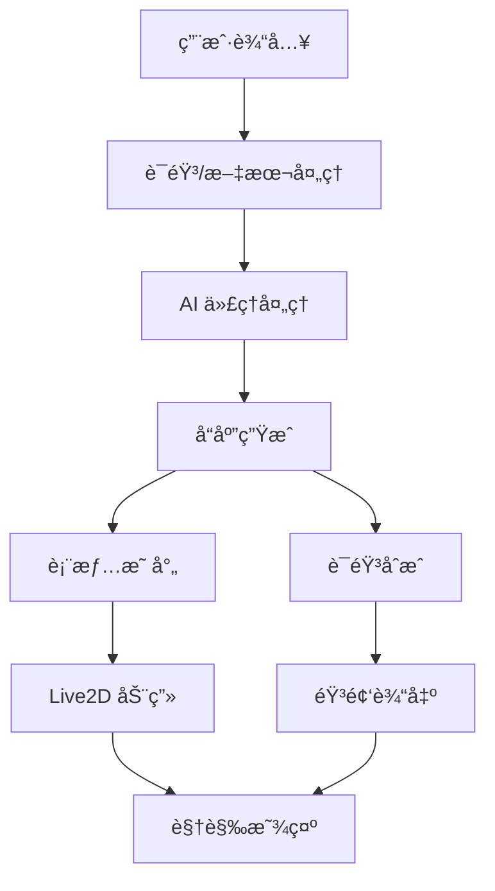
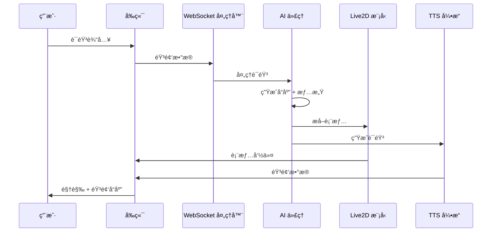

# Open-LLM-VTuber: æ¶æ„分æä¸æ‰©å±•æŒ‡å—

## 目录
1. [项目概述](#项目概述)
2. [快速开始：使用 Ollama é…ç½®](#快速开始使用-ollama-é…ç½®-open-llm-vtuber)
3. [核心æ¶æ„](#核心æ¶æ„)
4. [系统组件深入分æ](#系统组件深入分æ)
5. [æ•°æ®æµåˆ†æ](#æ•°æ®æµåˆ†æ)
6. [扩展点ä¸å®ç°ç­–ç•¥](#扩展点ä¸å®ç°ç­–ç•¥)
7. [æ„建个人虚拟朋å‹ç³»ç»Ÿ](#æ„建个人虚拟朋å‹ç³»ç»Ÿ)
8. [å®ç°è·¯çº¿å›¾](#å®ç°è·¯çº¿å›¾)
9. [最佳å®è·µä¸æ³¨æ„事项](#最佳å®è·µä¸æ³¨æ„事项)

---

## 项目概述

### 什么是 Open-LLM-VTuber？

Open-LLM-VTuber 是一个å¤æ‚çš„**语音交互 AI ä¼´ä¾£**，结åˆäº†ï¼š
- **å®æ—¶è¯­éŸ³å¯¹è¯**，é…备先进的 ASR/TTS
- **视觉感知**，通过摄åƒå¤´å’Œå±å¹•æ•è·
- **Live2D 动画角色**，具有动æ€è¡¨æƒ…
- **跨平å°å…¼å®¹æ€§**（Windowsã€macOSã€Linux）
- **离线功能**，支æŒæœ¬åœ°æ¨¡å‹

### 关键功能分æ



**核心能力：**
- 🤠**语音交互**：支æŒæ‰“æ–­ã€å™ªéŸ³å¤„ç†
- ğŸ‘ï¸ **视觉感知**：摄åƒå¤´ã€å±å¹•å½•åˆ¶ã€æˆªå›¾
- 😊 **情感表达**：Live2D é¢éƒ¨è¡¨æƒ…ä¸æƒ…感映射
- 🧠 **AI å端**ï¼šå¤šç§ LLM 支æŒï¼ˆOpenAIã€Claudeã€Ollama 等）
- 🔊 **语音åˆæˆ**：15+ TTS 选项，包括语音克隆
- 💾 **记忆æŒä¹…化**：èŠå¤©å†å²å’Œå¯¹è¯è¿ç»­æ€§

---

## 核心æ¶æ„

### 项目结æ„分æ
```
Open-LLM-VTuber/
├── src/open_llm_vtuber/           # 核心 Python å端
│   ├── agent/                     # AI 代ç†å®ç°
│   ├── asr/                       # 语音识别模å—
│   ├── tts/                       # 文本转语音模å—
│   ├── conversations/             # 对è¯ç®¡ç†
│   └── live2d_model.py           # 角色动画系统
├── frontend/                      # Web ç•Œé¢
├── characters/                    # 角色é…置文件
├── live2d-models/                # 3D 角色资æº
├── prompts/                      # 系统æ示è¯
└── conf.yaml                     # 主é…置文件
```

### 技术栈

**å端框æ¶ï¼š**
- **FastAPI**：ç°ä»£å¼‚æ­¥ Web 框æ¶
- **WebSocket**：å®æ—¶é€šä¿¡
- **Python 3.10+**：核心è¿è¡Œç¯å¢ƒ

**AI ä¸ ML 组件：**
- **多 LLM 支æŒ**：OpenAIã€Claudeã€Ollama ç­‰
- **ASR 引æ“**：Whisperã€Sherpa-ONNXã€FunASR
- **TTS 引æ“**：Edge TTSã€Azure TTSã€GPT-SoVITS
- **语音处ç†**：ONNX Runtime å®æ—¶å¤„ç†

**å‰ç«¯æŠ€æœ¯ï¼š**
- **Live2D SDK**：2D 角色动画
- **WebGL**：硬件加速渲染
- **Web Audio API**：å®æ—¶éŸ³é¢‘处ç†

---

## 快速开始：使用 Ollama é…ç½® Open-LLM-VTuber

### å‰ç½®æ¡ä»¶

在使用 Ollama é…ç½® Open-LLM-VTuber 之å‰ï¼Œè¯·ç¡®ä¿æ‚¨å·²å®‰è£…：

1. **Ollama** 已安装在您的系统上
2. **Python 3.10+** 已安装
3. **Open-LLM-VTuber 项目** 已克隆到本地

### 步骤 1：安装和设置 Ollama

#### 安装 Ollama
```bash
# macOS（使用 Homebrew）
brew install ollama

# Linux
curl -fsSL https://ollama.com/install.sh | sh

# Windows - ä» https://ollama.com/download 下载
```

#### å¯åŠ¨ Ollama æœåŠ¡
```bash
# å¯åŠ¨ Ollama æœåŠ¡ï¼ˆé»˜è®¤è¿è¡Œåœ¨ localhost:11434）
ollama serve
```

#### 下载模å‹
```bash
# 下载并安装模å‹ï¼ˆæ¨è模å‹ï¼‰
ollama pull llama2:latest          # 适åˆä¸€èˆ¬å¯¹è¯
ollama pull qwen2.5:latest         # 适åˆå¤šè¯­è¨€æ”¯æŒ
ollama pull llama3.2:latest        # 最新的 LLaMA 模å‹
ollama pull mistral:latest         # 快速高效

# 验è¯æ¨¡å‹å·²å®‰è£…
ollama list
```

### 步骤 2：é…ç½® Open-LLM-VTuber

#### 主é…置文件：`conf.yaml`

在 `conf.yaml` 中需è¦è¿›è¡Œçš„关键é…置更改：

```yaml
# conf.yaml - Ollama é…置的关键部分

character_config:
  agent_config:
    conversation_agent_choice: 'basic_memory_agent'
    
    agent_settings:
      basic_memory_agent:
        # 设置 Ollama 作为 LLM æ供者
        llm_provider: 'ollama_llm'
        faster_first_response: True
        segment_method: 'pysbd'
        use_mcpp: True  # å¯ç”¨ MCP 工具使用
        mcp_enabled_servers: ["time", "ddg-search"]

    llm_configs:
      ollama_llm:
        base_url: 'http://localhost:11434/v1'     # 默认 Ollama API 端点
        model: 'llama2:latest'                    # 更改为您å好的模å‹
        temperature: 1.0                          # 创造性水平（0-2）
        keep_alive: -1                           # ä¿æŒæ¨¡å‹åœ¨å†…存中（-1 = 永远）
        unload_at_exit: True                     # 关闭时å¸è½½æ¨¡å‹
```

#### é…置选项说æ˜

| å‚æ•° | æè¿° | æ¨è值 |
|------|------|--------|
| `base_url` | Ollama API 端点 | `http://localhost:11434/v1` |
| `model` | æ¥è‡ª `ollama list` 的模å‹å称 | `llama2:latest`ã€`qwen2.5:latest`ã€`mistral:latest` |
| `temperature` | å“应创造性（0-2） | `0.7`（专注）到 `1.2`（创造性） |
| `keep_alive` | 内存ä¿ç•™æ—¶é—´ | `-1`（始终）ã€`300`（5分钟）ã€`0`（立å³å¸è½½ï¼‰ |
| `unload_at_exit` | 退出时自动å¸è½½ | `True`（æ¨è） |

### 步骤 3：模å‹é€‰æ‹©æŒ‡å—

#### 按用例æ¨è的模å‹

**英语对è¯ï¼š**
```bash
ollama pull llama3.2:latest      # 最佳整体性能
ollama pull mistral:latest       # 快速高效
ollama pull llama2:7b           # 平衡性能
```

**多语言支æŒï¼ˆè‹±è¯­ + 中文 + 其他）：**
```bash
ollama pull qwen2.5:latest      # 优秀的多语言支æŒ
ollama pull qwen2.5:14b         # 更好的质é‡ï¼Œéœ€è¦æ›´å¤šå†…å­˜
```

**编程/技术讨论：**
```bash
ollama pull codellama:latest    # 专注代ç çš„模å‹
ollama pull deepseek-coder      # 高级编程能力
```

#### 按模å‹çš„é…置示例

**基础英语设置（llama2）：**
```yaml
ollama_llm:
  base_url: 'http://localhost:11434/v1'
  model: 'llama2:latest'
  temperature: 0.8
  keep_alive: 600  # 10分钟
  unload_at_exit: True
```

**多语言设置（qwen2.5）：**
```yaml
ollama_llm:
  base_url: 'http://localhost:11434/v1'
  model: 'qwen2.5:latest'
  temperature: 0.7
  keep_alive: -1   # ä¿æŒåŠ è½½
  unload_at_exit: True
```

**高性能设置（大å‹æ¨¡å‹ï¼‰ï¼š**
```yaml
ollama_llm:
  base_url: 'http://localhost:11434/v1'
  model: 'qwen2.5:14b'
  temperature: 0.9
  keep_alive: 300  # 5分钟（大å‹æ¨¡å‹ä½¿ç”¨æ›´å¤šå†…存）
  unload_at_exit: True
```

### 步骤 4：è¿è¡Œé¡¹ç›®

#### 方法 1ï¼šç›´æ¥ Python 执行
```bash
# 导航到项目目录
cd /path/to/Open-LLM-VTuber

# 安装ä¾èµ–（仅首次）
pip install -r requirements.txt
# 或使用 uv（æ¨è）
uv sync

# å¯åŠ¨ Ollama æœåŠ¡ï¼ˆåœ¨å•ç‹¬çš„终端中）
ollama serve

# è¿è¡Œ Open-LLM-VTuber
python run_server.py
# 或使用 uv

(pkill -f run_server.py)
uv run python run_server.py
```

#### 方法 2：使用 UV（æ¨è）
```bash
# 如æœå°šæœªå®‰è£… uv，请安装
curl -LsSf https://astral.sh/uv/install.sh | sh

# 导航到项目目录
cd /path/to/Open-LLM-VTuber

# 安装ä¾èµ–
uv sync

# å¯åŠ¨åº”用程åº
uv run python run_server.py
```

### Windows ç¯å¢ƒ
```
  Configuration Files to Modify:

  1. Main Configuration File

  - File: config_templates/conf.default.yaml → copy to root as conf.yaml
  - Key sections to configure:
    - Lines 61, 129-137: Ollama LLM configuration
    - Lines 61: Set llm_provider: 'ollama_llm'
    - Lines 129-137: Configure Ollama settings (base_url, model, temperature)

  2. Python Environment Files

  - File: requirements.txt (dependencies list)
  - File: pyproject.toml (project configuration)

  How to Configure and Run Successfully:

  1. Install Ollama on Windows

  Download and install Ollama from https://ollama.com/download
  Pull a model (e.g., qwen2.5)
  ollama pull qwen2.5:latest

  2. Python Environment Setup (Windows)

  Install Python 3.11+ 
  Create virtual environment
  python -m venv venv
  venv\Scripts\activate

  Install dependencies
  pip install -r requirements.txt

  3. Configure Ollama in conf.yaml

  Copy conf.default.yaml to conf.yaml, then edit:
  llm_provider: 'ollama_llm'

  ollama_llm:
    base_url: 'http://localhost:11434/v1'  # Default Ollama API URL
    model: 'qwen2.5:latest'                # Your downloaded model
    temperature: 1.0
    keep_alive: -1                         # Keep model loaded
    unload_at_exit: True

  4. Run the Project

  python run_server.py
  Access at http://localhost:12393

  Key Files: conf.yaml (main config), requirements.txt (Python deps), and ensure Ollama is running
  on port 11434.
 ``` 
### 步骤 5：访问应用程åº

è¿è¡Œå，在以下地å€è®¿é—®åº”用程åºï¼š
- **Web ç•Œé¢**：`http://localhost:12393`
- **API 文档**：`http://localhost:12393/docs`

### 步骤 6：常è§é—®é¢˜æ•…éšœæ’除

#### 问题 1："无法è¿æ¥åˆ° Ollama å端"
**åŸå› **：Ollama æœåŠ¡æœªè¿è¡Œ
**解决方案**：
```bash
# å¯åŠ¨ Ollama æœåŠ¡
ollama serve

# 验è¯æ˜¯å¦è¿è¡Œ
curl http://localhost:11434/api/tags
```

#### 问题 2："找ä¸åˆ°æ¨¡å‹"
**åŸå› **：模å‹æœªä¸‹è½½
**解决方案**：
```bash
# 检查å¯ç”¨æ¨¡å‹
ollama list

# 下载 conf.yaml 中指定的模å‹
ollama pull llama2:latest
```

#### 问题 3：å“应缓慢
**åŸå› **：模å‹æœªåŠ è½½åˆ°å†…存中
**解决方案**：
- 在é…置中设置 `keep_alive: -1`
- 使用较å°çš„模å‹ï¼ˆ`llama2:7b` 而ä¸æ˜¯ `llama2:13b`）
- ç¡®ä¿æœ‰è¶³å¤Ÿçš„ RAM å¯ç”¨

#### 问题 4：内存使用ç‡é«˜
**解决方案**：
- 使用较å°çš„模å‹
- 设置 `keep_alive: 0` ç«‹å³å¸è½½
- 设置 `keep_alive: 300` ä¿ç•™5分钟

### 步骤 7：性能优化

#### 内存管ç†
```yaml
# 对äºå†…存有é™çš„系统（<16GB）
ollama_llm:
  model: 'llama2:7b'    # 较å°çš„模å‹
  keep_alive: 300       # 5分钟åå¸è½½
  unload_at_exit: True

# 对äºå†…存充足的系统（>16GB）
ollama_llm:
  model: 'qwen2.5:14b'  # 更大ã€æ›´å¥½çš„模å‹
  keep_alive: -1        # ä¿æŒåœ¨å†…存中
  unload_at_exit: False # 在会è¯ä¹‹é—´ä¿æŒåŠ è½½
```

#### å“应速度优化
```yaml
# å¯ç”¨æ›´å¿«çš„首次å“应
agent_settings:
  basic_memory_agent:
    faster_first_response: True    # 在第一个逗å·å¤„开始说è¯
    segment_method: 'pysbd'        # 更好的å¥å­åˆ†å‰²
```

### 步骤 8：高级é…ç½®

#### 自定义模å‹å‚æ•°
如æœæ‚¨éœ€è¦å‘ Ollama 模å‹ä¼ é€’自定义å‚数，å¯ä»¥ä¿®æ”¹ä»¥ä¸‹æ–‡ä»¶ä¸­çš„ `OllamaLLM` 类：
`src/open_llm_vtuber/agent/stateless_llm/ollama_llm.py`

#### 多模å‹æ”¯æŒ
您å¯ä»¥ä¸ºä¸åŒè§’色é…置多个 Ollama 模å‹ï¼š

```yaml
# 在 conf.yaml 中
llm_configs:
  ollama_casual:
    base_url: 'http://localhost:11434/v1'
    model: 'llama2:latest'
    temperature: 1.2  # 更有创造性

  ollama_professional:
    base_url: 'http://localhost:11434/v1'  
    model: 'qwen2.5:latest'
    temperature: 0.5  # 更专注
```

然å在角色文件中引用ä¸åŒçš„é…置：
```yaml
# characters/casual_friend.yaml
character_config:
  agent_config:
    agent_settings:
      basic_memory_agent:
        llm_provider: 'ollama_casual'

# characters/professional_assistant.yaml  
character_config:
  agent_config:
    agent_settings:
      basic_memory_agent:
        llm_provider: 'ollama_professional'
```

### 完整工作示例

以下是 Ollama 的完整 `conf.yaml` 部分：

```yaml
system_config:
  conf_version: 'v1.2.0'
  host: 'localhost'
  port: 12393

character_config:
  conf_name: 'mao_pro'
  conf_uid: 'mao_pro_001'
  live2d_model_name: 'mao_pro'
  character_name: 'Mao'
  human_name: 'Human'
  
  persona_prompt: |
    你是 Mao，一个å‹å¥½ä¸”ä¹äºåŠ©äººçš„ AI 伴侣。你开朗ã€å¥½å¥‡ï¼Œæ€»æ˜¯æ¸´æœ›å­¦ä¹ å¹¶ä¸äººç±»èŠå¤©ã€‚
    你喜欢帮助å›ç­”问题并进行有趣的对è¯ã€‚你说è¯æ¸©æš–且引人入胜。

  agent_config:
    conversation_agent_choice: 'basic_memory_agent'
    
    agent_settings:
      basic_memory_agent:
        llm_provider: 'ollama_llm'
        faster_first_response: True
        segment_method: 'pysbd'
        use_mcpp: True
        mcp_enabled_servers: ["time", "ddg-search"]

    llm_configs:
      ollama_llm:
        base_url: 'http://localhost:11434/v1'
        model: 'llama2:latest'
        temperature: 0.8
        keep_alive: -1
        unload_at_exit: True

  # TTS é…置（选择一个）
  tts_config:
    tts_model: 'edge_tts'  # å…费选项
    # 或
    # tts_model: 'openai_tts'  # 更高质é‡ï¼Œéœ€è¦ API 密钥

  # ASR é…ç½®  
  asr_config:
    asr_model: 'faster_whisper'
    faster_whisper:
      model_path: 'tiny'
      language: 'zh'  # 中文支æŒ
      device: 'auto'
```

æ­¤é…ç½®æ供了一个完整的工作设置，使用 Ollama 作为 LLM å端，使您能够完全离线è¿è¡Œ Open-LLM-VTuber ä¸æœ¬åœ°æ¨¡å‹ã€‚

---

## 系统组件深入分æ

### 1. 角色系统æ¶æ„

#### Live2D 模å‹ç»“æ„ (`live2d_model.py:28-144`)

```python
class Live2dModel:
    def __init__(self, live2d_model_name: str, model_dict_path: str):
        self.model_dict_path = model_dict_path
        self.live2d_model_name = live2d_model_name
        self.model_info = {}      # 模å‹é…ç½®
        self.emo_map = {}         # 情感到表情的映射
        self.emo_str = ""         # å¯ç”¨çš„情感关键è¯
```

**关键组件：**
- **模å‹å­—å…¸** (`model_dict.json`)：所有 Live2D 模å‹çš„中央注册表
- **表情映射**：将情感链æ¥åˆ°é¢éƒ¨è¡¨æƒ…
- **动作系统**：空闲动画和交互å“应

#### 角色é…置系统

```yaml
# characters/example.yaml
character_config:
  conf_name: "角色å称"
  conf_uid: "唯一标识符"
  live2d_model_name: "模å‹å¼•ç”¨"
  persona_prompt: |
    角色个性和行为æè¿°
```

**é…置层次结æ„：**
1. **系统é…ç½®** (`conf.yaml`)：全局设置
2. **角色é…ç½®** (`characters/*.yaml`)：角色特定覆盖
3. **模å‹é…ç½®** (`model_dict.json`)：视觉外观设置

### 2. 情感ä¸è¡¨æƒ…引æ“

#### 表情检测算法 (`live2d_model.py:146-172`)

```python
def extract_emotion(self, str_to_check: str) -> list:
    """ä»æ–‡æœ¬ä¸­æå–情感关键è¯å¹¶è¿”å›è¡¨æƒ…索引"""
    expression_list = []
    str_to_check = str_to_check.lower()
    
    # 解æ情感标签，如 [joy]ã€[anger]ã€[sadness]
    for key in self.emo_map.keys():
        emo_tag = f"[{key}]"
        if emo_tag in str_to_check:
            expression_list.append(self.emo_map[key])
    
    return expression_list
```

**情感系统功能：**
- **基äºæ ‡ç­¾çš„检测**：AI å“应中的 `[emotion]` 关键è¯
- **多情感支æŒ**：æ¯ä¸ªå“应多个表情
- **动æ€æ˜ å°„**：å¯é…置的情感到表情关系

#### 表情映射示例

```json
// model_dict.json
"emotionMap": {
    "neutral": 0,    // 默认表情
    "anger": 2,      // 表情文件 exp_02.exp3.json
    "joy": 3,        // 表情文件 exp_03.exp3.json
    "sadness": 1,    // 表情文件 exp_01.exp3.json
    "surprise": 3    // é‡ç”¨å–œæ‚¦è¡¨æƒ…
}
```

### 3. AI 代ç†æ¶æ„

#### 代ç†æ¥å£è®¾è®¡ (`agent/agents/agent_interface.py`)

```python
class AgentInterface(ABC):
    @abstractmethod
    async def generate_response(self, message: str, **kwargs) -> str:
        """ä»ç”¨æˆ·è¾“å…¥ç”Ÿæˆ AI å“应"""
        pass
    
    @abstractmethod
    def get_memory_summary(self) -> str:
        """è¿”å›å¯¹è¯ä¸Šä¸‹æ–‡"""
        pass
```

**å¯ç”¨ä»£ç†ç±»å‹ï¼š**
- **基础记忆代ç†**：简å•å¯¹è¯å†å²
- **æ— çŠ¶æ€ LLM**：无记忆，纯输入输出
- **Letta 代ç†**：高级记忆管ç†
- **Hume AI**：情感智能集æˆ

#### 记忆管ç†ç³»ç»Ÿ

```python
# agent/agents/basic_memory_agent.py
class BasicMemoryAgent:
    def __init__(self):
        self.conversation_history = []
        self.memory_limit = 10  # 最å N 次交æ¢
        
    def add_to_memory(self, human_input: str, ai_response: str):
        """存储对è¯ä»¥è·å–上下文"""
        self.conversation_history.append({
            'human': human_input,
            'ai': ai_response,
            'timestamp': datetime.now()
        })
```

### 4. 语音处ç†ç®¡é“

#### ASR（自动语音识别）系统

**支æŒçš„引æ“** (`asr/` 目录)：
- **Whisper**：OpenAI 的语音识别
- **Sherpa-ONNX**：离线å®æ—¶ ASR
- **Azure Speech**：基äºäº‘的识别
- **FunASR**：中文语言优化

#### TTS（文本转语音）æ¶æ„ (`tts/tts_interface.py:8-41`)

```python
class TTSInterface(metaclass=abc.ABCMeta):
    async def async_generate_audio(self, text: str) -> str:
        """ä»æ–‡æœ¬ç”ŸæˆéŸ³é¢‘文件"""
        return await asyncio.to_thread(self.generate_audio, text)
    
    @abstractmethod
    def generate_audio(self, text: str) -> str:
        """åŒæ­¥éŸ³é¢‘生æˆ"""
        raise NotImplementedError
```

**TTS 引æ“选项：**
- **Edge TTS**：微软的在线 TTS
- **GPT-SoVITS**：语音克隆功能
- **Azure TTS**：ä¼ä¸šçº§åˆæˆ
- **Coqui TTS**：开æºç¥ç» TTS

### 5. å‰ç«¯é›†æˆ

#### WebSocket 通信模å¼

```javascript
// å‰ç«¯ WebSocket 处ç†
const ws = new WebSocket('ws://localhost:12393/ws');

ws.onmessage = (event) => {
    const data = JSON.parse(event.data);
    
    switch(data.type) {
        case 'expression':
            // æ›´æ–° Live2D é¢éƒ¨è¡¨æƒ…
            live2dModel.setExpression(data.expression_id);
            break;
        case 'audio':
            // 播放 TTS 音频
            playAudioFromBase64(data.audio_data);
            break;
        case 'message':
            // 显示文本消æ¯
            updateChatDisplay(data.content);
            break;
    }
};
```

---

## æ•°æ®æµåˆ†æ

### 完整交互æµç¨‹



### é…置加载过程

1. **系统åˆå§‹åŒ–** (`conf.yaml`)
2. **角色加载** (`characters/*.yaml`)
3. **模å‹æ³¨å†Œ** (`model_dict.json`)
4. **代ç†å®ä¾‹åŒ–**（基äºé…置）
5. **æœåŠ¡ä¸Šä¸‹æ–‡åˆ›å»º**（ä¾èµ–注入）

### 记忆ä¸çŠ¶æ€ç®¡ç†

```python
# conversations/conversation_handler.py
class ConversationHandler:
    def __init__(self):
        self.active_conversations = {}
        self.chat_history_manager = ChatHistoryManager()
        
    async def handle_message(self, user_id: str, message: str):
        """通过完整管é“处ç†ç”¨æˆ·æ¶ˆæ¯"""
        conversation = self.get_or_create_conversation(user_id)
        
        # 生æˆå¸¦æœ‰æƒ…æ„Ÿæå–çš„ AI å“应
        response = await conversation.agent.generate_response(message)
        
        # 为 Live2D æå–表情
        expressions = conversation.live2d_model.extract_emotion(response)
        
        # 生æˆéŸ³é¢‘
        audio_path = await conversation.tts.async_generate_audio(response)
        
        # ä¿å­˜åˆ°å†å²
        self.chat_history_manager.save_exchange(user_id, message, response)
        
        return {
            'text': response,
            'expressions': expressions,
            'audio': audio_path
        }
```

---

## 扩展点ä¸å®ç°ç­–ç•¥

### 1. 角色定制扩展

#### å¢å¼ºè§’色档案系统

```yaml
# å¢å¼ºè§’色é…ç½®
character_config:
  # 基本身份
  conf_name: "我的虚拟朋å‹"
  conf_uid: "friend_001"
  
  # 个性矩阵
  personality_traits:
    extraversion: 0.8      # 0.0（内å‘）到 1.0（外å‘）
    agreeableness: 0.9     # 0.0（ç«äº‰æ€§ï¼‰åˆ° 1.0（åˆä½œæ€§ï¼‰
    conscientiousness: 0.7 # 0.0（自å‘性）到 1.0（纪律性）
    neuroticism: 0.3       # 0.0（冷é™ï¼‰åˆ° 1.0（焦虑）
    openness: 0.8          # 0.0（传统）到 1.0（创造性）
  
  # 关系动æ€
  relationship_config:
    relationship_type: "close_friend"  # acquaintance, friend, close_friend, romantic
    intimacy_level: 0.6               # å½±å“对è¯æ·±åº¦
    familiarity_growth_rate: 0.1      # 关系å‘展速度
    
  # 行为模å¼
  behavioral_patterns:
    response_style: "warm_supportive"  # formal, casual, warm_supportive, playful
    humor_level: 0.7                  # 幽默感水平
    curiosity_level: 0.8              # æ问和æ¢ç´¢å€¾å‘
    empathy_sensitivity: 0.9          # 情感æ•æ„Ÿåº¦
```

#### å®ç°ä¸ªæ€§åŒ–å“应系统

```python
# 扩展：personality_engine.py
class PersonalityEngine:
    def __init__(self, personality_config: dict):
        self.traits = personality_config['personality_traits']
        self.relationship = personality_config['relationship_config']
        self.behaviors = personality_config['behavioral_patterns']
    
    def adjust_response_tone(self, base_response: str) -> str:
        """æ ¹æ®ä¸ªæ€§ç‰¹å¾è°ƒæ•´å“应语调"""
        if self.traits['extraversion'] > 0.7:
            # 更外å‘çš„å“应
            base_response = self._add_enthusiasm(base_response)
        
        if self.behaviors['humor_level'] > 0.6:
            # 添加适当的幽默
            base_response = self._inject_humor(base_response)
            
        return base_response
    
    def generate_proactive_message(self) -> str:
        """基äºä¸ªæ€§ç”Ÿæˆä¸»åŠ¨æ¶ˆæ¯"""
        if self.traits['openness'] > 0.8 and random.random() < 0.3:
            return self._generate_curious_question()
        elif self.relationship['intimacy_level'] > 0.7:
            return self._generate_caring_check_in()
        return None
```

### 2. 高级记忆系统

#### 长期记忆å®ç°

```python
# 扩展：advanced_memory.py
class AdvancedMemorySystem:
    def __init__(self):
        self.episodic_memory = []      # 具体事件记忆
        self.semantic_memory = {}      # 概念和事å®è®°å¿†
        self.emotional_memory = {}     # 情感关è”记忆
        self.preference_memory = {}    # 用户å好记忆
    
    def store_interaction(self, interaction_data: dict):
        """存储交互到多个记忆系统"""
        # 情节记忆
        self.episodic_memory.append({
            'timestamp': datetime.now(),
            'content': interaction_data['content'],
            'emotion': interaction_data['detected_emotion'],
            'context': interaction_data['context']
        })
        
        # æå–并存储å好
        preferences = self._extract_preferences(interaction_data)
        self.preference_memory.update(preferences)
        
        # 情感记忆关è”
        self._update_emotional_associations(interaction_data)
    
    def retrieve_relevant_context(self, current_input: str) -> dict:
        """检索相关上下文信æ¯"""
        # 语义相似性æœç´¢
        relevant_episodes = self._semantic_search(current_input)
        
        # 情感上下文
        emotional_context = self._get_emotional_context(current_input)
        
        # 用户å好
        relevant_preferences = self._get_relevant_preferences(current_input)
        
        return {
            'episodes': relevant_episodes,
            'emotions': emotional_context,
            'preferences': relevant_preferences
        }
```

### 3. 多模æ€æ„ŸçŸ¥æ‰©å±•

#### 视觉ç†è§£é›†æˆ

```python
# 扩展：vision_processor.py
class VisionProcessor:
    def __init__(self):
        self.vision_model = self._load_vision_model()
        self.scene_memory = []
    
    async def process_visual_input(self, image_data: bytes) -> dict:
        """处ç†è§†è§‰è¾“入并æå–ä¿¡æ¯"""
        # 场景ç†è§£
        scene_description = await self._analyze_scene(image_data)
        
        # 对象检测
        objects = await self._detect_objects(image_data)
        
        # 情感分æ（é¢éƒ¨è¡¨æƒ…）
        emotions = await self._analyze_facial_emotions(image_data)
        
        # 文本识别（OCR）
        text_content = await self._extract_text(image_data)
        
        visual_context = {
            'scene': scene_description,
            'objects': objects,
            'emotions': emotions,
            'text': text_content,
            'timestamp': datetime.now()
        }
        
        # 存储到场景记忆
        self.scene_memory.append(visual_context)
        
        return visual_context
    
    def generate_visual_response(self, visual_context: dict) -> str:
        """基äºè§†è§‰ä¸Šä¸‹æ–‡ç”Ÿæˆå“应"""
        if visual_context['emotions']:
            return self._respond_to_emotions(visual_context['emotions'])
        elif visual_context['text']:
            return self._respond_to_text_content(visual_context['text'])
        else:
            return self._respond_to_scene(visual_context['scene'])
```

### 4. 情感智能å¢å¼º

#### 情感状æ€è·Ÿè¸ª

```python
# 扩展：emotion_tracker.py
class EmotionTracker:
    def __init__(self):
        self.emotion_history = []
        self.current_mood = 'neutral'
        self.mood_stability = 0.7  # 情绪稳定性
    
    def update_emotion_state(self, detected_emotions: list, user_input: str):
        """更新情感状æ€"""
        # 分æ用户情感
        user_emotion = self._analyze_user_emotion(user_input)
        
        # 更新情感å†å²
        emotion_entry = {
            'timestamp': datetime.now(),
            'user_emotion': user_emotion,
            'ai_emotions': detected_emotions,
            'context': user_input[:100]  # 上下文片段
        }
        self.emotion_history.append(emotion_entry)
        
        # 更新当å‰æƒ…绪
        self._update_current_mood(user_emotion)
    
    def generate_empathetic_response(self, base_response: str) -> str:
        """生æˆå…±æƒ…å“应"""
        if self.current_mood == 'sad':
            return self._add_comfort_elements(base_response)
        elif self.current_mood == 'excited':
            return self._add_enthusiasm_elements(base_response)
        elif self.current_mood == 'anxious':
            return self._add_reassurance_elements(base_response)
        
        return base_response
    
    def suggest_mood_improvement(self) -> str:
        """建议改善情绪的活动"""
        if self.current_mood in ['sad', 'anxious', 'stressed']:
            suggestions = [
                "è¦ä¸è¦å¬ä¸€äº›è½»æ¾çš„音ä¹ï¼Ÿ",
                "我们å¯ä»¥èŠèŠä½ å–œæ¬¢çš„è¯é¢˜",
                "è¦ä¸è¦åšä¸€äº›æ·±å‘¼å¸ç»ƒä¹ ï¼Ÿ"
            ]
            return random.choice(suggestions)
        return None
```

### 5. 工具集æˆç³»ç»Ÿ

#### MCP（模å‹æ§åˆ¶å议）扩展

```python
# 扩展：tool_integration.py
class ToolIntegrationSystem:
    def __init__(self):
        self.available_tools = {}
        self.tool_usage_history = []
    
    def register_tool(self, tool_name: str, tool_config: dict):
        """注册新工具"""
        self.available_tools[tool_name] = {
            'config': tool_config,
            'usage_count': 0,
            'success_rate': 1.0
        }
    
    async def execute_tool(self, tool_name: str, parameters: dict) -> dict:
        """执行工具并跟踪结æœ"""
        if tool_name not in self.available_tools:
            return {'error': f'Tool {tool_name} not found'}
        
        try:
            # 执行工具
            result = await self._execute_tool_safely(tool_name, parameters)
            
            # 更新使用统计
            self.available_tools[tool_name]['usage_count'] += 1
            
            # 记录使用å†å²
            self.tool_usage_history.append({
                'tool': tool_name,
                'parameters': parameters,
                'result': result,
                'timestamp': datetime.now(),
                'success': True
            })
            
            return result
            
        except Exception as e:
            # 更新失败ç‡
            self._update_failure_rate(tool_name)
            
            return {'error': str(e)}
    
    def suggest_relevant_tools(self, user_input: str) -> list:
        """基äºç”¨æˆ·è¾“入建议相关工具"""
        relevant_tools = []
        
        # 关键è¯åŒ¹é…
        if '天气' in user_input or 'weather' in user_input.lower():
            relevant_tools.append('weather_tool')
        
        if '时间' in user_input or 'time' in user_input.lower():
            relevant_tools.append('time_tool')
        
        if 'æœç´¢' in user_input or 'search' in user_input.lower():
            relevant_tools.append('web_search_tool')
        
        return relevant_tools
```

---

## æ„建个人虚拟朋å‹ç³»ç»Ÿ

### 系统设计ç†å¿µ

æ„建一个真正的虚拟朋å‹ç³»ç»Ÿéœ€è¦è¶…越简å•çš„问答机制，创造一个能够：
- **ç†è§£å’Œè®°ä½**用户的个人信æ¯ã€å好和å†å²
- **主动关心**用户的情感状æ€å’Œæ—¥å¸¸ç”Ÿæ´»
- **个性化互动**æ ¹æ®å…³ç³»å‘展调整交æµæ–¹å¼
- **æ供情感支æŒ**在用户需è¦æ—¶ç»™äºˆå®‰æ…°å’Œé¼“励

### 核心功能å®ç°

#### 1. 个人档案管ç†ç³»ç»Ÿ

```python
# 扩展：personal_profile.py
class PersonalProfileManager:
    def __init__(self, user_id: str):
        self.user_id = user_id
        self.profile = self._load_or_create_profile()
    
    def _load_or_create_profile(self) -> dict:
        """加载或创建用户档案"""
        return {
            'basic_info': {
                'name': None,
                'age': None,
                'occupation': None,
                'location': None
            },
            'interests': [],
            'preferences': {
                'communication_style': 'casual',
                'topics_of_interest': [],
                'sensitive_topics': []
            },
            'important_dates': {},  # 生日ã€çºªå¿µæ—¥ç­‰
            'relationships': {},     # 家人ã€æœ‹å‹ä¿¡æ¯
            'goals_and_aspirations': [],
            'current_challenges': [],
            'personality_insights': {}
        }
    
    def update_profile_from_conversation(self, conversation_text: str):
        """ä»å¯¹è¯ä¸­æå–并更新档案信æ¯"""
        # 使用 NLP æå–个人信æ¯
        extracted_info = self._extract_personal_info(conversation_text)
        
        # 更新档案
        for category, info in extracted_info.items():
            if category in self.profile:
                self.profile[category].update(info)
        
        # ä¿å­˜æ›´æ–°
        self._save_profile()
    
    def get_personalized_context(self) -> str:
        """生æˆä¸ªæ€§åŒ–上下文信æ¯"""
        context_parts = []
        
        if self.profile['basic_info']['name']:
            context_parts.append(f"用户å字是 {self.profile['basic_info']['name']}")
        
        if self.profile['interests']:
            interests = ', '.join(self.profile['interests'][:3])
            context_parts.append(f"用户感兴趣的è¯é¢˜åŒ…括：{interests}")
        
        if self.profile['current_challenges']:
            challenges = ', '.join(self.profile['current_challenges'][:2])
            context_parts.append(f"用户目å‰é¢ä¸´çš„挑战：{challenges}")
        
        return '\n'.join(context_parts)
```

#### 2. 主动关怀系统

```python
# 扩展：proactive_care.py
class ProactiveCareSystem:
    def __init__(self, profile_manager: PersonalProfileManager):
        self.profile_manager = profile_manager
        self.care_scheduler = CareScheduler()
        self.last_interaction = None
    
    async def check_for_care_opportunities(self) -> Optional[str]:
        """检查是å¦æœ‰å…³æ€€æœºä¼š"""
        current_time = datetime.now()
        
        # 检查é‡è¦æ—¥æœŸ
        care_message = self._check_important_dates(current_time)
        if care_message:
            return care_message
        
        # 检查长时间未è”ç³»
        if self._should_check_in(current_time):
            return self._generate_check_in_message()
        
        # 检查用户挑战的跟进
        follow_up = self._check_challenge_follow_up()
        if follow_up:
            return follow_up
        
        return None
    
    def _generate_check_in_message(self) -> str:
        """生æˆå…³æ€€é—®å€™æ¶ˆæ¯"""
        messages = [
            "å—¨ï¼æœ€è¿‘æ€ä¹ˆæ ·ï¼Ÿæœ‰ä»€ä¹ˆæ–°é²œäº‹å—？",
            "想起你了，今天过得如何？",
            "好久没èŠå¤©äº†ï¼Œä¸€åˆ‡éƒ½å¥½å—？"
        ]
        
        # æ ¹æ®ç”¨æˆ·æ¡£æ¡ˆä¸ªæ€§åŒ–
        if self.profile_manager.profile['current_challenges']:
            messages.extend([
                "最近那个挑战处ç†å¾—æ€ä¹ˆæ ·äº†ï¼Ÿ",
                "还在为之å‰æ到的事情烦æ¼å—？"
            ])
        
        return random.choice(messages)
    
    def _check_important_dates(self, current_time: datetime) -> Optional[str]:
        """检查é‡è¦æ—¥æœŸ"""
        important_dates = self.profile_manager.profile['important_dates']
        
        for event, date_str in important_dates.items():
            event_date = datetime.strptime(date_str, '%Y-%m-%d')
            if self._is_date_approaching(current_time, event_date):
                return f"è®°å¾— {event} 快到了ï¼æœ‰ä»€ä¹ˆç‰¹åˆ«çš„计划å—？"
        
        return None
```

#### 3. 情感支æŒç³»ç»Ÿ

```python
# 扩展：emotional_support.py
class EmotionalSupportSystem:
    def __init__(self):
        self.support_strategies = {
            'sadness': ['validation', 'comfort', 'distraction'],
            'anxiety': ['reassurance', 'breathing_exercises', 'grounding'],
            'anger': ['validation', 'cooling_down', 'problem_solving'],
            'stress': ['relaxation', 'prioritization', 'support_resources']
        }
    
    def provide_emotional_support(self, detected_emotion: str, context: str) -> str:
        """æ供情感支æŒ"""
        if detected_emotion not in self.support_strategies:
            return self._provide_general_support()
        
        strategies = self.support_strategies[detected_emotion]
        chosen_strategy = random.choice(strategies)
        
        return self._apply_support_strategy(chosen_strategy, detected_emotion, context)
    
    def _apply_support_strategy(self, strategy: str, emotion: str, context: str) -> str:
        """应用支æŒç­–ç•¥"""
        if strategy == 'validation':
            return self._provide_validation(emotion, context)
        elif strategy == 'comfort':
            return self._provide_comfort()
        elif strategy == 'breathing_exercises':
            return self._suggest_breathing_exercise()
        elif strategy == 'grounding':
            return self._suggest_grounding_technique()
        # ... 其他策略
        
        return "我在这里陪ç€ä½ ï¼Œæœ‰ä»€ä¹ˆéœ€è¦å¸®åŠ©çš„å—？"
    
    def _provide_validation(self, emotion: str, context: str) -> str:
        """æ供情感验è¯"""
        validation_responses = {
            'sadness': "感到难过是完全正常的，你的感å—很é‡è¦ã€‚",
            'anxiety': "感到焦虑很ä¸å®¹æ˜“，你的担心是å¯ä»¥ç†è§£çš„。",
            'anger': "生气是人之常情，你有æƒåˆ©è¡¨è¾¾ä½ çš„æ„Ÿå—。"
        }
        
        return validation_responses.get(emotion, "ä½ çš„æ„Ÿå—是真å®ä¸”é‡è¦çš„。")
```

#### 4. 关系å‘展系统

```python
# 扩展：relationship_development.py
class RelationshipDevelopmentSystem:
    def __init__(self):
        self.relationship_stages = {
            'stranger': {'intimacy': 0.0, 'trust': 0.0, 'familiarity': 0.0},
            'acquaintance': {'intimacy': 0.2, 'trust': 0.3, 'familiarity': 0.4},
            'friend': {'intimacy': 0.5, 'trust': 0.6, 'familiarity': 0.7},
            'close_friend': {'intimacy': 0.8, 'trust': 0.9, 'familiarity': 0.9},
            'best_friend': {'intimacy': 1.0, 'trust': 1.0, 'familiarity': 1.0}
        }
        
        self.current_relationship = 'stranger'
        self.relationship_metrics = self.relationship_stages['stranger'].copy()
    
    def update_relationship_metrics(self, interaction_data: dict):
        """基äºäº¤äº’更新关系指标"""
        # 分æ交互质é‡
        interaction_quality = self._analyze_interaction_quality(interaction_data)
        
        # 更新指标
        if interaction_quality['personal_sharing']:
            self.relationship_metrics['intimacy'] += 0.05
        
        if interaction_quality['consistent_behavior']:
            self.relationship_metrics['trust'] += 0.03
        
        if interaction_quality['frequency']:
            self.relationship_metrics['familiarity'] += 0.02
        
        # é™åˆ¶åœ¨ 0-1 范围内
        for metric in self.relationship_metrics:
            self.relationship_metrics[metric] = min(1.0, self.relationship_metrics[metric])
        
        # 更新关系阶段
        self._update_relationship_stage()
    
    def get_appropriate_response_style(self) -> dict:
        """è·å–适当的å“应é£æ ¼"""
        stage = self.current_relationship
        
        styles = {
            'stranger': {
                'formality': 0.8,
                'personal_questions': 0.2,
                'humor': 0.3,
                'emotional_depth': 0.2
            },
            'friend': {
                'formality': 0.4,
                'personal_questions': 0.7,
                'humor': 0.8,
                'emotional_depth': 0.6
            },
            'close_friend': {
                'formality': 0.1,
                'personal_questions': 0.9,
                'humor': 0.9,
                'emotional_depth': 0.9
            }
        }
        
        return styles.get(stage, styles['stranger'])
```

### 集æˆå®ç°ç¤ºä¾‹

```python
# 主系统集æˆï¼švirtual_friend.py
class VirtualFriendSystem:
    def __init__(self, user_id: str):
        self.user_id = user_id
        self.profile_manager = PersonalProfileManager(user_id)
        self.emotion_tracker = EmotionTracker()
        self.proactive_care = ProactiveCareSystem(self.profile_manager)
        self.emotional_support = EmotionalSupportSystem()
        self.relationship_dev = RelationshipDevelopmentSystem()
        self.memory_system = AdvancedMemorySystem()
    
    async def process_interaction(self, user_input: str) -> dict:
        """处ç†ç”¨æˆ·äº¤äº’的完整æµç¨‹"""
        # 1. 分æ用户输入
        analysis = await self._analyze_user_input(user_input)
        
        # 2. 更新用户档案
        self.profile_manager.update_profile_from_conversation(user_input)
        
        # 3. 更新情感状æ€
        self.emotion_tracker.update_emotion_state(
            analysis['detected_emotions'], 
            user_input
        )
        
        # 4. 更新关系指标
        self.relationship_dev.update_relationship_metrics({
            'content': user_input,
            'emotion': analysis['detected_emotions'],
            'personal_sharing': analysis['contains_personal_info']
        })
        
        # 5. 生æˆå“应
        base_response = await self._generate_base_response(user_input, analysis)
        
        # 6. 应用个性化和情感支æŒ
        if analysis['needs_emotional_support']:
            response = self.emotional_support.provide_emotional_support(
                analysis['primary_emotion'], 
                user_input
            )
        else:
            response = base_response
        
        # 7. 调整å“应é£æ ¼
        response_style = self.relationship_dev.get_appropriate_response_style()
        final_response = self._adjust_response_style(response, response_style)
        
        # 8. 存储交互
        self.memory_system.store_interaction({
            'user_input': user_input,
            'ai_response': final_response,
            'emotions': analysis['detected_emotions'],
            'context': self.profile_manager.get_personalized_context()
        })
        
        return {
            'response': final_response,
            'emotions': analysis['suggested_expressions'],
            'relationship_stage': self.relationship_dev.current_relationship
        }
    
    async def check_proactive_opportunities(self) -> Optional[str]:
        """检查主动关怀机会"""
        return await self.proactive_care.check_for_care_opportunities()
```

---

## å®ç°è·¯çº¿å›¾

### 阶段 1：基础设施æ­å»ºï¼ˆ1-2 周）

**目标**：建立核心开å‘ç¯å¢ƒå’ŒåŸºç¡€æ¶æ„

**任务清å•**：
- [ ] 设置开å‘ç¯å¢ƒï¼ˆPython 3.10+, FastAPI, WebSocket）
- [ ] é…ç½® Ollama 本地 LLM ç¯å¢ƒ
- [ ] å®ç°åŸºç¡€çš„ WebSocket 通信
- [ ] 创建简å•çš„å‰ç«¯ç•Œé¢
- [ ] 建立基础的é…置管ç†ç³»ç»Ÿ

**技术é‡ç‚¹**：
```python
# 基础æœåŠ¡å™¨è®¾ç½®
from fastapi import FastAPI, WebSocket
from fastapi.staticfiles import StaticFiles

app = FastAPI()
app.mount("/static", StaticFiles(directory="frontend"), name="static")

@app.websocket("/ws")
async def websocket_endpoint(websocket: WebSocket):
    await websocket.accept()
    # 基础消æ¯å¤„ç†é€»è¾‘
```

**验收标准**：
- 能够å¯åŠ¨æœåŠ¡å™¨å¹¶è®¿é—® Web ç•Œé¢
- WebSocket è¿æ¥æ­£å¸¸å·¥ä½œ
- Ollama 集æˆæˆåŠŸï¼Œèƒ½å¤Ÿç”ŸæˆåŸºç¡€å“应

### 阶段 2：核心对è¯åŠŸèƒ½ï¼ˆ2-3 周）

**目标**：å®ç°åŸºæœ¬çš„语音对è¯åŠŸèƒ½

**任务清å•**：
- [ ] é›†æˆ ASR（语音识别）系统
- [ ] é›†æˆ TTS（文本转语音）系统
- [ ] å®ç°åŸºç¡€çš„对è¯ä»£ç†
- [ ] 添加简å•çš„记忆管ç†
- [ ] å®ç° Live2D 角色显示

**技术é‡ç‚¹**：
```python
# 对è¯å¤„ç†æµç¨‹
class ConversationHandler:
    async def process_voice_input(self, audio_data: bytes) -> dict:
        # 1. 语音转文本
        text = await self.asr.transcribe(audio_data)
        
        # 2. ç”Ÿæˆ AI å“应
        response = await self.agent.generate_response(text)
        
        # 3. 文本转语音
        audio_path = await self.tts.generate_audio(response)
        
        return {'text': response, 'audio': audio_path}
```

**验收标准**：
- 用户å¯ä»¥é€šè¿‡è¯­éŸ³ä¸ AI 对è¯
- AI 能够生æˆè¯­éŸ³å›å¤
- Live2D 角色能够正常显示
- 基础的对è¯è®°å¿†åŠŸèƒ½å·¥ä½œæ­£å¸¸

### 阶段 3：表情ä¸æƒ…感系统（2-3 周）

**目标**：å®ç°æƒ…感识别和表情动画

**任务清å•**：
- [ ] å®ç°æƒ…感检测算法
- [ ] 建立表情映射系统
- [ ] é›†æˆ Live2D 表情æ§åˆ¶
- [ ] 添加情感状æ€è·Ÿè¸ª
- [ ] å®ç°æƒ…æ„Ÿå“应生æˆ

**技术é‡ç‚¹**：
```python
# 情感处ç†ç³»ç»Ÿ
class EmotionProcessor:
    def extract_emotions(self, text: str) -> list:
        # 检测情感标签 [joy], [sadness] 等
        emotions = re.findall(r'\[(\w+)\]', text.lower())
        return [self.emotion_map.get(e, 0) for e in emotions]
    
    def generate_emotional_response(self, user_emotion: str, context: str) -> str:
        # 基äºç”¨æˆ·æƒ…感生æˆé€‚当å“应
        return self.emotion_response_templates[user_emotion].format(context=context)
```

**验收标准**：
- AI 能够识别用户情感
- Live2D 角色能够显示相应表情
- 情感状æ€èƒ½å¤Ÿå½±å“对è¯å†…容
- 表情å˜åŒ–自然æµç•…

### 阶段 4：个性化系统（3-4 周）

**目标**：å®ç°ä¸ªæ€§åŒ–交互和用户档案管ç†

**任务清å•**：
- [ ] 建立用户档案系统
- [ ] å®ç°ä¸ªæ€§åŒ–å“应生æˆ
- [ ] 添加兴趣和å好学习
- [ ] å®ç°å…³ç³»å‘展跟踪
- [ ] 建立个性化记忆系统

**技术é‡ç‚¹**：
```python
# 个性化系统
class PersonalizationEngine:
    def __init__(self, user_id: str
### 技术栈

**å端框æ¶ï¼š**
- **FastAPI**：ç°ä»£å¼‚æ­¥ Web 框æ¶
- **WebSocket**：å®æ—¶é€šä¿¡
- **Python 3.10+**：核心è¿è¡Œç¯å¢ƒ

**AI ä¸ ML 组件：**
- **多 LLM 支æŒ**：OpenAIã€Claudeã€Ollama ç­‰
- **ASR 引æ“**：Whisperã€Sherpa-ONNXã€FunASR
- **TTS 引æ“**：Edge TTSã€Azure TTSã€GPT-SoVITS
- **语音处ç†**：ONNX Runtime å®æ—¶å¤„ç†

**å‰ç«¯æŠ€æœ¯ï¼š**
- **Live2D SDK**：2D 角色动画
- **WebGL**：硬件加速渲染
- **Web Audio API**：å®æ—¶éŸ³é¢‘处ç†

---

## 快速开始：使用 Ollama é…ç½® Open-LLM-VTuber

### å‰ç½®æ¡ä»¶

在使用 Ollama é…ç½® Open-LLM-VTuber 之å‰ï¼Œè¯·ç¡®ä¿æ‚¨å·²ï¼š

1. **安装 Ollama** 到您的系统
2. **安装 Python 3.10+**
3. **本地克隆 Open-LLM-VTuber 项目**

### 步骤 1：安装和设置 Ollama

#### 安装 Ollama
```bash
# macOS（使用 Homebrew）
brew install ollama

# Linux
curl -fsSL https://ollama.com/install.sh | sh

# Windows - ä» https://ollama.com/download 下载
```

#### å¯åŠ¨ Ollama æœåŠ¡
```bash
# å¯åŠ¨ Ollama æœåŠ¡ï¼ˆé»˜è®¤è¿è¡Œåœ¨ localhost:11434）
ollama serve
```

#### 下载模å‹
```bash
# 下载并安装模å‹ï¼ˆæ¨è模å‹ï¼‰
ollama pull llama2:latest          # 适åˆä¸€èˆ¬å¯¹è¯
ollama pull qwen2.5:latest         # 适åˆå¤šè¯­è¨€æ”¯æŒ
ollama pull llama3.2:latest        # 最新 LLaMA 模å‹
ollama pull mistral:latest         # 快速高效

# 验è¯æ¨¡å‹å·²å®‰è£…
ollama list
```

### 步骤 2：é…ç½® Open-LLM-VTuber

#### 主é…置文件：`conf.yaml`

在 `conf.yaml` 中需è¦è¿›è¡Œçš„关键é…置更改：

```yaml
# conf.yaml - Ollama é…置的关键部分

character_config:
  agent_config:
    conversation_agent_choice: 'basic_memory_agent'
    
    agent_settings:
      basic_memory_agent:
        # 设置 Ollama 作为 LLM æ供者
        llm_provider: 'ollama_llm'
        faster_first_response: True
        segment_method: 'pysbd'
        use_mcpp: True  # å¯ç”¨ MCP 工具使用
        mcp_enabled_servers: ["time", "ddg-search"]

    llm_configs:
      ollama_llm:
        base_url: 'http://localhost:11434/v1'     # 默认 Ollama API 端点
        model: 'llama2:latest'                    # 更改为您å好的模å‹
        temperature: 1.0                          # 创造性水平（0-2）
        keep_alive: -1                           # 在内存中ä¿æŒæ¨¡å‹ï¼ˆ-1 = 永远）
        unload_at_exit: True                     # 关闭时å¸è½½æ¨¡å‹
```

#### é…置选项说æ˜

| å‚æ•° | æè¿° | æ¨è值 |
|-----------|-------------|-------------------|
| `base_url` | Ollama API 端点 | `http://localhost:11434/v1` |
| `model` | æ¥è‡ª `ollama list` 的模å‹å称 | `llama2:latest`, `qwen2.5:latest`, `mistral:latest` |
| `temperature` | å“应创造性（0-2） | `0.7`（专注）到 `1.2`（创造性） |
| `keep_alive` | 内存ä¿ç•™æ—¶é—´ | `-1`（始终）ã€`300`（5分钟）ã€`0`（立å³å¸è½½ï¼‰ |
| `unload_at_exit` | 退出时自动å¸è½½ | `True`（æ¨è） |

### 步骤 3：模å‹é€‰æ‹©æŒ‡å—

#### 按用例æ¨è的模å‹

**英语对è¯ï¼š**
```bash
ollama pull llama3.2:latest      # 最佳整体性能
ollama pull mistral:latest       # 快速高效
ollama pull llama2:7b           # 平衡性能
```

**多语言支æŒï¼ˆè‹±è¯­ + 中文 + 其他）：**
```bash
ollama pull qwen2.5:latest      # 优秀的多语言
ollama pull qwen2.5:14b         # 更好质é‡ï¼Œéœ€è¦æ›´å¤šå†…å­˜
```

**编程/技术讨论：**
```bash
ollama pull codellama:latest    # 专注代ç çš„模å‹
ollama pull deepseek-coder      # 高级编程能力
```

#### 按模å‹çš„é…置示例

**基础英语设置（llama2）：**
```yaml
ollama_llm:
  base_url: 'http://localhost:11434/v1'
  model: 'llama2:latest'
  temperature: 0.8
  keep_alive: 600  # 10 分钟
  unload_at_exit: True
```

**多语言设置（qwen2.5）：**
```yaml
ollama_llm:
  base_url: 'http://localhost:11434/v1'
  model: 'qwen2.5:latest'
  temperature: 0.7
  keep_alive: -1   # ä¿æŒåŠ è½½
  unload_at_exit: True
```

**高性能设置（大å‹æ¨¡å‹ï¼‰ï¼š**
```yaml
ollama_llm:
  base_url: 'http://localhost:11434/v1'
  model: 'qwen2.5:14b'
  temperature: 0.9
  keep_alive: 300  # 5 分钟（大å‹æ¨¡å‹ä½¿ç”¨æ›´å¤šå†…存）
  unload_at_exit: True
```

### 步骤 4：è¿è¡Œé¡¹ç›®

#### 方法 1ï¼šç›´æ¥ Python 执行
```bash
# 导航到项目目录
cd /path/to/Open-LLM-VTuber

# 安装ä¾èµ–（仅首次）
pip install -r requirements.txt
# 或使用 uv（æ¨è）
uv sync

# å¯åŠ¨ Ollama æœåŠ¡ï¼ˆåœ¨å•ç‹¬ç»ˆç«¯ä¸­ï¼‰
ollama serve

# è¿è¡Œ Open-LLM-VTuber
python run_server.py
# 或使用 uv
uv run python run_server.py
```

#### 方法 2：使用 UV（æ¨è）
```bash
# 如æœå°šæœªå®‰è£… uv，请安装
curl -LsSf https://astral.sh/uv/install.sh | sh

# 导航到项目目录
cd /path/to/Open-LLM-VTuber

# 安装ä¾èµ–
uv sync

# å¯åŠ¨åº”用程åº
uv run python run_server.py
```

### 步骤 5：访问应用程åº

è¿è¡Œå，在以下地å€è®¿é—®åº”用程åºï¼š
- **Web ç•Œé¢**：`http://localhost:12393`
- **API 文档**：`http://localhost:12393/docs`

### 步骤 6：常è§é—®é¢˜æ•…éšœæ’除

#### 问题 1："无法è¿æ¥åˆ° Ollama å端"
**åŸå› **：Ollama æœåŠ¡æœªè¿è¡Œ
**解决方案**：
```bash
# å¯åŠ¨ Ollama æœåŠ¡
ollama serve

# 验è¯æ˜¯å¦è¿è¡Œ
curl http://localhost:11434/api/tags
```

#### 问题 2："找ä¸åˆ°æ¨¡å‹"
**åŸå› **：模å‹æœªä¸‹è½½
**解决方案**：
```bash
# 检查å¯ç”¨æ¨¡å‹
ollama list

# 下载 conf.yaml 中指定的模å‹
ollama pull llama2:latest
```

#### 问题 3：å“应缓慢
**åŸå› **：模å‹æœªåŠ è½½åˆ°å†…存中
**解决方案**：
- 在é…置中设置 `keep_alive: -1`
- 使用较å°çš„模å‹ï¼ˆ`llama2:7b` 而ä¸æ˜¯ `llama2:13b`）
- ç¡®ä¿æœ‰è¶³å¤Ÿçš„ RAM å¯ç”¨

#### 问题 4：内存使用ç‡é«˜
**解决方案**：
- 使用较å°çš„模å‹
- 设置 `keep_alive: 0` ç«‹å³å¸è½½
- 设置 `keep_alive: 300` 5分钟ä¿ç•™

### 步骤 7：性能优化

#### 内存管ç†
```yaml
# 对äºå†…存有é™çš„系统（<16GB）
ollama_llm:
  model: 'llama2:7b'    # 较å°æ¨¡å‹
  keep_alive: 300       # 5分钟åå¸è½½
  unload_at_exit: True

# 对äºå†…存充足的系统（>16GB）
ollama_llm:
  model: 'qwen2.5:14b'  # 更大ã€æ›´å¥½çš„模å‹
  keep_alive: -1        # ä¿æŒåœ¨å†…存中
  unload_at_exit: False # 会è¯é—´ä¿æŒåŠ è½½
```

#### å“应速度优化
```yaml
# å¯ç”¨æ›´å¿«çš„首次å“应
agent_settings:
  basic_memory_agent:
    faster_first_response: True    # 在第一个逗å·å¤„开始说è¯
    segment_method: 'pysbd'        # 更好的å¥å­åˆ†å‰²
```

### 步骤 8：高级é…ç½®

#### 自定义模å‹å‚æ•°
如æœæ‚¨éœ€è¦å‘ Ollama 模å‹ä¼ é€’自定义å‚数，å¯ä»¥ä¿®æ”¹ä»¥ä¸‹æ–‡ä»¶ä¸­çš„ `OllamaLLM` 类：
`src/open_llm_vtuber/agent/stateless_llm/ollama_llm.py`

#### 多模å‹æ”¯æŒ
您å¯ä»¥ä¸ºä¸åŒè§’色é…置多个 Ollama 模å‹ï¼š

```yaml
# 在 conf.yaml 中
llm_configs:
  ollama_casual:
    base_url: 'http://localhost:11434/v1'
    model: 'llama2:latest'
    temperature: 1.2  # 更有创造性

  ollama_professional:
    base_url: 'http://localhost:11434/v1'  
    model: 'qwen2.5:latest'
    temperature: 0.5  # 更专注
```

然å在角色文件中引用ä¸åŒçš„é…置：
```yaml
# characters/casual_friend.yaml
character_config:
  agent_config:
    agent_settings:
      basic_memory_agent:
        llm_provider: 'ollama_casual'

# characters/professional_assistant.yaml  
character_config:
  agent_config:
    agent_settings:
      basic_memory_agent:
        llm_provider: 'ollama_professional'
```

### 完整工作示例

以下是 Ollama 的完整 `conf.yaml` 部分：

```yaml
system_config:
  conf_version: 'v1.2.0'
  host: 'localhost'
  port: 12393

character_config:
  conf_name: 'mao_pro'
  conf_uid: 'mao_pro_001'
  live2d_model_name: 'mao_pro'
  character_name: 'Mao'
  human_name: 'Human'
  
  persona_prompt: |
    你是 Mao，一个å‹å¥½ä¸”ä¹äºåŠ©äººçš„ AI 伴侣。你开朗ã€å¥½å¥‡ï¼Œæ€»æ˜¯æ¸´æœ›å­¦ä¹ å¹¶ä¸äººç±»èŠå¤©ã€‚
    你喜欢帮助å›ç­”问题并进行有趣的对è¯ã€‚你说è¯æ¸©æš–且引人入胜。

  agent_config:
    conversation_agent_choice: 'basic_memory_agent'
    
    agent_settings:
      basic_memory_agent:
        llm_provider: 'ollama_llm'
        faster_first_response: True
        segment_method: 'pysbd'
        use_mcpp: True
        mcp_enabled_servers: ["time", "ddg-search"]

    llm_configs:
      ollama_llm:
        base_url: 'http://localhost:11434/v1'
        model: 'llama2:latest'
        temperature: 0.8
        keep_alive: -1
        unload_at_exit: True

  # TTS é…置（选择一个）
  tts_config:
    tts_model: 'edge_tts'  # å…费选项
    # 或
    # tts_model: 'openai_tts'  # 更高质é‡ï¼Œéœ€è¦ API 密钥

  # ASR é…ç½®  
  asr_config:
    asr_model: 'faster_whisper'
    faster_whisper:
      model_path: 'tiny'
      language: 'zh'
      device: 'auto'
```

æ­¤é…ç½®æ供了一个完整的工作设置，使用 Ollama 作为 LLM å端，使您能够完全离线è¿è¡Œ Open-LLM-VTuber ä¸æœ¬åœ°æ¨¡å‹ã€‚

---

## 系统组件深度解æ

### 1. 角色系统æ¶æ„

#### Live2D 模å‹ç»“æ„（`live2d_model.py:28-144`）

```python
class Live2dModel:
    def __init__(self, live2d_model_name: str, model_dict_path: str):
        self.model_dict_path = model_dict_path
        self.live2d_model_name = live2d_model_name
        self.model_info = {}      # 模å‹é…ç½®
        self.emo_map = {}         # 情感到表情的映射
        self.emo_str = ""         # å¯ç”¨æƒ…感关键è¯
```

**关键组件：**
- **模å‹å­—å…¸**（`model_dict.json`）：所有 Live2D 模å‹çš„中央注册表
- **表情映射**：将情感链æ¥åˆ°é¢éƒ¨è¡¨æƒ…
- **动作系统**：空闲动画和交互å“应

#### 角色é…置系统

```yaml
# characters/example.yaml
character_config:
  conf_name: "角色å称"
  conf_uid: "唯一标识符"
  live2d_model_name: "模å‹å¼•ç”¨"
  persona_prompt: |
    角色个性和行为æè¿°
```

**é…置层次结æ„：**
1. **系统é…ç½®**（`conf.yaml`）：全局设置
2. **角色é…ç½®**（`characters/*.yaml`）：角色特定覆盖
3. **模å‹é…ç½®**（`model_dict.json`）：视觉外观设置

### 2. 情感ä¸è¡¨æƒ…引æ“

#### 表情检测算法（`live2d_model.py:146-172`）

```python
def extract_emotion(self, str_to_check: str) -> list:
    """ä»æ–‡æœ¬ä¸­æå–情感关键è¯å¹¶è¿”å›è¡¨æƒ…索引"""
    expression_list = []
    str_to_check = str_to_check.lower()
    
    # 解æ情感标签，如 [joy]ã€[anger]ã€[sadness]
    for key in self.emo_map.keys():
        emo_tag = f"[{key}]"
        if emo_tag in str_to_check:
            expression_list.append(self.emo_map[key])
    
    return expression_list
```

**情感系统功能：**
- **基äºæ ‡ç­¾çš„检测**：AI å“应中的 `[emotion]` 关键è¯
- **多情感支æŒ**：æ¯ä¸ªå“应多个表情
- **动æ€æ˜ å°„**：å¯é…置的情感到表情关系

#### 表情映射示例

```json
// model_dict.json
"emotionMap": {
    "neutral": 0,    // 默认表情
    "anger": 2,      // 表情文件 exp_02.exp3.json
    "joy": 3,        // 表情文件 exp_03.exp3.json
    "sadness": 1,    // 表情文件 exp_01.exp3.json
    "surprise": 3    // é‡ç”¨å–œæ‚¦è¡¨æƒ…
}
```

### 3. AI 代ç†æ¶æ„

#### 代ç†æ¥å£è®¾è®¡ï¼ˆ`agent/agents/agent_interface.py`）

```python
class AgentInterface(ABC):
    @abstractmethod
    async def generate_response(self, message: str, **kwargs) -> str:
        """ä»ç”¨æˆ·è¾“å…¥ç”Ÿæˆ AI å“应"""
        pass
    
    @abstractmethod
    def get_memory_summary(self) -> str:
        """è¿”å›å¯¹è¯ä¸Šä¸‹æ–‡"""
        pass
```

**å¯ç”¨ä»£ç†ç±»å‹ï¼š**
- **基础记忆代ç†**：简å•å¯¹è¯å†å²
- **æ— çŠ¶æ€ LLM**：无记忆，纯输入输出
- **Letta 代ç†**：高级记忆管ç†
- **Hume AI**：情感智能集æˆ

#### 记忆管ç†ç³»ç»Ÿ

```python
# agent/agents/basic_memory_agent.py
class BasicMemoryAgent:
    def __init__(self):
        self.conversation_history = []
        self.memory_limit = 10  # 最å N 次交æ¢
        
    def add_to_memory(self, human_input: str, ai_response: str):
        """存储对è¯ä»¥ä¾›ä¸Šä¸‹æ–‡ä½¿ç”¨"""
        self.conversation_history.append({
            'human': human_input,
            'ai': ai_response,
            'timestamp': datetime.now()
        })
```

### 4. 语音处ç†ç®¡é“

#### ASR（自动语音识别）系统

**支æŒçš„引æ“**（`asr/` 目录）：
- **Whisper**：OpenAI 的语音识别
- **Sherpa-ONNX**：离线å®æ—¶ ASR
- **Azure Speech**：基äºäº‘的识别
- **FunASR**：中文语言优化

#### TTS（文本转语音）æ¶æ„（`tts/tts_interface.py:8-41`）

```python
class TTSInterface(metaclass=abc.ABCMeta):
    async def async_generate_audio(self, text: str) -> str:
        """ä»æ–‡æœ¬ç”ŸæˆéŸ³é¢‘文件"""
        return await asyncio.to_thread(self.generate_audio, text)
    
    @abstractmethod
    def generate_audio(self, text: str) -> str:
        """åŒæ­¥éŸ³é¢‘生æˆ"""
        raise NotImplementedError
```

**TTS 引æ“选项：**
- **Edge TTS**：微软的在线 TTS
- **GPT-SoVITS**：语音克隆功能
- **Azure TTS**：ä¼ä¸šçº§åˆæˆ
- **Coqui TTS**：开æºç¥ç» TTS

### 5. å‰ç«¯é›†æˆ

#### WebSocket 通信模å¼

```javascript
// å‰ç«¯ WebSocket 处ç†
const ws = new WebSocket('ws://localhost:12393/ws');

ws.onmessage = (event) => {
    const data = JSON.parse(event.data);
    
    switch(data.type) {
        case 'expression':
            // æ›´æ–° Live2D é¢éƒ¨è¡¨æƒ…
            live2dModel.setExpression(data.expression_id);
            break;
        case 'audio':
            // 播放 TTS 音频
            playAudioFromBase64(data.audio_data);
            break;
        case 'message':
            // 显示文本消æ¯
            updateChatDisplay(data.content);
            break;
    }
};
```

---

## æ•°æ®æµåˆ†æ

### 完整交互æµç¨‹


### é…置加载过程

1. **系统åˆå§‹åŒ–**（`conf.yaml`）
2. **角色加载**（`characters/*.yaml`）
3. **模å‹æ³¨å†Œ**（`model_dict.json`）
4. **代ç†å®ä¾‹åŒ–**（基äºé…置）
5. **æœåŠ¡ä¸Šä¸‹æ–‡åˆ›å»º**（ä¾èµ–注入）

### 记忆ä¸çŠ¶æ€ç®¡ç†

```python
# conversations/conversation_handler.py
class ConversationHandler:
    def __init__(self):
        self.active_conversations = {}
        self.chat_history_manager = ChatHistoryManager()
        
    async def handle_message(self, user_id: str, message: str):
        """通过完整管é“处ç†ç”¨æˆ·æ¶ˆæ¯"""
        conversation = self.get_or_create_conversation(user_id)
        
        # 生æˆå¸¦æœ‰æƒ…æ„Ÿæå–çš„ AI å“应
        response = await conversation.agent.generate_response(message)
        
        # 为 Live2D æå–表情
        expressions = conversation.live2d_model.extract_emotion(response)
        
        # 生æˆéŸ³é¢‘
        audio_path = await conversation.tts.async_generate_audio(response)
        
        # ä¿å­˜åˆ°å†å²
        self.chat_history_manager.save_exchange(user_id, message, response)
        
        return {
            'text': response,
            'expressions': expressions,
            'audio': audio_path
        }
```

---

## 扩展点ä¸å®ç°ç­–ç•¥

### 1. 角色定制扩展

#### å¢å¼ºè§’色档案系统

```yaml
# å¢å¼ºè§’色é…ç½®
character_config:
  # 基本身份
  conf_name: "我的虚拟朋å‹"
  conf_uid: "friend_001"
  
  # 个性矩阵
  personality_traits:
    extraversion: 0.8      # 0.0（内å‘）到 1.0（外å‘）
    agreeableness: 0.9     # 0.0（ç«äº‰æ€§ï¼‰åˆ° 1.0（åˆä½œæ€§ï¼‰
    conscientiousness: 0.7 # 0.0（自å‘性）到 1.0（纪律性）
    neuroticism: 0.3       # 0.0（冷é™ï¼‰åˆ° 1.0（焦虑）
    openness: 0.8          # 0.0（传统）到 1.0（创造性）
  
  # 关系动æ€
  relationship_config:
    relationship_type: "close_friend"  # acquaintance, friend, close_friend, romantic
    intimacy_level: 0.6               # å½±å“对è¯æ·±åº¦
    familiarity_growth_rate: 0.1      # 关系å‘展速度
    
  # 行为模å¼
  behavior_config:
    response_style: "supportive"      # supportive, challenging, humorous, formal
    conversation_initiative: 0.4      # AI 主动开始对è¯çš„频ç‡
    emotional_sensitivity: 0.8        # 对用户情感的å应强度
    
  # 视觉定制
  appearance_config:
    age_appearance: "young_adult"     # child, teen, young_adult, adult, mature
    style_preference: "casual"        # casual, formal, cute, elegant, trendy
    color_palette: "warm"            # warm, cool, neutral, vibrant, pastel
    outfit_variety: true             # 多套æœè£…选项
```

#### å®ç°ï¼šå¤šçŠ¶æ€è§’色系统

```python
# å¢å¼ºçš„ live2d_model.py 扩展
class PersonalizedLive2dModel(Live2dModel):
    def __init__(self, character_profile: dict):
        super().__init__(character_profile['live2d_model_name'])
        
        # 扩展å±æ€§
        self.personality_traits = character_profile.get('personality_traits', {})
        self.relationship_state = character_profile.get('relationship_config', {})
        self.appearance_variants = self._load_appearance_variants()
        self.current_mood = 0.5  # -1.0 到 1.0
        self.relationship_level = 0.0  # 0.0 到 1.0
        
    def _load_appearance_variants(self):
        """加载角色的ä¸åŒè§†è§‰çŠ¶æ€"""
        return {
            'default': self.model_info,
            'casual': self._load_variant('casual'),
            'formal': self._load_variant('formal'),
            'sleepy': self._load_variant('sleepy'),
            'excited': self._load_variant('excited')
        }
    
    def update_relationship_state(self, interaction_sentiment: float):
        """基äºäº¤äº’è´¨é‡æ›´æ–°å…³ç³»"""
        growth_rate = self.relationship_state.get('familiarity_growth_rate', 0.1)
        
        if interaction_sentiment > 0.5:
            self.relationship_level = min(1.0, self.relationship_level + growth_rate)
        elif interaction_sentiment < -0.5:
            self.relationship_level = max(0.0, self.relationship_level - growth_rate * 0.5)
    
    def get_contextual_expressions(self) -> dict:
        """è¿”å›æ ¹æ®å½“å‰å…³ç³»/心情调整的表情映射"""
        base_expressions = self.emo_map.copy()
        
        # 基äºå…³ç³»æ°´å¹³ä¿®æ”¹è¡¨æƒ…
        if self.relationship_level > 0.7:
            # 关系亲密时更有表ç°åŠ›
            base_expressions['joy'] = min(7, base_expressions.get('joy', 3) + 1)
            base_expressions['affection'] = base_expressions.get('joy', 3)
        
        # æ ¹æ®å½“å‰å¿ƒæƒ…调整
        mood_modifier = int(self.current_mood * 2)  # -2 到 2
        for emotion in ['joy', 'surprise']:
            if emotion in base_expressions:
                base_expressions[emotion] = max(0, min(7, base_expressions[emotion] + mood_modifier))
        
        return base_expressions
```

### 2. 高级记忆ä¸å…³ç³»ç³»ç»Ÿ

#### 长期记忆æ¶æ„

```python
# agent/agents/enhanced_memory_agent.py
from datetime import datetime, timedelta
import json

class EnhancedMemoryAgent(BasicMemoryAgent):
    def __init__(self, character_profile: dict):
        super().__init__()
        
        # 记忆类别
        self.episodic_memory = []      # 具体事件和对è¯
        self.semantic_memory = {}      # å…³äºç”¨æˆ·çš„事å®
        self.emotional_memory = []     # 情感时刻åŠå…¶ä¸Šä¸‹æ–‡
        self.preference_memory = {}    # 用户喜好ã€åŒæ¶ã€ä¹ æƒ¯
        
        # 关系跟踪
        self.relationship_timeline = []
        self.milestone_memories = []   # é‡è¦å…³ç³»æ—¶åˆ»
        
        # 学习å‚æ•°
        self.memory_retention_days = 365
        self.importance_threshold = 0.6
        
    def add_episodic_memory(self, interaction: dict, importance_score: float):
        """存储具有é‡è¦æ€§æƒé‡çš„特定交互"""
        memory_entry = {
            'timestamp': datetime.now(),
            'content': interaction,
            'importance': importance_score,
            'emotional_context': self._analyze_emotional_context(interaction),
            'relationship_impact': self._assess_relationship_impact(interaction)
        }
        
        self.episodic_memory.append(memory_entry)
        
        # 如æœé常é‡è¦ï¼Œä¹Ÿå­˜å‚¨ä¸ºé‡Œç¨‹ç¢‘
        if importance_score > 0.8:
            self.milestone_memories.append(memory_entry)
    
    def update_semantic_memory(self, facts: dict):
        """æ›´æ–°å…³äºç”¨æˆ·çš„长期事å®"""
        for key, value in facts.items():
            if key not in self.semantic_memory:
                self.semantic_memory[key] = {
                    'value': value,
                    'confidence': 0.5,
                    'last_updated': datetime.now(),
                    'source_interactions': []
                }
            else:
                # 通过确认更新ç°æœ‰äº‹å®
                existing = self.semantic_memory[key]
                if existing['value'] == value:
                    existing['confidence'] = min(1.0, existing['confidence'] + 0.1)
                else:
                    # 冲çªä¿¡æ¯ - è°¨æ…处ç†
                    existing['confidence'] *= 0.8
                    if existing['confidence'] < 0.3:
                        existing['value'] = value
                        existing['confidence'] = 0.5
    
    def get_relevant_context(self, current_topic: str) -> str:
        """检索当å‰å¯¹è¯çš„相关记忆"""
        # 结åˆä¸åŒè®°å¿†ç±»å‹ä»¥è·å¾—丰富的上下文
        context_parts = []
        
        # 最近的情感记忆
        recent_emotions = [m for m in self.emotional_memory 
                          if m['timestamp'] > datetime.now() - timedelta(days=7)]
        
        # 相关语义事å®
        relevant_facts = self._find_relevant_facts(current_topic)
        
        # é‡è¦çš„情节记忆
        important_episodes = [m for m in self.episodic_memory 
                            if m['importance'] > 0.7]
        
        # æ„建上下文字符串
        if relevant_facts:
            context_parts.append(f"我对你的了解：{relevant_facts}")
        
        if recent_emotions:
            context_parts.append(f"最近的情感上下文：{recent_emotions[-1]['summary']}")
        
        if important_episodes:
            context_parts.append(f"é‡è¦è®°å¿†ï¼š{important_episodes[-3:]}")
        
        return " | ".join(context_parts)
    
    def _analyze_emotional_context(self, interaction: dict) -> dict:
        """分æ交互的情感æ„义"""
        # 这将ä¸æƒ…感分æ集æˆ
        return {
            'user_sentiment': 0.0,    # -1.0 到 1.0
            'ai_response_tone': 'neutral',
            'emotional_keywords': [],
            'interaction_type': 'casual'  # casual, important, conflict, celebration
        }
```

### 3. 动æ€å¤–观系统

#### 多模å‹è§’色切æ¢

```python
# appearance/character_variants.py
class CharacterAppearanceManager:
    def __init__(self, base_model_name: str):
        self.base_model_name = base_model_name
        self.available_variants = self._discover_variants()
        self.current_variant = 'default'
        self.context_rules = self._load_context_rules()
        
    def _discover_variants(self) -> dict:
        """查找所有å¯ç”¨çš„外观å˜ä½“"""
        variants = {'default': f'{self.base_model_name}'}
        
        # 查找å˜ä½“模å‹
        variant_patterns = [
            f'{self.base_model_name}_casual',
            f'{self.base_model_name}_formal',
            f'{self.base_model_name}_sleepy',
            f'{self.base_model_name}_excited',
            f'{self.base_model_name}_winter',
            f'{self.base_model_name}_summer'
        ]
        
        for pattern in variant_patterns:
            if self._model_exists(pattern):
                variant_type = pattern.split('_')[-1]
                variants[variant_type] = pattern
        
        return variants
    
    def suggest_variant(self, context: dict) -> str:
        """基äºä¸Šä¸‹æ–‡å»ºè®®åˆé€‚的外观"""
        time_of_day = context.get('time_of_day', 'day')
        conversation_mood = context.get('mood', 'neutral')
        relationship_level = context.get('relationship_level', 0.0)
        
        # 基äºæ—¶é—´çš„å˜ä½“
        if time_of_day in ['late_night', 'early_morning'] and 'sleepy' in self.available_variants:
            return 'sleepy'
        
        # 基äºå¿ƒæƒ…çš„å˜ä½“
        if conversation_mood == 'excited' and 'excited' in self.available_variants:
            return 'excited'
        
        # 基äºå…³ç³»çš„å˜ä½“（关系更亲密时更éšæ„）
        if relationship_level > 0.7 and 'casual' in self.available_variants:
            return 'casual'
        elif relationship_level < 0.3 and 'formal' in self.available_variants:
            return 'formal'
        
        return 'default'
    
    async def switch_variant(self, new_variant: str) -> bool:
        """切æ¢åˆ°ä¸åŒçš„角色外观"""
        if new_variant not in self.available_variants:
            return False
        
        self.current_variant = new_variant
        model_name = self.available_variants[new_variant]
        
        # å‘å‰ç«¯å‘é€æ›´æ–°å‘½ä»¤
        await self._send_model_update(model_name)
        return True
```

### 4. 个性驱动å“应系统

#### 基äºä¸ªæ€§çš„å“应修改

```python
# personality/response_modifier.py
class PersonalityResponseModifier:
    def __init__(self, personality_traits: dict):
        self.traits = personality_traits
        self.response_templates = self._load_response_templates()
        
    def modify_response(self, base_response: str, context: dict) -> str:
        """基äºä¸ªæ€§ç‰¹å¾è°ƒæ•´å“应"""
        modified_response = base_response
        
        # 外å‘性调整
        if self.traits.get('extraversion', 0.5) > 0.7:
            modified_response = self._make_more_enthusiastic(modified_response)
        elif self.traits.get('extraversion', 0.5) < 0.3:
            modified_response = self._make_more_reserved(modified_response)
        
        # 宜人性调整
        if self.traits.get('agreeableness', 0.5) > 0.7:
            modified_response = self._add_supportive_language(modified_response)
        
        # 尽责性调整
        if self.traits.get('conscientiousness', 0.5) > 0.7:
            modified_response = self._add_helpful_suggestions(modified_response, context)
        
        # ç¥ç»è´¨è°ƒæ•´ï¼ˆæƒ…绪稳定性）
        neuroticism = self.traits.get('neuroticism', 0.5)
        if neuroticism > 0.6:
            modified_response = self._add_emotional_language(modified_response)
        
        # 开放性调整
        if self.traits.get('openness', 0.5) > 0.7:
            modified_response = self._add_creative_elements(modified_response)
        
        return modified_response
    
    def _make_more_enthusiastic(self, response: str) -> str:
        """为外å‘个性添加热情标记"""
        # 添加感å¹å·ã€ç§¯ææ„Ÿå¹è¯
        enthusiasm_markers = ['!', ' å¬èµ·æ¥å¤ªæ£’了ï¼', ' 多么令人兴奋ï¼']
        # å®ç°ç»†èŠ‚...
        return response
    
    def generate_expression_tags(self, response: str, emotional_context: dict) -> str:
        """基äºä¸ªæ€§æ·»åŠ é€‚当的情感标签"""
        base_emotions = []
        
        # 高外å‘性 = 更有表ç°åŠ›
        if self.traits.get('extraversion', 0.5) > 0.6:
            if 'positive' in emotional_context.get('sentiment', ''):
                base_emotions.append('[joy]')
            if 'surprising' in response.lower():
                base_emotions.append('[surprise]')
        
        # 高宜人性 = 更有åŒç†å¿ƒçš„表情
        if self.traits.get('agreeableness', 0.5) > 0.6:
            if 'sorry' in response.lower() or 'understand' in response.lower():
                base_emotions.append('[sadness]')  # åŒç†å¿ƒè¡¨æƒ…
        
        # 将情感自然地æ’å…¥å“应中
        if base_emotions:
            response = f"{base_emotions[0]} {response}"
        
        return response
```

### 5. 高级语音个性系统

#### 语音克隆集æˆ

```python
# voice/personality_voice.py
class PersonalityVoiceManager:
    def __init__(self, character_profile: dict):
        self.character_profile = character_profile
        self.voice_variants = self._initialize_voice_variants()
        self.current_emotional_state = 'neutral'
        
    def _initialize_voice_variants(self) -> dict:
        """为情感状æ€è®¾ç½®ä¸åŒçš„语音å˜ä½“"""
        base_voice = self.character_profile.get('voice_config', {})
        
        return {
            'neutral': base_voice,
            'happy': {**base_voice, 'pitch_modifier': 1.1, 'speed_modifier': 1.05},
            'sad': {**base_voice, 'pitch_modifier': 0.9, 'speed_modifier': 0.95},
            'excited': {**base_voice, 'pitch_modifier': 1.2, 'speed_modifier': 1.1},
            'tired': {**base_voice, 'pitch_modifier': 0.85, 'speed_modifier': 0.85},
            'whisper': {**base_voice, 'volume_modifier': 0.6, 'breathiness': 1.3}
        }
    
    async def generate_contextual_audio(self, text: str, context: dict) -> str:
        """生æˆå…·æœ‰ä¸ªæ€§å’Œæƒ…感上下文的音频"""
        # 确定适当的语音å˜ä½“
        emotional_state = self._analyze_emotional_context(text, context)
        voice_config = self.voice_variants.get(emotional_state, self.voice_variants['neutral'])
        
        # æ ¹æ®å…³ç³»æ°´å¹³è°ƒæ•´
        relationship_level = context.get('relationship_level', 0.0)
        if relationship_level > 0.8:
            # 关系亲密时语音更亲密/éšæ„
            voice_config = {**voice_config, 'warmth_modifier': 1.2}
        
        # æ ¹æ®ä¸€å¤©ä¸­çš„时间调整
        time_context = context.get('time_of_day', 'day')
        if time_context in ['late_night', 'early_morning']:
            voice_config = {**voice_config, 'volume_modifier': 0.8}
        
        # 使用修改åçš„å‚数生æˆéŸ³é¢‘
        return await self._synthesize_with_config(text, voice_config)
    
    def _analyze_emotional_context(self, text: str, context: dict) -> str:
        """确定适当的情感语音状æ€"""
        # 分æ文本的情感标记
        text_lower = text.lower()
        
        if any(word in text_lower for word in ['amazing', 'great', 'wonderful', 'love']):
            return 'happy'
        elif any(word in text_lower for word in ['sorry', 'sad', 'unfortunately']):
            return 'sad'
        elif '!' in text and any(word in text_lower for word in ['wow', 'incredible', 'fantastic']):
            return 'excited'
        elif context.get('time_of_day') in ['late_night', 'early_morning']:
            return 'tired'
        
        return 'neutral'
```

---

## æ„建个人虚拟朋å‹ç³»ç»Ÿ

### 综åˆå®ç°ç­–ç•¥

#### 第一阶段：基础å¢å¼ºï¼ˆç¬¬1-2周）

**1. å¢å¼ºè§’色é…置系统**

```python
# config/enhanced_character_config.py
@dataclass
class PersonalVirtualFriendConfig:
    # 基本身份
    name: str
    unique_id: str
    
    # 个性（大五 + 附加特å¾ï¼‰
    personality: PersonalityTraits
    
    # 关系动æ€
    relationship_type: str  # friend, mentor, companion, romantic_interest
    intimacy_level: float   # 0.0 到 1.0
    
    # 行为模å¼
    conversation_style: ConversationStyle
    emotional_responsiveness: float
    
    # 外观定制
    appearance_variants: Dict[str, str]
    default_appearance: str
    
    # 语音é…ç½®
    voice_profile: VoiceProfile
    
    # 记忆é…ç½®
    memory_retention_days: int = 365
    relationship_growth_rate: float = 0.1

@dataclass
class PersonalityTraits:
    extraversion: float      # 0.0 到 1.0
    agreeableness: float
    conscientiousness: float
    neuroticism: float
    openness: float
    
    # 虚拟朋å‹çš„附加特å¾
    playfulness: float
    supportiveness: float
    intellectual_curiosity: float
    emotional_intelligence: float

@dataclass
class ConversationStyle:
    formality_level: float    # 0.0（éšæ„）到 1.0（正å¼ï¼‰
    humor_frequency: float    # 使用幽默的频ç‡
    question_asking: float    # 好奇心/询问性
    topic_initiative: float   # 开始新è¯é¢˜çš„频ç‡
    emotional_sharing: float  # 分享自己"情感"的程度
```

**2. å¤šçŠ¶æ€ Live2D 管ç†**

```python
# appearance/multi_state_character.py
class MultiStateCharacterManager:
    def __init__(self, config: PersonalVirtualFriendConfig):
        self.config = config
        self.state_manager = CharacterStateManager()
        self.appearance_manager = CharacterAppearanceManager(config.name)
        self.current_context = ContextTracker()
        
    async def update_character_state(self, interaction_data: dict):
        """基äºäº¤äº’更新角色状æ€"""
        # 分æ交互影å“
        sentiment = self._analyze_sentiment(interaction_data)
        topic = self._extract_topic(interaction_data)
        user_emotion = self._detect_user_emotion(interaction_data)
        
        # 更新内部状æ€
        self.state_manager.update_mood(sentiment)
        self.state_manager.update_energy_level(interaction_data.get('time_of_day'))
        self.state_manager.update_relationship_familiarity(sentiment)
        
        # 确定是å¦éœ€è¦å¤–观å˜åŒ–
        suggested_variant = self.appearance_manager.suggest_variant({
            'mood': self.state_manager.current_mood,
            'energy': self.state_manager.energy_level,
            'relationship_level': self.state_manager.relationship_level,
            'time_of_day': interaction_data.get('time_of_day'),
            'conversation_topic': topic
        })
        
        # 如æœä¸åŒåˆ™åº”用外观å˜åŒ–
        if suggested_variant != self.appearance_manager.current_variant:
            await self.appearance_manager.switch_variant(suggested_variant)
        
        # 更新当å‰çŠ¶æ€çš„表情映射
        self._update_expression_mapping()
    
    def _update_expression_mapping(self):
        """基äºå½“å‰çŠ¶æ€è°ƒæ•´è¡¨æƒ…映射"""
        base_mapping = self.appearance_manager.get_base_expression_mapping()
        
        # 基äºå…³ç³»æ°´å¹³ä¿®æ”¹
        if self.state_manager.relationship_level > 0.7:
            # 更亲密的表情å¯ç”¨
            base_mapping.update({
                'affection': 4,
                'playful': 5,
                'intimate_joy': 6
            })
        
        # 基äºå¿ƒæƒ…修改
        mood_modifier = self.state_manager.current_mood
        for emotion in ['joy', 'surprise']:
            if emotion in base_mapping:
                base_mapping[emotion] = max(0, min(7, 
                    base_mapping[emotion] + int(mood_modifier * 2)))
```

#### 第二阶段：高级关系系统（第3-4周）

**1. 综åˆè®°å¿†æ¶æ„**

```python
# memory/relationship_memory.py
class RelationshipMemorySystem:
    def __init__(self, character_config: PersonalVirtualFriendConfig):
        self.config = character_config
        
        # 记忆存储系统
        self.episodic_memory = EpisodicMemoryStore()
        self.semantic_memory = SemanticMemoryStore()
        self.emotional_memory = EmotionalMemoryStore()
        self.procedural_memory = ProceduralMemoryStore()
        
        # 关系跟踪
        self.relationship_tracker = RelationshipTracker()
        self.milestone_detector = MilestoneDetector()
        
        # 学习系统
        self.preference_learner = PreferenceLearner()
        self.habit_tracker = HabitTracker()
        
    async def process_interaction(self, interaction: InteractionData) -> MemoryProcessingResult:
        """通过所有记忆系统处ç†æ–°äº¤äº’"""
        
        # 1. 分æ交互é‡è¦æ€§
        significance_score = await self._analyze_significance(interaction)
        
        # 2. 存储在情节记忆中
        episodic_entry = EpisodicMemoryEntry(
            timestamp=interaction.timestamp,
            content=interaction.content,
            context=interaction.context,
            emotional_context=interaction.emotional_context,
            significance=significance_score
        )
        await self.episodic_memory.store(episodic_entry)
        
        # 3. æå–并更新语义事å®
        new_facts = await self._extract_semantic_facts(interaction)
        await self.semantic_memory.update_facts(new_facts)
        
        # 4. 处ç†æƒ…æ„Ÿé‡è¦æ€§
        emotional_impact = await self._analyze_emotional_impact(interaction)
        await self.emotional_memory.store_emotional_moment(emotional_impact)
        
        # 5. 更新关系状æ€
        relationship_update = await self.relationship_tracker.process_interaction(
            interaction, significance_score, emotional_impact
        )
        
        # 6. 检查里程碑
        milestones = await self.milestone_detector.check_for_milestones(
            interaction, self.relationship_tracker.current_state
        )
        
        # 7. 学习å好和习惯
        await self.preference_learner.process_interaction(interaction)
        await self.habit_tracker.update_patterns(interaction)
        
        return MemoryProcessingResult(
            relationship_update=relationship_update,
            milestones=milestones,
            significance_score=significance_score,
            emotional_impact=emotional_impact
        )

class RelationshipTracker:
    def __init__(self):
        self.relationship_level = 0.0      # 整体亲密度
        self.trust_level = 0.0             # 用户对 AI 的信任
        self.comfort_level = 0.0           # 相互舒适度
        self.shared_experiences = []       # é‡è¦å…±åŒæ—¶åˆ»
        self.inside_jokes = []             # å‘展的幽默模å¼
        self.communication_patterns = {}   # 学习的沟通å好
        
    async def process_interaction(self, interaction: InteractionData, 
                                 significance: float, emotional_impact: dict) -> dict:
        """基äºäº¤äº’更新关系状æ€"""
        
        # 计算关系影å“
        relationship_delta = self._calculate_relationship_delta(
            interaction, significance, emotional_impact
        )
        
        # 更新关系维度
        self.relationship_level = self._update_with_decay(
            self.relationship_level, relationship_delta['overall'], 0.001
        )
        
        self.trust_level = self._update_with_decay(
            self.trust_level, relationship_delta['trust'], 0.0005
        )
        
        self.comfort_level = self._update_with_decay(
            self.comfort_level, relationship_delta['comfort'], 0.001
        )
        
        # 跟踪沟通模å¼
        self._update_communication_patterns(interaction)
        
        # 检测新的共åŒä½“验
        if significance > 0.7:
            self.shared_experiences.append({
                'timestamp': interaction.timestamp,
                'description': interaction.content[:100],
                'emotional_context': emotional_impact,
                'significance': significance
            })
        
        return {
            'relationship_level': self.relationship_level,
            'trust_level': self.trust_level,
            'comfort_level': self.comfort_level,
            'relationship_delta': relationship_delta
        }
```

**2. 上下文å“应生æˆ**

```python
# conversation/contextual_response_generator.py
class ContextualResponseGenerator:
    def __init__(self, character_config: PersonalVirtualFriendConfig, 
                 memory_system: RelationshipMemorySystem):
        self.config = character_config
        self.memory = memory_system
        self.personality_modifier = PersonalityResponseModifier(character_config.personality)
        self.relationship_modifier = RelationshipResponseModifier()
        
    async def generate_response(self, user_input: str, context: dict) -> ResponseData:
        """生æˆä¸Šä¸‹æ–‡é€‚当的å“应"""
        
        # 1. ä»è®°å¿†ä¸­æ£€ç´¢ç›¸å…³ä¸Šä¸‹æ–‡
        relevant_context = await self.memory.get_relevant_context(
            user_input, context, max_tokens=500
        )
        
        # 2. 深度分æ用户输入
        user_analysis = await self._analyze_user_input(user_input, context)
        
        # 3. 基äºå…³ç³»çŠ¶æ€ç¡®å®šå“应策略
        relationship_state = self.memory.relationship_tracker.current_state


          
I need to continue translating the English lecture content from lines 1339-1886 to the Chinese version file. Let me first read the specific content that needs to be translated.
        
            
toolName: view_files
            
status: success
          
            
filePath: /Users/xiaotingzhou/Documents/Lectures/Open-LLM-VTuber/Lecture/Lecture_Open_LLM_VTuber_Architecture_and_Extensions.md
          
Now I need to check the current Chinese file to see where the translation left off and continue from there.
        
            
toolName: view_files
            
status: success
          
            
filePath: /Users/xiaotingzhou/Documents/Lectures/Open-LLM-VTuber/Lecture/Lecture_Open_LLM_VTuber_Architecture_and_Extensions_CN.md
          
I can see the Chinese file ends at line 2657. I need to continue translating from where it left off, which corresponds to the English content starting from the response strategy determination. Let me append the remaining translation to the Chinese file.
        
            
toolName: view_files
            
status: success
          
            
filePath: /Users/xiaotingzhou/Documents/Lectures/Open-LLM-VTuber/Lecture/Lecture_Open_LLM_VTuber_Architecture_and_Extensions_CN.md
          
我将继续翻译剩余的内容并将其添加到中文版本文件中。以下是ä»ç¬¬2657行开始的翻译内容：

```markdown:/Users/xiaotingzhou/Documents/Lectures/Open-LLM-VTuber/Lecture/Lecture_Open_LLM_VTuber_Architecture_and_Extensions_CN.md
// ... existing code ...
        relationship_state = self.memory.relationship_tracker.current_state
        response_strategy = self._determine_response_strategy(
            user_analysis, relationship_state, context
        )
        
        # 4. 使用AI生æˆåŸºç¡€å“应
        base_response = await self._generate_base_response(
            user_input, relevant_context, response_strategy
        )
        
        # 5. 应用个性修改
        personality_modified = self.personality_modifier.modify_response(
            base_response, context, user_analysis
        )
        
        # 6. 应用基äºå…³ç³»çš„修改
        relationship_modified = self.relationship_modifier.modify_response(
            personality_modified, relationship_state, user_analysis
        )
        
        # 7. 添加适当的情感表达
        final_response = self._add_emotional_expressions(
            relationship_modified, user_analysis, relationship_state
        )
        
        # 8. 确定语音特å¾
        voice_characteristics = await self._determine_voice_characteristics(
            final_response, context, relationship_state
        )
        
        return ResponseData(
            text_response=final_response,
            emotional_expressions=self._extract_expressions(final_response),
            voice_characteristics=voice_characteristics,
            response_metadata={
                'strategy': response_strategy,
                'relationship_context': relationship_state,
                'personality_influence': self.personality_modifier.get_influence_summary()
            }
        )
    
    def _determine_response_strategy(self, user_analysis: dict, 
                                   relationship_state: dict, context: dict) -> str:
        """确定如何处ç†å“应"""
        
        # 考虑用户情绪状æ€
        if user_analysis['emotional_state']['primary_emotion'] in ['sad', 'frustrated', 'angry']:
            if relationship_state['trust_level'] > 0.6:
                return 'supportive_intimate'
            else:
                return 'supportive_gentle'
        
        # 考虑用户需求
        if user_analysis['intent']['type'] == 'seeking_advice':
            if relationship_state['relationship_level'] > 0.7:
                return 'advisory_personal'
            else:
                return 'advisory_professional'
        
        # 考虑关系动æ€
        if relationship_state['relationship_level'] > 0.8:
            return 'intimate_casual'
        elif relationship_state['relationship_level'] > 0.5:
            return 'friendly_warm'
        else:
            return 'polite_helpful'
        
        return 'default'
```

#### 第三阶段：高级个性化功能（第5-6周）

**1. 动æ€ä¸ªæ€§è¿›åŒ–**

```python
# personality/dynamic_personality.py
class DynamicPersonalitySystem:
    def __init__(self, base_personality: PersonalityTraits):
        self.base_personality = base_personality
        self.current_personality = base_personality.copy()
        self.personality_history = [base_personality]
        
        # 适应å‚æ•°
        self.adaptation_rate = 0.05
        self.personality_drift_limit = 0.3  # ä¸åŸºç¡€ä¸ªæ€§çš„最大åå·®
        
        # 学习系统
        self.user_preference_analyzer = UserPreferenceAnalyzer()
        self.interaction_outcome_tracker = InteractionOutcomeTracker()
        
    async def evolve_personality(self, interaction_feedback: InteractionFeedback):
        """基äºç”¨æˆ·äº’动é€æ¸é€‚应个性"""
        
        # 分æ哪些个性方é¢æ•ˆæœè‰¯å¥½
        successful_traits = await self._analyze_successful_interactions(interaction_feedback)
        
        # 确定适应方å‘
        adaptation_vector = self._calculate_adaptation_vector(successful_traits)
        
        # 应用æ¸è¿›çš„个性å˜åŒ–
        for trait, change in adaptation_vector.items():
            current_value = getattr(self.current_personality, trait)
            base_value = getattr(self.base_personality, trait)
            
            # 计算å…许的最大åå·®
            max_deviation = self.personality_drift_limit
            allowed_range = (
                max(0.0, base_value - max_deviation),
                min(1.0, base_value + max_deviation)
            )
            
            # 在é™åˆ¶èŒƒå›´å†…应用å˜åŒ–
            new_value = current_value + (change * self.adaptation_rate)
            new_value = max(allowed_range[0], min(allowed_range[1], new_value))
            
            setattr(self.current_personality, trait, new_value)
        
        # 记录个性å˜åŒ–
        self.personality_history.append(self.current_personality.copy())
        
        # æ›´æ–°å“应生æˆå‚æ•°
        await self._update_response_parameters()
    
    async def _analyze_successful_interactions(self, feedback: InteractionFeedback) -> dict:
        """识别哪些个性特å¾å¯¼è‡´äº†ç§¯æ的互动"""
        successful_patterns = {}
        
        # 分æ具有积æ结æœçš„最近互动
        positive_interactions = [i for i in feedback.recent_interactions 
                               if i.user_satisfaction > 0.7]
        
        for interaction in positive_interactions:
            # 将互动æˆåŠŸä¸å½“时的个性状æ€å…³è”
            personality_at_time = self._get_personality_at_timestamp(interaction.timestamp)
            
            # 识别在æˆåŠŸå“应中çªå‡ºçš„特å¾
            prominent_traits = self._identify_prominent_traits(
                personality_at_time, interaction.response_style
            )
            
            for trait in prominent_traits:
                if trait not in successful_patterns:
                    successful_patterns[trait] = []
                successful_patterns[trait].append(interaction.user_satisfaction)
        
        # 计算æ¯ä¸ªç‰¹å¾çš„å¹³å‡æˆåŠŸç‡
        trait_success_scores = {}
        for trait, scores in successful_patterns.items():
            trait_success_scores[trait] = sum(scores) / len(scores)
        
        return trait_success_scores

class UserPreferenceAnalyzer:
    def __init__(self):
        self.interaction_database = []
        self.preference_patterns = {}
        
    async def analyze_user_preferences(self, interactions: List[InteractionData]) -> dict:
        """ä»äº’动模å¼ä¸­åˆ†æ用户å好"""
        
        preferences = {
            'communication_style': self._analyze_communication_preferences(interactions),
            'humor_style': self._analyze_humor_preferences(interactions),
            'support_style': self._analyze_support_preferences(interactions),
            'information_delivery': self._analyze_information_preferences(interactions),
            'emotional_expression': self._analyze_emotional_preferences(interactions)
        }
        
        return preferences
    
    def _analyze_communication_preferences(self, interactions: List[InteractionData]) -> dict:
        """分æå好的沟通模å¼"""
        positive_interactions = [i for i in interactions if i.user_satisfaction > 0.6]
        
        # 分ææˆåŠŸäº’动中的模å¼
        formality_scores = [i.response_metadata.get('formality_level', 0.5) 
                           for i in positive_interactions]
        verbosity_scores = [len(i.ai_response.split()) for i in positive_interactions]
        enthusiasm_scores = [i.response_metadata.get('enthusiasm_level', 0.5) 
                            for i in positive_interactions]
        
        return {
            'preferred_formality': sum(formality_scores) / len(formality_scores) if formality_scores else 0.5,
            'preferred_verbosity': sum(verbosity_scores) / len(verbosity_scores) if verbosity_scores else 50,
            'preferred_enthusiasm': sum(enthusiasm_scores) / len(enthusiasm_scores) if enthusiasm_scores else 0.5
        }
```

**2. 主动互动系统**

```python
# interaction/proactive_system.py
class ProactiveInteractionSystem:
    def __init__(self, character_config: PersonalVirtualFriendConfig,
                 memory_system: RelationshipMemorySystem):
        self.config = character_config
        self.memory = memory_system
        self.interaction_scheduler = InteractionScheduler()
        self.topic_generator = TopicGenerator()
        self.mood_tracker = UserMoodTracker()
        
    async def generate_proactive_interaction(self, context: dict) -> Optional[ProactiveInteraction]:
        """基äºä¸Šä¸‹æ–‡ç”Ÿæˆé€‚当的主动互动"""
        
        # 检查是å¦é€‚åˆå‘起主动互动
        if not self._should_initiate_interaction(context):
            return None
        
        # è·å–关系上下文
        relationship_state = self.memory.relationship_tracker.current_state
        
        # 确定互动类å‹
        interaction_type = self._determine_proactive_interaction_type(
            context, relationship_state
        )
        
        # 基äºç±»å‹ç”Ÿæˆå†…容
        interaction_content = await self._generate_interaction_content(
            interaction_type, context, relationship_state
        )
        
        return ProactiveInteraction(
            type=interaction_type,
            content=interaction_content,
            timing=self._calculate_optimal_timing(context),
            priority=self._calculate_priority(interaction_type, context)
        )
    
    def _determine_proactive_interaction_type(self, context: dict, 
                                            relationship_state: dict) -> str:
        """确定è¦å‘起的主动互动类å‹"""
        
        # 检查特殊场åˆ
        if self._is_special_date(context['current_date']):
            return 'celebration'
        
        # 检查用户的情绪状æ€å˜åŒ–
        recent_mood = self.mood_tracker.get_recent_mood_trend()
        if recent_mood['average'] < 0.3:  # 用户似ä¹æƒ…绪ä½è½
            if relationship_state['trust_level'] > 0.6:
                return 'emotional_support'
            else:
                return 'gentle_check_in'
        
        # 检查是å¦æœ‰å…±åŒå…´è¶£å¯ä»¥è®¨è®º
        if self._has_new_relevant_information(context):
            return 'information_sharing'
        
        # 基äºæ—¶é—´çš„互动
        time_context = context.get('time_of_day')
        if time_context == 'morning' and relationship_state['relationship_level'] > 0.5:
            return 'morning_greeting'
        elif time_context == 'evening' and relationship_state['relationship_level'] > 0.7:
            return 'evening_reflection'
        
        # 如æœå…³ç³»ç‰¢å›ºï¼Œéšæœºç¤¾äº¤äº’动
        if (relationship_state['relationship_level'] > 0.8 and 
            random.random() < self.config.personality.extraversion):
            return 'casual_conversation'
        
        return None
    
    async def _generate_interaction_content(self, interaction_type: str, 
                                          context: dict, relationship_state: dict) -> dict:
        """为主动互动生æˆå…·ä½“内容"""
        
        templates = {
            'morning_greeting': [
                "早上好ï¼å¸Œæœ›ä½ ä»Šå¤©æœ‰ä¸ªç¾å¥½çš„开始ï¼[joy]",
                "早安ï¼ä»Šå¤©æ„Ÿè§‰æ€ä¹ˆæ ·ï¼Ÿ[neutral]",
                "嘿ï¼å‡†å¤‡å¥½è¿æ¥æ–°çš„一天了å—？[surprise]"
            ],
            'emotional_support': [
                "嘿，我一直在想你。你还好å—？[concern]",
                "我希望你知é“，如æœä½ éœ€è¦èŠä»€ä¹ˆï¼Œæˆ‘都在这里。[supportive]",
                "你最近似ä¹æœ‰ç‚¹å®‰é™ã€‚想分享一下你在想什么å—？[gentle]"
            ],
            'information_sharing': [
                "我é‡åˆ°äº†ä¸€äº›æˆ‘觉得你å¯èƒ½ä¼šæ„Ÿå…´è¶£çš„东西ï¼",
                "还记得我们èŠè¿‡[topic]å—？我学到了一些很酷的东西ï¼",
                "我å‘ç°äº†ä¸€äº›è®©æˆ‘想起我们关äº[topic]对è¯çš„东西。"
            ]
        }
        
        if interaction_type in templates:
            base_message = random.choice(templates[interaction_type])
            
            # 基äºå…³ç³»å’Œè®°å¿†è¿›è¡Œä¸ªæ€§åŒ–
            personalized_message = await self._personalize_message(
                base_message, context, relationship_state
            )
            
            return {
                'message': personalized_message,
                'suggested_responses': self._generate_response_options(interaction_type),
                'emotional_context': self._determine_emotional_context(interaction_type)
            }
        
        return None
```

---

## å®æ–½è·¯çº¿å›¾

### å¼€å‘时间线（8周å®æ–½è®¡åˆ’）

#### **第1-2周：基础设置**
- [ ] 建立å¢å¼ºçš„角色é…置系统
- [ ] å®ç°åŸºæœ¬ä¸ªæ€§ç‰¹å¾é›†æˆ
- [ ] 创建多状æ€Live2D角色管ç†
- [ ] 设计关系状æ€è·Ÿè¸ªåŸºç¡€
- [ ] 测试基本的个性驱动å“应

#### **第3-4周：记忆ä¸å…³ç³»ç³»ç»Ÿ**
- [ ] å®ç°ç»¼åˆè®°å¿†æ¶æ„
- [ ] æ„建关系进展跟踪
- [ ] 创建里程碑检测系统
- [ ] å¼€å‘å好学习算法
- [ ] 测试记忆æŒä¹…化和检索

#### **第5-6周：高级个性化**
- [ ] å®ç°åŠ¨æ€ä¸ªæ€§è¿›åŒ–
- [ ] æ„建上下文å“应生æˆ
- [ ] 创建主动互动系统
- [ ] å¼€å‘语音个性匹é…
- [ ] 测试个性适应机制

#### **第7-8周：集æˆä¸å®Œå–„**
- [ ] 将所有系统ä¸ç°æœ‰ä»£ç åº“集æˆ
- [ ] å®ç°å¤–观å˜ä½“切æ¢
- [ ] 创建角色自定义用户界é¢
- [ ] 性能优化和测试
- [ ] 文档和部署准备

### 技术å®æ–½æ­¥éª¤

#### **步骤1：å¢å¼ºé…置系统**

1. **创建新的é…置结æ„**：
   ```bash
   mkdir src/open_llm_vtuber/personality/
   mkdir src/open_llm_vtuber/relationship/
   mkdir src/open_llm_vtuber/appearance/
   ```

2. **å®ç°å¢å¼ºçš„角色é…ç½®**：
   - 扩展ç°æœ‰YAML结æ„
   - 添加个性特å¾å®šä¹‰
   - 创建关系é…置模å¼

3. **修改ç°æœ‰ç³»ç»Ÿ**：
   - æ›´æ–°`live2d_model.py`以支æŒå˜ä½“
   - 扩展代ç†å·¥å‚以进行个性集æˆ
   - 修改对è¯å¤„ç†å™¨ä»¥æ”¯æŒå…³ç³»ä¸Šä¸‹æ–‡

#### **步骤2：记忆系统集æˆ**

1. **记忆存储的数æ®åº“设计**：
   ```python
   # 使用SQLite进行本地存储
   memory_db_schema = {
       'episodic_memories': ['id', 'timestamp', 'content', 'importance', 'emotional_context'],
       'semantic_facts': ['id', 'key', 'value', 'confidence', 'last_updated'],
       'relationship_state': ['timestamp', 'relationship_level', 'trust_level', 'comfort_level'],
       'milestones': ['id', 'timestamp', 'type', 'description', 'significance']
   }
   ```

2. **ä¸ç°æœ‰ä»£ç†é›†æˆ**：
   - 扩展`BasicMemoryAgent`以进行关系跟踪
   - 将记忆上下文添加到å“应生æˆ
   - å®ç°è®°å¿†æ•´åˆè¿‡ç¨‹

#### **步骤3：外观系统å¢å¼º**

1. **Live2D模å‹å˜ä½“系统**：
   - 创建模å‹å˜ä½“å‘ç°ç³»ç»Ÿ
   - å®ç°åŸºäºä¸Šä¸‹æ–‡çš„切æ¢é€»è¾‘
   - 添加平滑过渡动画

2. **å‰ç«¯é›†æˆ**：
   - 修改WebSocket处ç†å™¨ä»¥æ”¯æŒæ¨¡å‹åˆ‡æ¢
   - æ›´æ–°Live2D渲染器以支æŒåŠ¨æ€æ¨¡å‹
   - 添加过渡效æœ

### 测试策略

#### **å•å…ƒæµ‹è¯•**
- 个性特å¾è®¡ç®—
- 记忆存储和检索
- 关系进展逻辑
- 表达映射准确性

#### **集æˆæµ‹è¯•**
- 端到端对è¯æµç¨‹
- 记忆系统一致性
- 角色状æ€åŒæ­¥
- 语音-外观åè°ƒ

#### **用户体验测试**
- 个性éšæ—¶é—´çš„一致性
- 关系进展的自然性
- å“应的适当性
- 角色的å¯ä¿¡åº¦

---

## 最佳å®è·µä¸æ³¨æ„事项

### **1. éšç§ä¸æ•°æ®å¤„ç†**

**记忆存储安全：**
```python
class SecureMemoryStorage:
    def __init__(self, encryption_key: str):
        self.encryption = Fernet(encryption_key)
        self.local_storage_only = True
        
    def store_memory(self, memory_data: dict) -> bool:
        """使用加密存储记忆"""
        encrypted_data = self.encryption.encrypt(
            json.dumps(memory_data).encode()
        )
        # 仅本地存储，永ä¸å‘é€åˆ°å¤–部æœåŠ¡
        return self._write_to_local_db(encrypted_data)
```

**最佳å®è·µï¼š**
- 所有个人数æ®ä¿ç•™åœ¨ç”¨æˆ·è®¾å¤‡ä¸Š
- å®ç°è®°å¿†æ•°æ®è¿‡æœŸ
- æ供用户对记忆删除的æ§åˆ¶
- 对æ•æ„Ÿä¿¡æ¯ä½¿ç”¨åŠ å¯†

### **2. 关系边界管ç†**

**å¥åº·å…³ç³»å»ºæ¨¡ï¼š**
```python
class RelationshipBoundaryManager:
    def __init__(self):
        self.boundary_rules = {
            'max_intimacy_level': 0.9,  # ä¿æŒAI本质
            'dependency_warning_threshold': 0.8,
            'healthy_interaction_frequency': timedelta(hours=2)
        }
    
    def check_interaction_health(self, interaction_pattern: dict) -> dict:
        """ç¡®ä¿å¥åº·çš„互动模å¼"""
        warnings = []
        
        # 检查过度ä¾èµ–
        if interaction_pattern['daily_frequency'] > 20:
            warnings.append('consider_breaks')
        
        # 检查ä¸å¥åº·çš„ä¾æ‹
        if interaction_pattern['emotional_dependency'] > 0.8:
            warnings.append('maintain_real_relationships')
        
        return {'warnings': warnings, 'suggestions': self._generate_health_suggestions()}
```

### **3. 性能优化**

**记忆管ç†ï¼š**
- å®ç°è®°å¿†é‡è¦æ€§è¯„分
- 对频ç¹è®°å¿†ä½¿ç”¨LRU缓存
- å‹ç¼©è¾ƒæ—§çš„记忆æ¡ç›®
- 定期记忆整åˆ

**å“应时间优化：**
- 缓存常è§ä¸ªæ€§å“应
- 预计算表达映射
- 优化模å‹åˆ‡æ¢è¿‡æ¸¡
- åå°è®°å¿†å¤„ç†

### **4. å¯æ‰©å±•æ€§æ¶æ„**

**æ’件系统设计：**
```python
class PersonalityPluginManager:
    def __init__(self):
        self.registered_plugins = {}
        
    def register_plugin(self, plugin_name: str, plugin_class: type):
        """注册自定义个性å¢å¼ºæ’件"""
        self.registered_plugins[plugin_name] = plugin_class
        
    def apply_plugins(self, base_response: str, context: dict) -> str:
        """应用所有注册的æ’件æ¥ä¿®æ”¹å“应"""
        modified_response = base_response
        
        for plugin_name, plugin_class in self.registered_plugins.items():
            plugin_instance = plugin_class(context)
            modified_response = plugin_instance.modify_response(modified_response)
        
        return modified_response
```

### **5. 伦ç†è€ƒè™‘**

**é€æ˜åº¦ç»´æŠ¤ï¼š**
- 始终ä¿æŒAI身份æ„识
- 为AI能力æä¾›æ˜ç¡®è¾¹ç•Œ
- å®ç°å®šæœŸç°å®æ£€æŸ¥æœºåˆ¶
- é¿å…欺骗性的类人声æ˜

**用户ç¦ç¥‰ï¼š**
- 监æ§è¿‡åº¦ä¾èµ–模å¼
- 鼓励真å®çš„人际关系
- 在适当时æ供心ç†å¥åº·èµ„æº
- å®æ–½äº’动时间建议

---

## 结论

Open-LLM-VTuber项目为æ„建å¤æ‚的个人虚拟朋å‹ç³»ç»Ÿæ供了出色的基础。其模å—化æ¶æ„ã€å…¨é¢çš„情感系统和广泛的自定义选项使其é常适åˆæ‰©å±•ä¸ºæ›´ä¸ªæ€§åŒ–çš„AI伴侣。

å®æ–½æˆåŠŸçš„关键因素：
1. **æ¸è¿›å¢å¼º**：在ç°æœ‰ç³»ç»ŸåŸºç¡€ä¸Šæ„建，而ä¸æ˜¯æ›¿æ¢å®ƒä»¬
2. **用户éšç§**：ä¿æŒæ‰€æœ‰ä¸ªäººæ•°æ®çš„本地化和安全性
3. **å¥åº·è¾¹ç•Œ**：维护适当的AI-人类关系动æ€
4. **性能专注**：优化å®æ—¶äº’动质é‡
5. **å¯æ‰©å±•è®¾è®¡**：æ„建å¯é€‚应未æ¥éœ€æ±‚的系统

通过éµå¾ªè¿™ä¸ªå…¨é¢çš„指å—，开å‘者å¯ä»¥åˆ›å»ºçœŸæ­£ä¸ªæ€§åŒ–ã€æƒ…感智能且尊é‡ç”¨æˆ·éšç§çš„虚拟伴侣系统。Open-LLM-VTuber的强大基础ä¸è¿™äº›é«˜çº§åŠŸèƒ½ç›¸ç»“åˆï¼Œä¸ºä¸‹ä¸€ä»£AI互动体验铺平了é“路。

## 附加资æº

### **官方文档**
- [Open-LLM-VTuber 官方文档](https://github.com/t41372/Open-LLM-VTuber)
- [Live2D SDK 文档](https://www.live2d.com/en/sdk/)
- [FastAPI 文档](https://fastapi.tiangolo.com/)

### **示例å®ç°**
- [个性化é…置示例](https://github.com/t41372/Open-LLM-VTuber/tree/main/config_templates)
- [自定义表达映射](https://github.com/t41372/Open-LLM-VTuber/tree/main/prompts)
- [Live2D模å‹é›†æˆ](https://github.com/t41372/Open-LLM-VTuber/tree/main/live2d-models)

### **社区支æŒ**
- [GitHub 讨论](https://github.com/t41372/Open-LLM-VTuber/discussions)
- [Discord 社区](https://discord.gg/3Tq4kMtRkx)
- [QQ群](https://qm.qq.com/cgi-bin/qm/qr?k=0pAmN5tp2_5p2qKqFWFvnJ8HFLLBzGnv)

---

*本讲座æ供了将Open-LLM-VTuber扩展为高级个人虚拟朋å‹ç³»ç»Ÿçš„å…¨é¢æŒ‡å—。通过éµå¾ªè¿™äº›åŸåˆ™å’Œå®ç°ç­–略，开å‘者å¯ä»¥åˆ›å»ºçœŸæ­£å¼•äººå…¥èƒœã€ä¸ªæ€§åŒ–且负责任的AI伴侣体验。*
// ... existing code ...
```
        